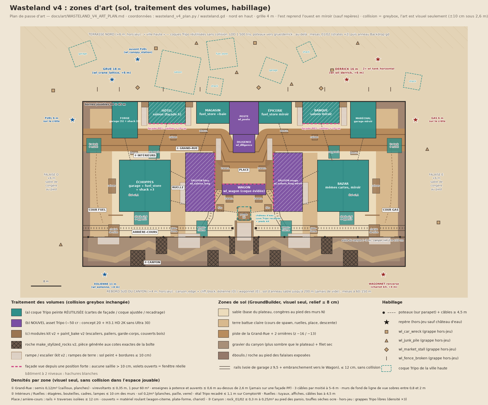

# Wasteland v4 : plan de la passe d'art (2026-09-25)

Direction artistique. Cette passe démarre après la validation du greybox v4 (LD-40 à LD-43).
Sources : `scripts/levels/maps/layouts/wasteland.gd`, `docs/research/11_wasteland_v4_layout.md`
(§5 lanes, §6 positions fortes, §8 direction artistique), `docs/art/WASTELAND_ART_RESET.md`.
Cibles : `.orchestrator/refs/wasteland_hero.png` et `.orchestrator/refs/concepts/*.jpg`.
Point de départ : le coin beauté `reports/checkpoints/2026-09-25_1330_textures_peintes/`.
Plan annoté : `docs/research/img/wasteland_v4_art_zones.png`.

## 0. Décisions clés

1. **La collision reste celle du greybox.** Tout ce qui suit est visuel. Sous 2,6 m, le visuel colle aux
   boîtes à ±10 cm. Une sonde de parité visuel/collision bloque toute livraison (§1, R1 et R9).
2. **Bâtiment jouable = peau de façade.** On découpe des cartes dans les coques Tripo peintes, on y perce les
   ouvertures réelles, puis on les plaque sur les murs du Kit. On ne pose jamais une coque entière autour d'un
   intérieur. Les intérieurs reprennent les murs du Kit en matières peintes, plus des modules kit v2 cuits par
   `paint_bake` v2.
3. **Volume plein = coque Tripo ajustée à la boîte.** Pour les couverts : module kit v2 cuit, ou Tripo ajusté.
   Dans tous les cas, le visuel remplit au moins 85 % de chaque face.
4. **5 nouveaux assets Tripo** : Wagon, Saloon long, Poste, Diligence, Éolienne. Coût : 275 cr, plus une
   réserve de 100 cr, soit 375 cr au plus. Tout le reste réutilise les 15 assets peints déjà installés.
5. **Lisibilité.** Tout texte peint est un callout (§8 du doc 11). Des volets ouverts signalent une fenêtre
   praticable ; des volets fermés, un mur. Une porte peinte est toujours une vraie porte.
6. **Bloquant B0 (décision du lead, puis de l'utilisateur) : la hauteur des toits à 60°.** Voir §1. Le plan
   tient quelle que soit la décision : les cartes s'arrêtent à l'égout et la couche toit suit la collision.

## 1. Coexistence de l'art et de la collision

- **R1. Enveloppe.**
  - Sous 2,6 m, aucun visuel ne dépasse une boîte de plus de 10 cm, en saillie comme en retrait. Cela vaut
    pour les poteaux de porche, les marches, les caisses au pied des murs et les jupes de terre.
  - Au-dessus de 2,6 m, on tolère des saillies jusqu'à 0,6 m (auvent, enseigne à potence, corniche), sauf sur
    une **façade PP**. Les façades PP sont : Hôtel sud, Banque sud, Saloon ouest côté est, Saloon est côté ouest
    et Wagon nord. Elles restent à ≤ 10 cm sur toute leur hauteur : un auvent visuel sous une fenêtre de PP
    cacherait un joueur qu'on peut pourtant toucher.
  - Aucun visuel ne dépasse le dessus d'un couvert de moins de 2,6 m.
- **R2. Peau de façade.** C'est l'outil `tools/blender/shell_to_skin.py` (ART-92). Il a trois modes.
  - `card` : on tranche une face d'une coque Tripo sur 0,6 m de profondeur et on supprime le dos. Pour
    l'allonger, on répète une travée : jamais plus de 12 % d'étirement par axe. On écrase ensuite le relief
    selon R1, puis on pose la carte à 3 cm devant le mur du Kit.
  - `shell` : on ajuste une coque entière à une boîte, avec au plus 15 % d'étirement par axe (exception : 32 %
    le long d'un cylindre). Option : évider l'intérieur (boîte intérieure = boîte moins le mur de 0,25 m).
  - `crop` : on garde une tranche de la coque, en hauteur ou dans une boîte.
  - Matières : le slot 0 garde l'albédo Tripo intact. Les faces de coupe (tableaux de porte, chants) prennent
    le slot 1, en `wood_planks` peint.
  - Chaque sortie a un sidecar qui mesure le relief sous 2,6 m, l'étirement et l'écart des ouvertures.
- **R3. Ouvertures.** La source de vérité est la collision construite. Elle est exportée en
  `tools/art/data/wasteland_v4_boxes.json` (ART-91), jamais recopiée à la main. L'outil perce la carte à ±2 cm
  et pose un cadre kit v2 qui habille l'épaisseur du mur (0,25 m).
  Exemple : pendant la rédaction de ce plan, LD-43 a élargi les portes des Échoppes et des Saloons à 2,4 m.
- **R4. Fausses ouvertures.** Une porte peinte par Tripo qui ne correspond à aucune ouverture est condamnée :
  planches clouées ou volets fermés, en ≤ 10 cm. À l'étage, une fausse fenêtre prend des volets fermés, une
  vraie des volets ouverts.
- **R5. Couche toit.** Les cartes s'arrêtent à l'égout. Le toit est une tôle ondulée en un seul pan par versant
  (générée, texture peinte), posée à 3 cm au-dessus des pans de collision, avec faîtière et rives. Les fausses
  façades Tripo montent au-dessus de l'égout, côté rue.
- **R6. Intérieurs.**
  - Les murs, sols et dalles du Kit restent visibles côté intérieur, en matières peintes : `wall_kind =
    wood_planks` et plancher peint, via `wasteland_look.gd`.
  - On y ajoute des modules kit v2 cuits : poteaux d'angle, corniche de plafond, cadres, volets, poutres
    au-dessus de 2,6 m.
  - L'habillage mural reste à ≤ 10 cm : étagères, bouteilles, cadres, lampes. Aucun objet au sol hors des
    boîtes existantes.
- **R7. Volumes pleins et couverts.** Les silhouettes orthographiques de chaque face couvrent au moins 85 % de
  la boîte. Un creux de plus de 20 cm se comble : muret, caisses, bâche. Sinon, on voit à travers un obstacle
  qui arrête les balles.
- **R8. Réutilisation.** Une même source apparaît au plus deux fois en jeu par moitié. Chaque réemploi change
  au moins deux paramètres parmi : travée, miroir, rotation, teinte et enseigne. L'est est l'ouest en miroir,
  teinté chaud (rouge `#B8322A` et crème). L'ouest est teinté froid (tôle bleue `#3E7BB5`). Les teintes
  300–355° et 105–145° sont interdites.
- **R9. Mise en œuvre.** L'art n'existe que si sa pièce figure dans `data["pieces"]` (les barrières Duel/Duo
  se filtrent seules). Aucun `CollisionObject3D` ajouté dans les bornes (la navmesh ne lit que les collisions
  statiques). Couche sautée sur serveur headless. Pièce entièrement remplacée : `visual:false`, collision gardée.

**B0. Les toits à 60° cassent la ligne de ciel.** Le toit est un seul faîtage le long de x. Sa hauteur vaut
la demi-profondeur × tan 60°. Voir la capture `reports/checkpoints/2026-09-25_1205_blockout_v4/v4_aerial_sw.jpg`.

| Volume | Murs | Profondeur z | Faîtage actuel |
|---|---|---|---|
| Magasin / Épicerie | 3,6 m | 6 m | 8,8 m |
| Hôtel / Banque | 6,4 m | 6 m | 11,6 m |
| Forge / Maréchal | 3,6 m | 10 m | 12,3 m |
| Échoppes / Bazar | 3,6 m | 14 m | 15,7 m |
| Saloons | 6,4 m | 16 m | **20,3 m** |
| Wagon | 3,4 m | 3 m | 6,0 m (pointe sur un wagon) |

Ligne de ciel visée (§8 du doc 11) : 3,6 / 6,4 / 7 / 12 / 18 m. Avec ces toits, le château d'eau (12 m)
disparaît derrière Échoppes et Saloons depuis les cours de spawn, les fausses façades de 7 m ne masquent plus
rien et la ville haute (terrasse nord, +6 m) est invisible.
- **O1, recommandée.** Toits à 25–30°, faîtage à l'égout + 3 m au plus. La collision est identique au visuel.
  On ajoute un volume hors-limites de 1,5 s au-dessus des toits. C'est le « dernier recours » prévu au §12.3,
  justifié par cette mesure. Il faut rouvrir la décision 12.3 avec l'utilisateur.
- **O2.** On garde 60° et l'art suit la pente : tôle sur les pans, fausses façades montées à 9–12 m,
  grue et derrick rehaussés de 6 m. La ligne de ciel ressemble alors à des tentes. Déconseillée.

## 2. Traitement par volume

Noms de `wasteland.gd`. L'est est le miroir de l'ouest (`_mirror_piece`). Le repère Tripo place la façade
en +Z à `rot_y = 0`, comme dans BeautyCorner. Codes : (a) coque Tripo réutilisée, (b) nouveau Tripo,
(c) kit v2 + paint_bake v2.

**Bâtiments jouables** (collision building2 inchangée ; peau R2 ; intérieur R6) :

| Pièce (est) | T | Source et transformation par face | Remarques |
|---|---|---|---|
| ForgeW (ForgeE « Maréchal ») 7×10×3,6 | a | S : face avant de `wl_garage` + 1 travée de 0,8 m (7 m), grand portail centré sur la vraie porte de 2 m, reste du portail en planches R4. O : flanc droit du garage ×2, le second en miroir (recadrage à 10 m). E (Impasse) : flanc de `wl_shack` ×2 + 1 travée. N : contre la falaise, pas de carte. | Enseigne FORGE, ou MARÉCHAL à l'est (fer à cheval). Teinte froide ou chaude. |
| Hotel (Banque) 10×6×6,4 | a | S : face avant de `wl_saloon` (x 0,92, y 1,0), porche et balcon écrasés à ≤ 10 cm (façade PP1/PP2). O et E : flancs du saloon recadrés sur les 6 premiers m, portes d'étage percées. | Fausse façade conservée au-dessus de 6,4 m. HÔTEL ou BANQUE. Volets ouverts sur les fenêtres de PP. |
| MagasinW (MagasinE « Épicerie ») 9×6×3,6 | a | S : face avant de `wl_fuel_store` + 1 travée de 1,55 m (9 m). O : flanc gauche recadré à 6 m. E : contre le Poste, pas de carte. | Le fronton FUEL est couvert par l'enseigne MAGASIN ou ÉPICERIE : FUEL reste réservé à la cour de spawn. Zone HP P2. |
| EchoppesW (EchoppesE « Bazar ») 14×14×3,6 | a | N : garage avant + 0,8 m (salle A) + flanc du fuel_store recadré à 7 m (salle B). O : flanc du fuel_store 7 m + flanc du garage + 1,5 m. E (Ruelle) : shack avant + flanc du shack + shack avant en miroir + 1,27 m. S : dos du garage + dos du shack + dos du fuel_store recadré à 3,7 m. | Auvents ≤ 0,6 m au-dessus de 2,6 m sur les faces N et O. Mur intérieur MurW1/W2 : planches cuites. |
| SaloonW (SaloonE) 8×16×6,4 | b | `wl_saloon_long`, 4 faces sans étirement (±5 %). E = façade PP3/PP4. La galerie Tripo est retirée et remplacée par le kit : porche + `balcony_railing` sur BalconW et RampeBalconW. | « Saloon bleu » ou « Saloon rouge » : teinte et enseigne SALOON. Texture 4K (16 m de façade). |
| Wagon 12×3×3,4 | b | `wl_wagon` en mode `shell` évidé. Ouvertures percées aux extrémités O et E et au sud à x ±3. Fenêtres nord à volets ouverts. | Caisse posée au sol, bogies enfouis (≤ 8 cm). Intérieur en planches, banquettes plaquées ≤ 10 cm. HP P1, PP5. |
| Escaliers Impasse, Passage, Ruelle, Galerie ; paliers | c | Module `stairs_fit(largeur, montée, course)` aux cotes exactes (ART-92), marches en planches ; paliers sur consoles plaquées au mur. | Aucun poteau libre sous 2,6 m. |

**Centre** (non mirroré) :

| Pièce | T | Traitement |
|---|---|---|
| Poste 8×9×6,4 (plein) | b | `wl_poste` en mode `shell` ajusté (≤ 15 %). Horloge et enseigne POSTE en fausse façade jusqu'à 8,5 m, visibles des deux moitiés de la Grand-Rue au-dessus de la Diligence. |
| Diligence 6×5×3,4 (plein) | b | `wl_diligence` en mode `shell` : diligence collée à une pile de malles et de sacs postaux, bloc compact, sans jour sous la caisse (R7). |
| Château d'eau : 4 pieds 0,4×0,4×8 + cuve 3,6×3,6×4 à 8–12 m | a+c | Cuve et toit recadrés dans `wl_water_tower` (mode `crop`), ajustés à la boîte de la cuve. Pieds en bois et fer (module `tower_leg`) à ±5 cm. Croisillons seulement au-dessus de 2,6 m. Tuyau fin (`thin`) vers la Pompe. |
| Pompe 3×2,5×2,4 (plein) | c | Abri de pompe en planches cuites, couvercle ≤ 10 cm, volant et tuyaux au-dessus de 2,4 m. |
| MuretGouletO / E | c | Traverses empilées en mur de soutènement (fait écho aux rails). |
| Descente | c | Ruban de terre battue drapé à 2 cm au-dessus de la rampe (ART-97), bordures de traverses ≤ 10 cm. |

**Couverts et petits volumes** (ouest, miroir à l'est ; remplissage R7 ≥ 85 %) :

| Pièce | T | Traitement |
|---|---|---|
| CiterneFUEL (CiterneGAS) 4×4×2,8 | a+c | `wl_tank_horizontal` ×0,8 uniforme, axe E-O, sur un muret de rétention kit de 1,2 m. Pignons comblés par des fûts. Pochoir FUEL ou GAS, tôle bleue ou rouge. |
| CaisseFUEL 2×4×2,2 · CaissesW 1,5×1,5×1,1 · CaissesQuaiW 2×2×2 | c | Module `crate_stack_fit` aux cotes. Sur le quai : caisses arrimées sur une plate-forme de wagon (bogies ≤ 10 cm au sol). |
| CharretteW 3×3,5×2,2 | a+c | `wl_car_wreck` ×0,72 uniforme (axe z), plus ridelles en planches et caisses arrimées sur le toit jusqu'à 2,2 m : l'épave sert de charrette. |
| AbreuvoirW1 / W2 2×1×1,1 · ComptoirW 2×1×1,1 | c | Modules `trough` et `counter` en planches cuites. Bouteilles et marchandises sur le comptoir. |
| TonneauxW 2×2×2 | c | 2 rangs de 4 fûts sur palette. Fût procédural cuit par paint_bake v2, jamais laissé en aplat. |
| TraversesW, PileTraversesNW | c | Module `sleeper_stack` (croisillons pleins) : remplit la boîte à 100 %. |
| RemiseW 4×3,5×2,6 | a+c | `wl_shack` en mode `crop`, boîte de 4×3,5×2,6 (on coupe la profondeur plutôt que d'étirer), plus un appentis en tôle de 0,3 m. |
| CuveW 3×4,5×2,4 | a+c | Wagon-citerne : `wl_tank_horizontal` (0,68 ; 0,69 ; 0,97), allongé comme un vrai wagon-citerne, sur un châssis kit posé sur les rails. |
| ChariotMineW 3×3,5×2,2 | c | Module `mine_cart` : benne pleine de minerai, sur les rails. |
| ClotureW | a | `wl_fence_broken` recadré à ≤ 1,1 m, ×2, dont un en miroir. |
| ParapetW1/2/3 (1,1 m) | c | Garde-corps en planches jointives (on ne voit pas à travers), poteaux tous les 2 m. Un poteau électrique encastré tous les 12 m environ. |
| RampeCanyonW1 / W2 | c | Ruban de terre drapé à 2 cm, bordures de traverses ≤ 10 cm. |
| Barrières Duel/Duo (2,6 m) | c | Barricade de planches et de sacs de sable, posée seulement si la pièce existe (R9). |

**Roches et falaises** (`make_stylized_rocks.py` v2, strates à l'échelle ×2 sur les grandes pièces) :
- **RocherS1W, N1W, S2W, GueW et leurs miroirs.** 8 aiguilles *uniques*, générées aux cotes exactes de leur
  boîte : 8 graines, pas de copie miroir. Facettes à ±10 cm, dessus plat avec une lèvre ≤ 10 cm.
- **Falaises.** Côté jeu, la face reste à ±10 cm du plan de collision ; côté hors-jeu, le relief est libre
  (R1). CliffN n'est visible que sur les cours de spawn, l'Impasse et le Passage. CliffW et CliffE
  (−2 à +6 m) sont découpées en segments de 8 m. CliffS (−2 à +4 m) est la paroi sud du canyon.

**Nouveaux assets Tripo** (concept 1 image à 20 cr, puis modèle HD H3.1 sans Ultra à 30 cr en 2K ou 55 cr en 4K).
Chaque prompt se termine par le même suffixe de style : *hand-painted cel-shaded, thick black ink outlines,
saturated warm desert palette, Borderlands-like, isolated on plain background, 3/4 view, no text*. Les
contraintes de géométrie sont écrites en clair, parce que les ouvertures seront percées ensuite :

1. `wl_wagon`, 12×3×3,4 m, 50 cr : *derailed wooden western boxcar resting directly on the ground, plank body
   with rusted iron straps, closed flat sides, low curved roof, broken bogies half buried*.
2. `wl_saloon_long`, 8×16×6,4 m, 4K, 75 cr : *long two-storey western saloon, flat plank walls with upper
   windows, tall false front with a SALOON board on the short side, no porch, no balcony*.
3. `wl_poste`, 8×9×6,4 m, 50 cr : *compact adobe and brick stagecoach post office, flat walls, stepped false
   front with a big round clock and a blank sign board, no porch*.
4. `wl_diligence`, 6×5×3,4 m, 50 cr : *western stagecoach packed tight against stacked trunks, crates and mail
   sacks on a low plank dock, compact rectangular block, no gaps underneath*.
5. `wl_eolienne`, 11 m, 50 cr : *American farm windpump on a timber lattice tower, rusty fan wheel and tail
   vane, small water tank at its foot*. Repère du bout ouest du canyon ; aucun modèle existant ne le remplace.

## 3. Sol (GroundBuilder, visuel seul)

**Extensions additives** de `GroundBuilder.gd` (ART-97), toutes avec un défaut qui laisse le comportement
actuel inchangé :
- `visual_only` : pas de `HeightMapShape3D`, et la profondeur des pistes, ornières et buttes peut descendre à
  0,03 m (le plafond du contrat est de 0,08 m) ;
- `zones` : `[{rect | poly, paint: sand|dirt|track|rock, feather}]` ;
- `paint` par route, pour dessiner des pistes en terre ou en ballast.

Trois instances, placées par transformation de nœud :

| Instance | Emprise, y | Contenu |
|---|---|---|
| Plateau | x −44…44, z −25…12, y 0, cellule 0,5 m, bruit 0,03 | Base sable. Grand-Rue : piste (−44,−14,5)→(−6,5,−14,5)→(−4,6,−9,9)→(4,6,−9,9)→(6,5,−14,5)→(44,−14,5), 6,2 m de large (4 m dans le coude), 0,06 m de profondeur, ornières à ±1,5 m (z −16 et −13) de 0,04 m. Terre battue claire : cours de spawn (\|x\| ≥ 36), Ruelles (\|x\| 16–20, z −11…12), Place (x ±8, z −11…5), Descente. Ballast (roche) le long des rails. Jupes de terre de 0,06 m au pied des murs, congères de sable contre les murs nord et au pied des falaises. |
| Canyon | x −44…44, z 12…20, y −2 | Gravier (roche 0,5 + terre) plus sombre que le plateau (§8). Filet sec sinueux entre les aiguilles. Éboulis de 1,5 m au pied des deux parois. |
| Anneau | des bornes à 200 m, cellule 2 m | Sable et roche à +6 m au nord, à l'ouest et à l'est, et à +4 m au sud. Il rejoint `Backdrop.gd` : jamais de vide. |

**Rails** (maillage d'ArtGround, sans collision, ≤ 12 cm) :
- une voie de garage à z 9,5, de x ±44 jusqu'aux heurtoirs à x ±3,2 (au bord des murets du Goulet) ;
- un embranchement (±11 ; 9,5)→(±9,2 ; 6,5)→(±8,6 ; 2,5)→(±6,6 ; −0,6), qui s'arrête en rail tordu dans
  l'emprise du Wagon.

Le Wagon-citerne, la plate-forme et le chariot de mine reposent sur la voie. La place raconte ainsi le
déraillement.

## 4. Canyon, falaises et fond

- **Arête du canyon** (z 12, de −2 à 0) : segments `canyon_rim_2m` à ±10 cm. Les parapets (§2) sont posés
  dessus. Les deux bouts sont fermés par des éboulis : `cliff_block` et gros rochers, derrière le plan x ±44.
- **Paroi sud** (CliffS, de −2 à +4) : segments `canyon_wall_6m`, puis `canyon_edge_01` en retrait jusqu'à
  +12. Au rebord (+4 m) : l'**éolienne** (−38 ; 22,2) et le **wagonnet renversé** (38 ; 22,2), dont le minerai
  coule sur la paroi en ≤ 10 cm devant le plan z 20.
- **Terrasse nord** (+6 m, hors-jeu) : la **ville haute**, avec 7 coques Tripo réutilisées en LOD lointain
  (1 500 tris, manifeste `tools/ai3d/manifests/painted_env_far.yaml`), dont les orientations sont sur le plan
  annoté. S'y ajoutent des grappes Tripo sans collision (épaves, bric-à-brac, étals, clôtures) et une ligne de
  poteaux vers la grue et le derrick.
- **Horizon** : `mesa_01/02` régénérées aux strates ×2, entre 60 et 150 m, puis l'anneau `Backdrop.gd`.
  Critère : aucune couleur de fond (vide) sous l'horizon, dans les 12 vues.

## 5. Habillage et repères

**Densités** (visuel seul, rappel sur le plan annoté) :

| Zone | Au sol (≤ 10 cm) | Murs (≤ 10 cm) | Au-dessus de 2,6 m | Sur les couverts existants |
|---|---|---|---|---|
| ① Grand-Rue | cailloux et planches 0,12/m², virevoltants ≤ 0,35 m, 1 pour 60 m², **statiques** | affiches, planches, tuyaux, volets | enseignes à potence, auvents ≤ 0,6 m (hors façades PP), 3 câbles par moitié à 5–6 m | charrette, caisses, abreuvoirs |
| Cours FUEL / GAS | traces de pneus, taches d'huile, congères | pochoirs FUEL ou GAS peints sur la falaise | billboard sur la crête | citerne, caisses |
| ② Intérieurs, Ruelles | planches, paille, verre 0,2/m² | étagères, bouteilles, cadres, lampes | lanternes, poutres ; câbles bas à 4,5 m dans les Ruelles | comptoirs |
| Place, arrière-cours | rails, traverses isolées, ballast | — | câbles de la galerie vers le château d'eau | fûts, traverses, matériel roulant |
| ③ Canyon | `rock_01/02` (≤ 0,3 m) 0,25/m² au pied des parois, touffes sèches ocre | strates peintes | — | aiguilles |
| Hors-jeu | grappes Tripo libres (densité ×3), `tripo_row` avec `collision:false` | — | poteaux et câbles | — |

**Poteaux et câbles** (`DressingKit.poles_and_cables`) : ligne encastrée dans le parapet de l'arête (x ±42,5,
±31, ±22, ±11, ±4) ; consoles murales au-dessus de 3,6 m pour les traversées de la Grand-Rue (x ≈ ±32, ±21,
±10) et des Ruelles (z −6 et 2) ; un câble de la galerie du Saloon au château d'eau. Aucun poteau libre dans
l'espace jouable ; les câbles sont marqués `thin` et la sonde de parité les ignore.

**Repères** (hauteur au-dessus du plateau) :

| Repère | Position | Asset |
|---|---|---|
| Grue | (−36 ; +6 ; −31) → 24 m | `wl_crane_lattice`, 18 m |
| Derrick | (28 ; +6 ; −31) → 22 m | `wl_oil_derrick`, 16 m |
| Auvent FUEL | (−29 ; +6 ; −36,5) | `wl_canopy_station`, bleu |
| 2 citernes GAS | (36,5 ; +6 ; −36,5) | `wl_tank_horizontal`, rouge |
| FUEL | crête ouest (−46,5 ; +6 ; −20), face à l'est | `wl_fuel_billboard`, 6 m |
| GAS | crête est (46,5 ; +6 ; −20), face à l'ouest | `wl_gas_billboard`, 10,9 m |
| Château d'eau | centre, 12 m | cuve Tripo et pieds kit (§2) |
| Éolienne, Wagonnet | rebord sud (±38 ; +4 ; 22,2) | `wl_eolienne` (nouveau) et `mine_cart` renversé |

**Enseignes** : `tools/textures/make_signs.py` (ART-92). Chaque panneau est peint en PIL : planches peintes,
police `resources/fonts/Bangers-Regular.ttf`, encre et usure, regroupés dans un atlas de 12 panneaux (0 cr).
Liste : FORGE, MARÉCHAL, HÔTEL, BANQUE, MAGASIN, ÉPICERIE, ÉCHOPPES, BAZAR, SALOON ×2, POSTE, FUEL, GAS.
La Diligence n'en a pas.

## 6. Tâches

Captures (JPG ≤ 1600 px) dans `reports/checkpoints/<date>_<id>/`, vues nommées définies par ART-91
(`tools/art/data/wasteland_v4_views.json`) : V1 Grand-Rue O depuis le spawn bleu · V2 Grand-Rue E depuis le
spawn rouge · V3 fenêtre PP1 · V4 galerie PP3 · V5 Place depuis la Descente · V6 intérieur Échoppes · V7 Ruelle O
· V8 canyon depuis RampeCanyonW1 · V9 arrière-cours et rails · V10 aérienne SO · V11 ortho · V12 ciel nord
depuis la Place. Aucun fichier n'est partagé par deux tâches d'une même vague.

| Id | Titre | Fichiers possédés | Dépend de | Acceptation (et captures) | Cr |
|---|---|---|---|---|---|
| ART-91 | Fondation : couche d'art v4 et sonde de parité | `scripts/levels/maps/wasteland_art/WastelandArt.gd` (registre qui charge chaque module s'il existe) ; hook dans `MapSetup.gd` (2 lignes) ; `visual:false` dans `Kit.gd` (additif) ; `tools/art/export_v4_openings.gd` et `tools/art/data/*.json` ; `tools/art/v4_shots.gd` ; kinds intérieurs dans `wasteland_look.gd` ; `tests/maps/test_wasteland_art_parity.gd` | — | Hash des collisions identique avec et sans art. JSON : toutes les pièces et les ouvertures des 11 building2. Parité : 3 000 paires navmesh et les 5 PP, raycast collision contre raycast visuel, ≤ 0,5 % d'écart global et 0 sur les PP ; un bloc témoin de 1 m doit la faire échouer. Art sauté en headless. Capture : ouvertures JSON sur V11. | 0 |
| ART-92 | Outils : peau de façade, modules kit v2 manquants, enseignes | `tools/blender/shell_to_skin.py` et son test ; `make_wl_shanty_kit.py` (ajout de `stairs_fit`, `door_frame`, `crate_stack_fit`, `sleeper_stack`, `trough`, `counter`, `mine_cart`, `plank_rail_solid`, `bund_wall`, `tower_leg`, `roof_sheet`) ; `tools/textures/make_signs.py` ; `assets/textures/wasteland/signs/` | — | Sur `wl_saloon`, carte Hôtel S : ouvertures à ±2 cm du JSON, relief ≤ 10 cm sous 2,6 m, étirement ≤ 12 %, albédo intact (ΔE moyen < 2 hors coupes). Tous les modules `painted: true`, `check_asset` PASS. Captures : turntable avant/après de la carte, planche des modules, atlas des enseignes. | 0 |
| ART-93 | 5 nouveaux assets Tripo | `painted_env.yaml` (bloc ART-93) ; `assets/incoming/tripo/studio/wl_{wagon,saloon_long,poste,diligence,eolienne}.glb` ; `assets/models/props/wasteland/tripo/` (ces 5) ; `docs/assets/CREDITS.md` | — | Planche des 5 concepts **validée par l'utilisateur avant la 3D**. ≤ 6 000 tris, turntables, 5 lignes au registre. Dépense ≤ 375. | 275 (+100) |
| ART-94 | Bâtiments à 1 niveau (Forge, Magasin, Échoppes et leurs miroirs) | `wasteland_art/ArtBuildings1F.gd` ; `tools/art/skins_1f.yaml` ; `assets/models/props/wasteland/skins/{forge,magasin,echoppes}_*` | 91, 92, B0 (toits seulement) | Parité et enveloppe vertes. Aucune fausse porte au rez-de-chaussée. Captures V1, V2, V6, V7. | 0 |
| ART-95 | Bâtiments à 2 niveaux et Wagon (Hôtel/Banque, Saloons, Wagon, escaliers, galeries) | `ArtBuildings2F.gd` ; `tools/art/skins_2f.yaml` ; `skins/{hotel,banque,saloon,wagon}_*` | 91, 92, 93, B0 | 0 écart de parité depuis les 5 PP. Volets ouverts = vraies fenêtres. Captures V3, V4, V5, plus l'intérieur du Wagon. | 0 |
| ART-96 | Volumes pleins, couverts, château d'eau, parapets, barrières | `ArtCovers.gd` ; `skins/{poste,diligence,covers}_*` | 91, 92, 93 (Poste, Diligence) | R7 : remplissage ≥ 85 % mesuré en orthographique sur chaque face. Barrières absentes en 4v4. Captures V5, V9, plus un plan serré Diligence et Poste. | 0 |
| ART-97 | Sol v4 et rails | `GroundBuilder.gd` (clés additives) ; `tests/levels/test_ground_builder.gd` ; `wasteland_art/ArtGround.gd` | 91 (contrat du registre) | 2 000 points : sol visuel à ±8 cm des boîtes de sol ; aucun corps physique ajouté ; tests existants verts. Captures V8, V9, V11. | 0 |
| ART-98 | Roches, falaises, canyon, fond | `make_stylized_rocks.py` (spécifications v4) et son test ; `assets/models/props/wasteland/rocks/v4_*` ; `painted_env_far.yaml` ; `wasteland_art/ArtRocksBackdrop.gd` | 91 | Faces côté jeu à ±10 cm. 0 pixel de vide sous l'horizon dans les 12 vues. Captures V8, V10, V12. | 0 |
| ART-99 | Repères et habillage | `DressingKit.gd` (`collision` additif, vrai par défaut) ; `tests/levels/test_dressing_kit.gd` ; `wasteland_art/ArtLandmarks.gd` et `ArtDressing.gd` | 91 | 0 collision ajoutée dans les bornes. Densités du §5 à ±20 %. Grue, derrick et château d'eau visibles depuis V1, V2, V5 et V12. Captures V1, V8, V12. | 0 |
| ART-100 | Intégration : lisibilité, performance, revue | `wasteland_look.gd` (atmosphère : soleil sud-sud-ouest à 40°, brume de sable ≤ 8 % à 41 m) ; `reports/` | toutes | Planche des 12 vues face à la cible et aux concepts ; `style_check` CHK vert. Contraste d'un ennemi contre le fond ΔL ≥ 0,15 à 10, 25 et 41 m dans 8 vues. GPU ≤ 8,3 ms en 1080p et ≤ 1 000 draw calls sur la pire vue. Suite complète et revue complète vertes. | 0 |

**Ordre.** Vague 1 : ART-91, 92, 93, 97, 98. Vague 2 : ART-94, 95, 96, 99. Vague 3 : ART-100.
`wasteland_look.gd` passe d'ART-91 (vague 1) à ART-100 (vague 3), jamais en même temps. B0 doit être tranché
avant la vague 2 ; seules les couches toit d'ART-94 et d'ART-95 l'attendent.

## 7. Budget Tripo

Solde au registre : 6 835 cr (`docs/assets/CREDITS.md`, après les icônes). Ferme : 5 concepts (100) + 4 modèles
HD H3.1 2K sans Ultra (120) + Saloon long en 4K (55) = **275 cr**. Réserve de 2 reprises : 100. **Plafond :
375 cr** (cible ≤ 400 tenue). Tout le reste est à 0 cr : les 15 assets peints existants, `shell_to_skin`, les
modules kit v2, les roches, les enseignes PIL et les LOD lointains. Solde après la passe : au moins 6 460 cr.

## 8. Risques

- **Toits (B0).** Si l'option O2 est retenue, la ligne de ciel et les repères perdent leur lecture. L'impact
  est limité à la couche toit, à la hauteur des fausses façades et à celle des repères.
- **Lignes de vue cassées par le visuel.** Auvents, fausses façades, enseignes, croisillons, rebords de
  roche. Parade : R1, avec façades PP à ≤ 10 cm, et la sonde de parité d'ART-91 qui bloque chaque tâche.
  `test_wasteland_los3d` reste vert, puisque la collision est inchangée.
- **Lisibilité des ennemis sur fond chargé.** Les murs en fond de ligne de vue (falaises des cours, faces O/E
  du Poste, Magasin/Épicerie, galeries) restent sobres entre 0,8 et 2 m : ni affiche ni grappe, valeur
  L 0,45–0,65. Aucun habillage mobile en jeu (virevoltants statiques, vent seulement hors-jeu). Teintes
  réservées balayées par histogramme dans `style_check`. L'encre des accessoires ne dépasse jamais celle des
  personnages.
- **Coutures et densité de texels.** Une coque 2K sur 16 m donne 64 px/m, contre ~250 px/m pour le shack :
  d'où le Saloon long en 4K. Les coupes tombent sur les joints de planches ; le slot 1 habille les chants.
- **Z-fighting.** Cartes et tôle à 3 cm, dos des cartes culé, face extérieure du Kit laissée dessous.
- **Performance.** ~600 k tris dans la scène, ≤ 350 k visibles ; les cartes réutilisent la texture de leur
  source (~25 textures 2K). Parades : `OccluderInstance3D` cuit depuis les boîtes du greybox,
  `visibility_range` 35 m et aucune ombre sur le semis et les câbles, LOD 1 500 tris hors-jeu, art sauté sur
  le serveur.
- **Monotonie du miroir.** R8, deux quartiers de teinte, enseignes toutes différentes, repères asymétriques
  (grue et FUEL contre derrick et GAS, éolienne contre wagonnet).
- **Murs invisibles aux bornes.** La première surface visible est à ±10 cm du plan de collision ; le décor
  plus profond va derrière ou au-dessus.
- **Qualité Tripo variable.** Concepts validés avant de dépenser 30 à 55 cr par modèle ; réserve de deux
  reprises, puis repli sur kit v2 et paint_bake pour le volume concerné.
