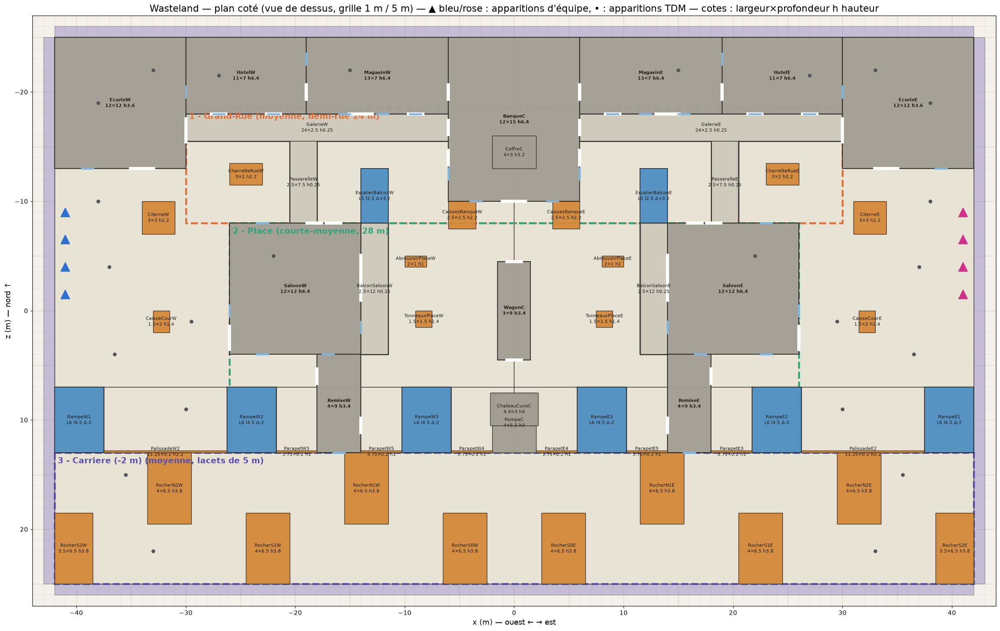
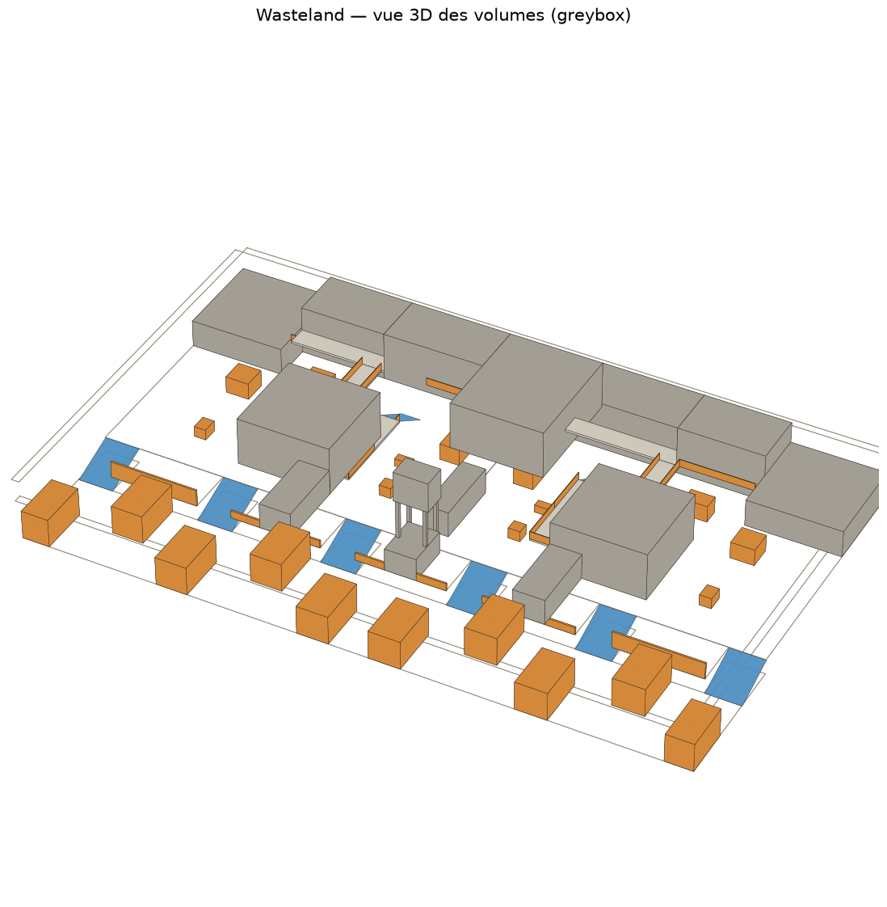
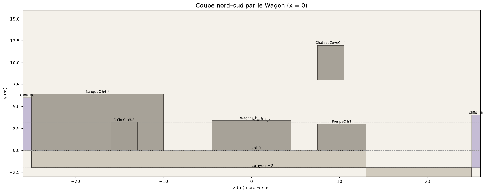
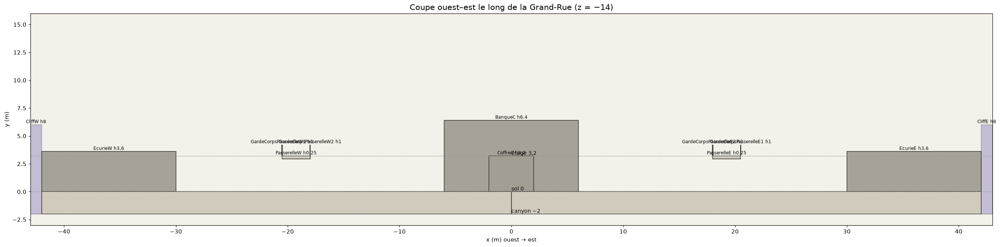

# Wasteland — plan coté (greybox)

Document GÉNÉRÉ par `python tools/maps/render_plan.py` depuis la source unique `data/maps/wasteland_plan.json` : ne pas l'éditer à la main (modifier le JSON puis relancer). La carte en jeu est construite depuis le même JSON.

Axes : x ouest→est, z nord→sud (z négatif = nord), y vertical ; unités en mètres ; bornes x -42…42, z -25…25 ; moitié ouest décrite, moitié est = miroir en x (suffixe W → E).

## Métriques

| Élément | Valeur |
|---|---|
| Joueur | rayon 0,4, hauteur 1,8 (accroupi 0,9), yeux 1,6 ; marche 5,2 m/s, sprint 8,2 m/s ; marche franchissable 0,4 ; stun de chute dès 6 |
| Niveaux | canyon -2, sol 0, étage 3,2 |
| Portes | std 1,2×2,4, M 1,6, L 2,4 |
| Fenêtres | 1,2×1, allège 1 |
| Couverts | C1 1 (accroupi), C2 1,4 (debout), C3 2,2 (plein) |
| Escaliers | marche 0,2/0,3125, volée 3,2 sur 5, largeur ≥ 2 |
| Étage / murs | hauteur d'étage 3,2, murs 0,25, dalles 0,25 |
| Toits | pente 27°, volume anti-joueur jusqu'à 12 |

## Couloirs

| Couloir | Portée | Niveau | Zone x | Zone z | Largeurs |
|---|---|---|---|---|---|
| 1 - Grand-Rue | moyenne, demi-rue 24 m | 0 | -30…30 | -18,5…-8 | facade a facade (Hotel/Magasin -> Saloon) 10 ; bouche de rue (escalier balcon -> Banque) 5,5 ; coude de la cour (Ecurie -> Citerne -> Saloon) 3 |
| 2 - Place | courte-moyenne, 28 m | 0 | -26…26 | -8…13 | place facade a facade (Saloons) 28 ; place : Banque -> chateau d'eau 16,5 ; wagon -> Banque / -> pompe 4,5 ; ruelle arriere (Saloon -> bord) 9 |
| 3 - Carriere (-2 m) | moyenne, lacets de 5 m | -2 | -42…42 | 13…25 | paroi a paroi 12 ; rampes 4,5 ; passage rocher / paroi (mini) 3,5 |

## Bâtiments

| Id | Nom | x | z | y | L×P×H | Étages | Portes | Fenêtres |
|---|---|---|---|---|---|---|---|---|
| EcurieW | Ecurie FUEL | -42…-30 | -25…-13 | 0…3,6 | 12×12 h3.6 | 1 | S0 L @2, E0 L @2,5 | E0 @-1, S0 @-3 |
| EcurieE | Ecurie GAS | 30…42 | -25…-13 | 0…3,6 | 12×12 h3.6 | 1 | S0 L @-2, W0 L @2,5 | W0 @-1, S0 @3 |
| HotelW | Hotel | -30…-19 | -25…-18 | 0…6,4 | 11×7 h6.4 | 2 | S0 M @-2,5, E0 M @1,5, S1 M @2,5 | S0 @2,5, S1 @-2,5, E1 @-1,5 |
| HotelE | Pension | 19…30 | -25…-18 | 0…6,4 | 11×7 h6.4 | 2 | S0 M @2,5, W0 M @1,5, S1 M @-2,5 | S0 @-2,5, S1 @2,5, W1 @-1,5 |
| MagasinW | Magasin | -19…-6 | -25…-18 | 0…6,4 | 13×7 h6.4 | 2 | S0 L @-1,5, W0 M @1,5, E0 M @1,5, S1 M @3,5 | S0 @3,5, S1 @-3, S1 @0,5 |
| MagasinE | Epicerie | 6…19 | -25…-18 | 0…6,4 | 13×7 h6.4 | 2 | S0 L @1,5, E0 M @1,5, W0 M @1,5, S1 M @-3,5 | S0 @-3,5, S1 @3, S1 @-0,5 |
| BanqueC | Banque | -6…6 | -25…-10 | 0…6,4 | 12×15 h6.4 | 2 | W0 M @-2,5, E0 M @-2,5, W0 M @3,5, E0 M @3,5, S0 L @0, W1 M @0,75, E1 M @0,75 | S1 @-3,5, S1 @3,5, W1 @5, E1 @5 |
| SaloonW | Saloon FUEL | -26…-14 | -8…4 | 0…6,4 | 12×12 h6.4 | 2 | W0 L @4,5, N0 M @3,5, E0 L @0, N1 M @1,75, E1 L @-2 | E1 @3,5, S1 @-3, S1 @3, W1 @2, N1 @-3 |
| SaloonE | Saloon GAS | 14…26 | -8…4 | 0…6,4 | 12×12 h6.4 | 2 | E0 L @4,5, N0 M @-3,5, W0 L @0, N1 M @-1,75, W1 L @-2 | W1 @3,5, S1 @3, S1 @-3, E1 @2, N1 @3 |
| WagonC | Wagon (traversant N-S) | -1,5…1,5 | -4,5…4,5 | 0…3,4 | 3×9 h3.4 | 1 | N0 M @0, S0 M @0 |  |
| RemiseW | Remise | -18…-14 | 4…13 | 0…3,4 | 4×9 h3.4 | 1 | W0 M @-2,5, E0 M @2 | S0 @0 |
| RemiseE | Remise | 14…18 | 4…13 | 0…3,4 | 4×9 h3.4 | 1 | E0 M @-2,5, W0 M @2 | S0 @-0 |

## Volumes pleins et repères

| Id | Nom | x | z | y | L×P×H | Étages | Portes | Fenêtres |
|---|---|---|---|---|---|---|---|---|
| CoffreC | Coffre (bloque l'axe des portes) | -2…2 | -16…-13 | 0…3,2 | 4×3 h3.2 |  |  |  |
| PompeC | Pompe (socle du chateau d'eau) | -2…2 | 7,5…13 | 0…3 | 4×5.5 h3 |  |  |  |
| ChateauPiedNW | Pied NO | -1,9…-1,5 | 7,6…8 | 3…8 | 0.4×0.4 h5 |  |  |  |
| ChateauPiedNE | Pied NE | 1,5…1,9 | 7,6…8 | 3…8 | 0.4×0.4 h5 |  |  |  |
| ChateauPiedSW | Pied SO | -1,9…-1,5 | 10,1…10,5 | 3…8 | 0.4×0.4 h5 |  |  |  |
| ChateauPiedSE | Pied SE | 1,5…1,9 | 10,1…10,5 | 3…8 | 0.4×0.4 h5 |  |  |  |
| ChateauCuveC | Cuve du chateau d'eau | -2,2…2,2 | 7,5…10,5 | 8…12 | 4.4×3 h4 |  |  |  |

## Dalles et paliers

| Id | Nom | x | z | y | L×P×H | Étages | Portes | Fenêtres |
|---|---|---|---|---|---|---|---|---|
| GalerieW | Galerie | -30…-6 | -18…-15,5 | 2,95…3,2 | 24×2.5 h0.25 |  |  |  |
| GalerieE | Galerie | 6…30 | -18…-15,5 | 2,95…3,2 | 24×2.5 h0.25 |  |  |  |
| PasserelleW | Passerelle | -20,5…-18 | -15,5…-8 | 2,95…3,2 | 2.5×7.5 h0.25 |  |  |  |
| PasserelleE | Passerelle | 18…20,5 | -15,5…-8 | 2,95…3,2 | 2.5×7.5 h0.25 |  |  |  |
| BalconSaloonW | Balcon du Saloon | -14…-11,5 | -8…4 | 2,95…3,2 | 2.5×12 h0.25 |  |  |  |
| BalconSaloonE | Balcon du Saloon | 11,5…14 | -8…4 | 2,95…3,2 | 2.5×12 h0.25 |  |  |  |

## Escaliers et rampes

| Id | Nom | x | z | y | L×P×H | Étages | Portes | Fenêtres |
|---|---|---|---|---|---|---|---|---|
| EscalierBalconW | Escalier du balcon (rue) | -12,75→-12,75 | -13→-8 | 0→3,2 | L5 l2.5 Δ+3.2 | | | |
| EscalierBalconE | Escalier du balcon (rue) | 12,75→12,75 | -13→-8 | 0→3,2 | L5 l2.5 Δ+3.2 | | | |
| RampeW1 | Rampe Cour | -39,75→-39,75 | 7→13 | 0→-2 | L6 l4.5 Δ-2 | | | |
| RampeE1 | Rampe Cour | 39,75→39,75 | 7→13 | 0→-2 | L6 l4.5 Δ-2 | | | |
| RampeW2 | Rampe Ruelle | -24→-24 | 7→13 | 0→-2 | L6 l4.5 Δ-2 | | | |
| RampeE2 | Rampe Ruelle | 24→24 | 7→13 | 0→-2 | L6 l4.5 Δ-2 | | | |
| RampeW3 | Rampe Place | -8→-8 | 7→13 | 0→-2 | L6 l4.5 Δ-2 | | | |
| RampeE3 | Rampe Place | 8→8 | 7→13 | 0→-2 | L6 l4.5 Δ-2 | | | |

## Couverts, murets, rochers

| Id | Nom | x | z | y | L×P×H | Étages | Portes | Fenêtres |
|---|---|---|---|---|---|---|---|---|
| GardeCorpsGalerieW1 | Garde-corps galerie | -30…-20,5 | -15,525…-15,475 | 3,2…4,2 | 9.5×0.05 h1 |  |  |  |
| GardeCorpsGalerieE1 | Garde-corps galerie | 20,5…30 | -15,525…-15,475 | 3,2…4,2 | 9.5×0.05 h1 |  |  |  |
| GardeCorpsGalerieW2 | Garde-corps galerie | -18…-12 | -15,525…-15,475 | 3,2…4,2 | 6×0.05 h1 |  |  |  |
| GardeCorpsGalerieE2 | Garde-corps galerie | 12…18 | -15,525…-15,475 | 3,2…4,2 | 6×0.05 h1 |  |  |  |
| GardeCorpsGalerieW3 | Garde-corps galerie | -12…-6 | -15,525…-15,475 | 3,2…4,2 | 6×0.05 h1 |  |  |  |
| GardeCorpsGalerieE3 | Garde-corps galerie | 6…12 | -15,525…-15,475 | 3,2…4,2 | 6×0.05 h1 |  |  |  |
| GardeCorpsPasserelleW1 | Garde-corps passerelle | -20,525…-20,475 | -15,5…-8 | 3,2…4,2 | 0.05×7.5 h1 |  |  |  |
| GardeCorpsPasserelleE1 | Garde-corps passerelle | 20,475…20,525 | -15,5…-8 | 3,2…4,2 | 0.05×7.5 h1 |  |  |  |
| GardeCorpsPasserelleW2 | Garde-corps passerelle | -18,025…-17,975 | -15,5…-8 | 3,2…4,2 | 0.05×7.5 h1 |  |  |  |
| GardeCorpsPasserelleE2 | Garde-corps passerelle | 17,975…18,025 | -15,5…-8 | 3,2…4,2 | 0.05×7.5 h1 |  |  |  |
| GardeCorpsBalconW1 | Garde-corps balcon | -11,525…-11,475 | -8…-2 | 3,2…4,2 | 0.05×6 h1 |  |  |  |
| GardeCorpsBalconE1 | Garde-corps balcon | 11,475…11,525 | -8…-2 | 3,2…4,2 | 0.05×6 h1 |  |  |  |
| GardeCorpsBalconW3 | Garde-corps balcon | -11,525…-11,475 | -2…4 | 3,2…4,2 | 0.05×6 h1 |  |  |  |
| GardeCorpsBalconE3 | Garde-corps balcon | 11,475…11,525 | -2…4 | 3,2…4,2 | 0.05×6 h1 |  |  |  |
| GardeCorpsBalconW2 | Garde-corps balcon | -14…-11,5 | 3,975…4,025 | 3,2…4,2 | 2.5×0.05 h1 |  |  |  |
| GardeCorpsBalconE2 | Garde-corps balcon | 11,5…14 | 3,975…4,025 | 3,2…4,2 | 2.5×0.05 h1 |  |  |  |
| AbreuvoirPlaceW | Abreuvoir place | -10…-8 | -5…-4 | 0…1 | 2×1 h1 |  |  |  |
| AbreuvoirPlaceE | Abreuvoir place | 8…10 | -5…-4 | 0…1 | 2×1 h1 |  |  |  |
| CaissesBanqueW | Caisses Banque | -6…-3,5 | -10…-7,5 | 0…2,2 | 2.5×2.5 h2.2 |  |  |  |
| CaissesBanqueE | Caisses Banque | 3,5…6 | -10…-7,5 | 0…2,2 | 2.5×2.5 h2.2 |  |  |  |
| TonneauxPlaceW | Tonneaux place | -9…-7,5 | 0…1,5 | 0…1,4 | 1.5×1.5 h1.4 |  |  |  |
| TonneauxPlaceE | Tonneaux place | 7,5…9 | 0…1,5 | 0…1,4 | 1.5×1.5 h1.4 |  |  |  |
| CharretteRueW | Charrette rue | -26…-23 | -13,5…-11,5 | 0…2,2 | 3×2 h2.2 |  |  |  |
| CharretteRueE | Charrette rue | 23…26 | -13,5…-11,5 | 0…2,2 | 3×2 h2.2 |  |  |  |
| CiterneW | Citerne FUEL | -34…-31 | -10…-7 | 0…2,2 | 3×3 h2.2 |  |  |  |
| CiterneE | Citerne GAS | 31…34 | -10…-7 | 0…2,2 | 3×3 h2.2 |  |  |  |
| CaisseCourW | Caisses cour | -33…-31,5 | 0…2 | 0…1,4 | 1.5×2 h1.4 |  |  |  |
| CaisseCourE | Caisses cour | 31,5…33 | 0…2 | 0…1,4 | 1.5×2 h1.4 |  |  |  |
| PalissadeW2 | Palissade | -37,5…-26,25 | 12,8…13 | 0…2,2 | 11.25×0.2 h2.2 |  |  |  |
| PalissadeE2 | Palissade | 26,25…37,5 | 12,8…13 | 0…2,2 | 11.25×0.2 h2.2 |  |  |  |
| ParapetW3 | Parapet | -21,75…-18 | 12,8…13 | 0…1 | 3.75×0.2 h1 |  |  |  |
| ParapetE3 | Parapet | 18…21,75 | 12,8…13 | 0…1 | 3.75×0.2 h1 |  |  |  |
| ParapetW5 | Parapet | -14…-10,25 | 12,8…13 | 0…1 | 3.75×0.2 h1 |  |  |  |
| ParapetE5 | Parapet | 10,25…14 | 12,8…13 | 0…1 | 3.75×0.2 h1 |  |  |  |
| ParapetW4 | Parapet | -5,75…-2 | 12,8…13 | 0…1 | 3.75×0.2 h1 |  |  |  |
| ParapetE4 | Parapet | 2…5,75 | 12,8…13 | 0…1 | 3.75×0.2 h1 |  |  |  |
| RocherS0W | Aiguille du Gue | -6,5…-2,5 | 18,5…25 | -2…1,8 | 4×6.5 h3.8 |  |  |  |
| RocherS0E | Aiguille du Gue | 2,5…6,5 | 18,5…25 | -2…1,8 | 4×6.5 h3.8 |  |  |  |
| RocherN1W | Aiguille N1 | -15,5…-11,5 | 13…19,5 | -2…1,8 | 4×6.5 h3.8 |  |  |  |
| RocherN1E | Aiguille N1 | 11,5…15,5 | 13…19,5 | -2…1,8 | 4×6.5 h3.8 |  |  |  |
| RocherS1W | Aiguille S1 | -24,5…-20,5 | 18,5…25 | -2…1,8 | 4×6.5 h3.8 |  |  |  |
| RocherS1E | Aiguille S1 | 20,5…24,5 | 18,5…25 | -2…1,8 | 4×6.5 h3.8 |  |  |  |
| RocherN2W | Aiguille N2 | -33,5…-29,5 | 13…19,5 | -2…1,8 | 4×6.5 h3.8 |  |  |  |
| RocherN2E | Aiguille N2 | 29,5…33,5 | 13…19,5 | -2…1,8 | 4×6.5 h3.8 |  |  |  |
| RocherS2W | Aiguille S2 | -42…-38,5 | 18,5…25 | -2…1,8 | 3.5×6.5 h3.8 |  |  |  |
| RocherS2E | Aiguille S2 | 38,5…42 | 18,5…25 | -2…1,8 | 3.5×6.5 h3.8 |  |  |  |

## Limites et murs invisibles

| Id | Nom | x | z | y | L×P×H | Étages | Portes | Fenêtres |
|---|---|---|---|---|---|---|---|---|
| CliffN | Falaise nord | -42…42 | -26…-25 | 0…6 | 84×1 h6 |  |  |  |
| CliffS | Paroi sud | -42…42 | 25…26 | -2…4 | 84×1 h6 |  |  |  |
| CliffW | Falaise ouest | -43…-42 | -25…25 | -2…6 | 1×50 h8 |  |  |  |
| CliffE | Falaise est | 42…43 | -25…25 | -2…6 | 1×50 h8 |  |  |  |

## Apparitions

| Équipe | Position | Regard |
|---|---|---|
| 0 | (-41, 0, -9) | [1.0, 0.0] |
| 1 | (41, 0, -9) | [1.0, 0.0] |
| 0 | (-41, 0, -6,5) | [1.0, 0.0] |
| 1 | (41, 0, -6,5) | [1.0, 0.0] |
| 0 | (-41, 0, -4) | [1.0, 0.0] |
| 1 | (41, 0, -4) | [1.0, 0.0] |
| 0 | (-41, 0, -1,5) | [1.0, 0.0] |
| 1 | (41, 0, -1,5) | [1.0, 0.0] |

