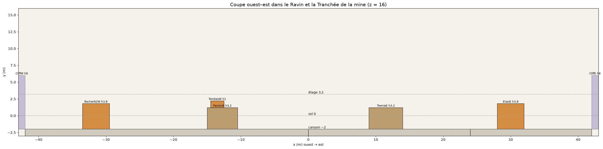

# Wasteland — plan coté (greybox)

Document GÉNÉRÉ par `python tools/maps/render_plan.py` depuis la source unique `data/maps/wasteland_plan.json` : ne pas l'éditer à la main (modifier le JSON puis relancer). La carte en jeu est construite depuis le même JSON.

Axes : x ouest→est, z nord→sud (z négatif = nord), y vertical ; unités en mètres ; bornes x -42…42, z -25…25 ; carte ASYMÉTRIQUE : moitiés ouest (W), centre (C) et est (E) décrites explicitement, sans miroir.

## Métriques

| Élément | Valeur |
|---|---|
| Joueur | rayon 0,4, hauteur 1,8 (accroupi 0,9), yeux 1,6 ; marche 5,2 m/s, sprint 8,2 m/s ; marche franchissable 0,4 ; stun de chute dès 6 |
| Niveaux | canyon -2, sol 0, étage 3,2 |
| Portes | std 1,2×2,4, M 1,6, L 2,4 |
| Fenêtres | 1,2×1, allège 1 |
| Couverts | C1 1 (accroupi), C2 1,4 (debout), C3 2,2 (plein) |
| Escaliers | marche 0,2/0,3125, volée 3,2 sur 5, largeur ≥ 2 |
| Étage / murs | hauteur d'étage 3,2, murs 0,25, dalles 0,25 |
| Toits | pente 27°, volume anti-joueur jusqu'à 12 |

## Couloirs

| Couloir | Portée | Niveau | Zone x | Zone z | Largeurs |
|---|---|---|---|---|---|
| 1 - Grand-Rue / les Voies | moyenne, 24 m par moitie | 0 | -30…-6 + -6…6 + 6…28 + 20…28 | -18…-8 + -10…-7,5 + -15,5…-6 + -25…-15,5 | O : Grand-Rue facade a facade 10 ; E : les Voies, Bureau -> Poste d'aiguillage 10 ; E : couloir nord du fourgon 3 |
| 2 - Place / le Quai | courte-moyenne, <= 30 m | 0 | -26…0 + 0…24 + 24…30 | -7,5…13 + -6…13 + -6…15 | place ouest (balcon -> wagon) 10 ; place est (wagon -> rampe du quai) 9,5 ; quai +1,2 4 ; voie de garage 9,5 |
| 3 - Ravin / la Tranchee (-2 m) | moyenne, lacets de 5 m | -2 | -42…0 + 0…24 + 24…42 | 13…25 + 13…25 + 15…25 | O : ravin paroi a paroi 12 ; E : tranchee (x < 24) 12 ; E : tranchee (x > 24) 10 ; rampes 4,5 |

## Bâtiments

| Id | Nom | x | z | y | L×P×H | Étages | Portes | Fenêtres |
|---|---|---|---|---|---|---|---|---|
| BanqueC | Banque | -6…6 | -25…-10 | 0…6,4 | 12×15 h6.4 | 2 | W0 M @-2,5, E0 M @-2,5, W0 M @3,5, E0 M @3,5, S0 M @-3, S0 M @3, W1 M @0,75, E1 M @0,75 | S1 @-3,5, S1 @3,5, W1 @5, E1 @5 |
| WagonC | Wagon (traversant N-S) | -1,5…1,5 | -4,5…4,5 | 0…3,4 | 3×9 h3.4 | 1 | N0 M @0, S0 M @0 |  |
| EcurieW | Ecurie | -42…-30 | -25…-13 | 0…3,6 | 12×12 h3.6 | 1 | S0 L @2, E0 L @2,5 | E0 @-1, S0 @-3 |
| HotelW | Hotel | -30…-19 | -25…-18 | 0…6,4 | 11×7 h6.4 | 2 | S0 M @-2,5, E0 M @1,5, S1 M @2,5 | S0 @2,5, S1 @-2,5, E1 @-1,5 |
| MagasinW | Magasin | -19…-6 | -25…-18 | 0…6,4 | 13×7 h6.4 | 2 | S0 L @-1,5, W0 M @1,5, E0 M @1,5, S1 M @3,5 | S0 @3,5, S1 @-3, S1 @0,5 |
| SaloonW | Saloon | -26…-14 | -8…4 | 0…6,4 | 12×12 h6.4 | 2 | W0 L @4,5, N0 M @3,5, E0 L @0, N1 M @1,75, E1 L @-2 | E1 @3,5, S1 @-3, S1 @3, W1 @2, N1 @-3 |
| RemiseW | Remise | -18…-14 | 4…13 | 0…3,4 | 4×9 h3.4 | 1 | W0 M @-2,5, E0 M @0 | S0 @0 |
| BureauE | Bureau du fret | 9…20 | -25…-15,5 | 0…6,4 | 11×9.5 h6.4 | 2 | W0 M @0,25, E0 M @0,25, S0 L @-2, W1 M @3,5, S1 M @3,75, E1 M @-0,5 | S0 @1,5, S1 @-3,5, S1 @-0,5, E1 @3 |
| HalleE | Halle aux marchandises | 28…42 | -25…-3 | 0…6,4 | 14×22 h6.4 | 2 | W0 L @-6, W0 M @3,5, S0 L @3, W1 M @-6,75 | W1 @2, W1 @5, W0 @0, S1 @-3 |
| FourgonE | Fourgon de queue (traversant O-E, chicane) | 20,5…25 | -9…-6 | 0…3,4 | 4.5×3 h3.4 | 1 | W0 std @-0,9, E0 std @0,9 |  |
| PosteE | Poste d'aiguillage | 13,5…20,5 | -6…1 | 0…6,4 | 7×7 h6.4 | 2 | N0 M @0, W0 L @0, N1 M @1,25 | W1 @-2, W1 @2,5, N1 @-2,5 |
| SalleAttenteE | Salle d'attente (bout du quai, chicane) | 16…22 | 1…5 | 1,2…4,6 | 6×4 h3.4 | 1 | W0 std @-1,3, E0 std @1,3 |  |
| LampisterieE | Lampisterie (traversante O-E, chicane) | 14…18,5 | 5…13 | 0…3,4 | 4.5×8 h3.4 | 1 | W0 M @0, E0 M @-3 |  |
| SouteE | Estacade a charbon (ecran, portes en chicane) | 34…37 | -3…4 | 0…3,5 | 3×7 h3.5 | 1 | E0 M @2, W0 M @0 |  |
| RecetteE | Recette du puits | 37…42 | 19,5…25 | -2…1,6 | 5×5.5 h3.6 | 1 | W0 L @0, N0 M @0 | N0 @1,8 |

## Volumes pleins et repères

| Id | Nom | x | z | y | L×P×H | Étages | Portes | Fenêtres |
|---|---|---|---|---|---|---|---|---|
| CoffreC | Coffre (bloque l'axe des portes) | -2…2 | -16…-13 | 0…3,2 | 4×3 h3.2 |  |  |  |
| BassinC | Bassin de l'eolienne | -2…2 | 7,5…13 | 0…3 | 4×5.5 h3 |  |  |  |
| EolienneC1 | Pylone de l'eolienne | -1,6…-1,2 | 8,6…9 | 3…10 | 0.4×0.4 h7 |  |  |  |
| EolienneC2 | Pylone de l'eolienne | 1,2…1,6 | 8,6…9 | 3…10 | 0.4×0.4 h7 |  |  |  |
| EolienneC3 | Pylone de l'eolienne | -1,6…-1,2 | 11,6…12 | 3…10 | 0.4×0.4 h7 |  |  |  |
| EolienneC4 | Pylone de l'eolienne | 1,2…1,6 | 11,6…12 | 3…10 | 0.4×0.4 h7 |  |  |  |
| EolienneTeteC | Roue de l'eolienne | -1,8…1,8 | 9,8…10,4 | 10…13 | 3.6×0.6 h3 |  |  |  |
| ArbrePenduW | Arbre du pendu | -11,6…-11,2 | 18,4…18,8 | 1,2…7 | 0.4×0.4 h5.8 |  |  |  |
| GuichetE | Guichet (chicane de la salle d'attente) | 18,5…19 | 1…3,8 | 1,2…3,6 | 0.5×2.8 h2.4 |  |  |  |
| ChateauPiedE1 | Pied du chateau d'eau | 30,8…31,2 | 5…5,4 | 0…8,5 | 0.4×0.4 h8.5 |  |  |  |
| ChateauPiedE2 | Pied du chateau d'eau | 33,8…34,2 | 5…5,4 | 0…8,5 | 0.4×0.4 h8.5 |  |  |  |
| ChateauPiedE3 | Pied du chateau d'eau | 30,8…31,2 | 8…8,4 | 0…8,5 | 0.4×0.4 h8.5 |  |  |  |
| ChateauPiedE4 | Pied du chateau d'eau | 33,8…34,2 | 8…8,4 | 0…8,5 | 0.4×0.4 h8.5 |  |  |  |
| ChateauCuveE | Cuve du chateau d'eau | 30…35 | 4,2…9,2 | 8,5…12,5 | 5×5 h4 |  |  |  |
| ChevalementE1 | Chevalement | 38…38,4 | 20,5…20,9 | 1,6…11 | 0.4×0.4 h9.4 |  |  |  |
| ChevalementE2 | Chevalement | 41…41,4 | 20,5…20,9 | 1,6…11 | 0.4×0.4 h9.4 |  |  |  |
| ChevalementE3 | Chevalement | 38…38,4 | 23,6…24 | 1,6…11 | 0.4×0.4 h9.4 |  |  |  |
| ChevalementE4 | Chevalement | 41…41,4 | 23,6…24 | 1,6…11 | 0.4×0.4 h9.4 |  |  |  |
| MoletteE | Molette du chevalement | 38…41,4 | 21,8…22,4 | 11…13 | 3.4×0.6 h2 |  |  |  |

## Dalles et paliers

| Id | Nom | x | z | y | L×P×H | Étages | Portes | Fenêtres |
|---|---|---|---|---|---|---|---|---|
| GalerieW | Galerie de la Grand-Rue | -30…-6 | -18…-15,5 | 2,95…3,2 | 24×2.5 h0.25 |  |  |  |
| PasserelleW | Passerelle | -20,5…-18 | -15,5…-8 | 2,95…3,2 | 2.5×7.5 h0.25 |  |  |  |
| BalconSaloonW | Balcon du Saloon | -14…-11,5 | -8…4 | 2,95…3,2 | 2.5×12 h0.25 |  |  |  |
| PontBanqueE | Pont Banque-Bureau | 6…9 | -18…-15,5 | 2,95…3,2 | 3×2.5 h0.25 |  |  |  |
| PasserelleFretE | Passerelle du fret | 20…28 | -22…-19,5 | 2,95…3,2 | 8×2.5 h0.25 |  |  |  |
| PortiqueE | Portique de signalisation | 17…19,5 | -15,5…-6 | 2,95…3,2 | 2.5×9.5 h0.25 |  |  |  |

## Escaliers et rampes

| Id | Nom | x | z | y | L×P×H | Étages | Portes | Fenêtres |
|---|---|---|---|---|---|---|---|---|
| EscalierBalconW | Escalier du balcon (rue) | -12,75→-12,75 | -13→-8 | 0→3,2 | L5 l2.5 Δ+3.2 | | | |
| RampeCourW | Rampe de la Cour | -39,75→-39,75 | 7→13 | 0→-2 | L6 l4.5 Δ-2 | | | |
| RampeRuelleW | Rampe de la Ruelle | -24→-24 | 7→13 | 0→-2 | L6 l4.5 Δ-2 | | | |
| RampePlaceW | Rampe de la Place | -8→-8 | 7→13 | 0→-2 | L6 l4.5 Δ-2 | | | |
| EscalierPenduW | Marches du Pendu (terrasse) | -12,75→-12,75 | 11→13 | 0→1,2 | L2 l2.5 Δ+1.2 | | | |
| EscalierPenduRavinW | Marches du Pendu (ravin) | -20→-15 | 14,25→14,25 | -2→1,2 | L5 l2.5 Δ+3.2 | | | |
| EscalierPortiqueE | Escalier du portique | 12→17 | -10,25→-10,25 | 0→3,2 | L5 l2.5 Δ+3.2 | | | |
| EscalierQuaiOuestE | Marches du quai (place) | 14,1→16 | 3→3 | 0→1,2 | L1.9 l4 Δ+1.2 | | | |
| EscalierQuaiE | Marches du quai | 31→29 | 3→3 | 0→1,2 | L2 l2.5 Δ+1.2 | | | |
| EscalierTremieE | Marches de la tremie | 10→10 | 8→10 | 0→1,2 | L2 l2 Δ+1.2 | | | |
| EscalierTremieTrancheeE | Marches de la tremie (tranchee) | 19→14 | 14,25→14,25 | -2→1,2 | L5 l2.5 Δ+3.2 | | | |
| RampeGueE | Rampe du Gue | 5,25→5,25 | 7→13 | 0→-2 | L6 l4.5 Δ-2 | | | |
| RampeCarreauE | Rampe du Carreau | 38→38 | 9→15 | 0→-2 | L6 l4.5 Δ-2 | | | |

## Couverts, murets, rochers

| Id | Nom | x | z | y | L×P×H | Étages | Portes | Fenêtres |
|---|---|---|---|---|---|---|---|---|
| GardeCorpsGalerieW1 | Garde-corps galerie | -30…-20,5 | -15,525…-15,475 | 3,2…4,2 | 9.5×0.05 h1 |  |  |  |
| GardeCorpsGalerieW2 | Garde-corps galerie | -18…-12 | -15,525…-15,475 | 3,2…4,2 | 6×0.05 h1 |  |  |  |
| GardeCorpsGalerieW3 | Garde-corps galerie | -12…-6 | -15,525…-15,475 | 3,2…4,2 | 6×0.05 h1 |  |  |  |
| GardeCorpsPasserelleW1 | Garde-corps passerelle | -20,525…-20,475 | -15,5…-8 | 3,2…4,2 | 0.05×7.5 h1 |  |  |  |
| GardeCorpsPasserelleW2 | Garde-corps passerelle | -18,025…-17,975 | -15,5…-8 | 3,2…4,2 | 0.05×7.5 h1 |  |  |  |
| GardeCorpsBalconW1 | Garde-corps balcon | -11,525…-11,475 | -8…-2 | 3,2…4,2 | 0.05×6 h1 |  |  |  |
| GardeCorpsBalconW3 | Garde-corps balcon | -11,525…-11,475 | -2…4 | 3,2…4,2 | 0.05×6 h1 |  |  |  |
| GardeCorpsBalconW2 | Garde-corps balcon | -14…-11,5 | 3,975…4,025 | 3,2…4,2 | 2.5×0.05 h1 |  |  |  |
| AbreuvoirPlaceW | Abreuvoir | -10…-8 | -5…-4 | 0…1 | 2×1 h1 |  |  |  |
| CaissesBanqueW | Caisses de la Banque | -6…-3,5 | -10…-7,5 | 0…2,2 | 2.5×2.5 h2.2 |  |  |  |
| TonneauxPlaceW | Tonneaux | -9…-7,5 | 0…1,5 | 0…1,4 | 1.5×1.5 h1.4 |  |  |  |
| CharretteRueW | Charrette | -26…-23 | -13,5…-11,5 | 0…2,2 | 3×2 h2.2 |  |  |  |
| CiterneW | Citerne | -34…-31 | -10…-7 | 0…2,2 | 3×3 h2.2 |  |  |  |
| CaisseCourW | Caisses de la cour | -33…-31,5 | 0…2 | 0…1,4 | 1.5×2 h1.4 |  |  |  |
| PalissadeW | Palissade | -37,5…-26,25 | 12,8…13 | 0…2,2 | 11.25×0.2 h2.2 |  |  |  |
| ParapetW1 | Parapet | -21,75…-18 | 12,8…13 | 0…1 | 3.75×0.2 h1 |  |  |  |
| ParapetW2 | Parapet | -5,75…-2 | 12,8…13 | 0…1 | 3.75×0.2 h1 |  |  |  |
| TombesW | Tombes | -14,5…-12,5 | 16…16,6 | 1,2…2,2 | 2×0.6 h1 |  |  |  |
| RocherS0W | Aiguille du Gue | -6,5…-2,5 | 18,5…25 | -2…1,8 | 4×6.5 h3.8 |  |  |  |
| RocherS1W | Aiguille S1 | -24,5…-20,5 | 18,5…25 | -2…1,8 | 4×6.5 h3.8 |  |  |  |
| RocherN2W | Aiguille N2 | -33,5…-29,5 | 13…19,5 | -2…1,8 | 4×6.5 h3.8 |  |  |  |
| RocherS2W | Aiguille S2 | -42…-38,5 | 18,5…25 | -2…1,8 | 3.5×6.5 h3.8 |  |  |  |
| GardeCorpsPontE1 | Garde-corps pont | 6…9 | -18,025…-17,975 | 3,2…4,2 | 3×0.05 h1 |  |  |  |
| GardeCorpsPontE2 | Garde-corps pont | 6…9 | -15,525…-15,475 | 3,2…4,2 | 3×0.05 h1 |  |  |  |
| GardeCorpsFretE1 | Garde-corps passerelle du fret | 20…28 | -22,025…-21,975 | 3,2…4,2 | 8×0.05 h1 |  |  |  |
| GardeCorpsFretE2 | Garde-corps passerelle du fret | 20…28 | -19,525…-19,475 | 3,2…4,2 | 8×0.05 h1 |  |  |  |
| CaissesFretE | Caisses de la cour du fret | 23…25 | -25…-22,5 | 0…2,2 | 2×2.5 h2.2 |  |  |  |
| GardeCorpsPortiqueE1 | Garde-corps portique | 16,975…17,025 | -15,5…-11,5 | 3,2…4,2 | 0.05×4 h1 |  |  |  |
| GardeCorpsPortiqueE3 | Garde-corps portique | 16,975…17,025 | -9…-6 | 3,2…4,2 | 0.05×3 h1 |  |  |  |
| GardeCorpsPortiqueE2 | Garde-corps portique | 19,475…19,525 | -15,5…-6 | 3,2…4,2 | 0.05×9.5 h1 |  |  |  |
| WagonnetsVidesE | Wagonnets vides (voie de garage) | 29…33 | 9…11 | 0…2,2 | 4×2 h2.2 |  |  |  |
| PileTraversesE | Pile de traverses (coin du rebord) | 24…26 | 13…15 | 0…2,2 | 2×2 h2.2 |  |  |  |
| BidonsPlaceE | Bidons | 4,5…6 | 1…2,5 | 0…1,4 | 1.5×1.5 h1.4 |  |  |  |
| CoffreFortE | Coffre-fort renverse (angle SE de la Banque) | 3…6 | -10…-8 | 0…2,2 | 3×2 h2.2 |  |  |  |
| TraversesPlaceE | Traverses | 8…10,5 | -4,5…-3,5 | 0…1 | 2.5×1 h1 |  |  |  |
| WagonnetsTremieE | Wagonnets de minerai | 9,2…10,4 | 16,5…19,5 | 1,2…2,6 | 1.2×3 h1.4 |  |  |  |
| TreuilTremieE | Cabane du treuil | 11,5…13 | 11…13 | 1,2…3,4 | 1.5×2 h2.2 |  |  |  |
| TerrilE1 | Terril du gue | 2,5…6 | 18,5…25 | -2…1,8 | 3.5×6.5 h3.8 |  |  |  |
| TerrilE2 | Terril | 19…23 | 18,5…25 | -2…1,8 | 4×6.5 h3.8 |  |  |  |
| EtaisE | Pile d'etais | 28…32 | 15…20,5 | -2…1,8 | 4×5.5 h3.8 |  |  |  |

## Limites et murs invisibles

| Id | Nom | x | z | y | L×P×H | Étages | Portes | Fenêtres |
|---|---|---|---|---|---|---|---|---|
| CliffN | Falaise nord | -42…42 | -26…-25 | 0…6 | 84×1 h6 |  |  |  |
| CliffS | Paroi sud | -42…42 | 25…26 | -2…4 | 84×1 h6 |  |  |  |
| CliffW | Falaise ouest | -43…-42 | -25…25 | -2…6 | 1×50 h8 |  |  |  |
| CliffE | Falaise est | 42…43 | -25…25 | -2…6 | 1×50 h8 |  |  |  |

## Apparitions

| Équipe | Position | Regard |
|---|---|---|
| 0 | (-41, 0, -9) | [1.0, 0.0] |
| 0 | (-41, 0, -6,5) | [1.0, 0.0] |
| 0 | (-41, 0, -4) | [1.0, 0.0] |
| 0 | (-41, 0, -1,5) | [1.0, 0.0] |
| 1 | (41, 0, -2) | [-1.0, 0.0] |
| 1 | (41, 0, -0,25) | [-1.0, 0.0] |
| 1 | (41, 0, 1,5) | [-1.0, 0.0] |
| 1 | (41, 0, 3,25) | [-1.0, 0.0] |

