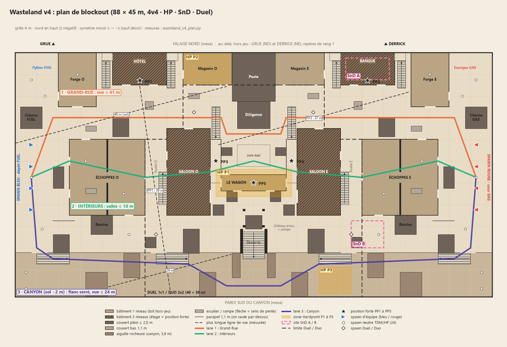

# 11 — Wasteland v4 : un layout rapide, trois lanes, un seul étage

> Statut : proposition du 2026-09-25 (level design). Aucun fichier de jeu n'est modifié.
> Demande : « on veut un FPS rapide », « il faut qu'il y ait du fight tout le temps et que le retour au combat ne soit pas trop long ». Références aimées : Crossfire, Crash, Standoff, Raid, Nuketown, Terminal, Highrise.
> Verdict sur la v3 : jeu faible, 80 × 43 m, damier de petites boîtes, lanes illisibles, trop de toits jouables (aggravé par le grappin de Vanne et le planeur de Guet). Banc de bots v3 : premier contact 3 à 4 s, 20 à 23 éliminations par minute en 4v4.
> Lu : `tasks/context.md`, `scripts/levels/maps/layouts/wasteland*.gd`, `Kit.gd` (building2, stairs, ramp, fence), `MapSetup.gd` (navmesh : montée 0,5 m, pente 46°), `MovementConfig.gd`, `AgentDatabase.gd` et les capacités, `HardpointMode.gd` (45 s), `SnDMode.gd`, `GameWorld.gd` (réapparition 3 s), `03_level_design.md`, `09_wasteland_vertical_slice.md` §a et §c.
> Mesures : modèle 2D à 0,5 m, [`img/wasteland_v4_plan.py`](img/wasteland_v4_plan.py). Il contient les coordonnées de ce document, mesure les chemins praticables par le navmesh (sprint 8,2 m/s) et les lignes de vue à 1,6 m. Il produit aussi le plan. Pour relancer l'audit v3 avec les mêmes calculs : `--audit-v3`. Calage : le modèle donne 3,9 s de premier contact sur la v3, le banc de bots 3 à 4 s.

---

## 0. Résumé

**Les 5 chiffres clés (v4 mesurée sur le modèle, v3 entre parenthèses)**

| # | Chiffre | v4 | v3 |
|---|---|---|---|
| 1 | Emprise, sol praticable par joueur en 4v4 | 88 × 45 m, 3 310 m² soit ≈ 410 m² | 80 × 43 m, 2 090 m² soit ≈ 260 m² |
| 2 | Premier contact au sprint, selon la lane | **4,1 à 5,7 s** | 3,9 à 5,4 s |
| 3 | Mort → contact (réapparition 3 s + course jusqu'au front) | **≈ 7,3 s en médiane, 7,9 s au pire** | non mesuré |
| 4 | Plus longue ligne de vue au sol (lane principale / flanc) | **41 m / 24 m** | 62 m / 43 m |
| 5 | Niveaux de hauteur et toits jouables | **3 niveaux, 0 % de toits** | 6 niveaux, 51 % de la surface de toit à pied, ≈ 100 % avec les capacités |

**Concept.** Une petite ville western posée sur un plateau, découpée en trois bandes parallèles entre deux cours de spawn : le dépôt FUEL à l'ouest (bleu) et la cour GAS à l'est (rouge).
- **Au nord, la Grand-Rue** : une rue de terre à ornières, bordée de façades. Dans chaque moitié, un hôtel à étage domine la rue (Crossfire, Crash).
- **Au milieu, une chaîne d'intérieurs** : Échoppes, Ruelle puis Saloon. Elle débouche sur la **place de la Gare**, où un wagon déraillé fait office de couloir central (l'avion de Terminal) et de repère disputé (le centre de Standoff et Raid).
- **Au sud, le canyon sec** : un flanc serré, 2 m plus bas, coupé par des aiguilles rocheuses en chicane.

Le jeu est en symétrie miroir x → −x. L'art, lui, est asymétrique : grue au nord-ouest, derrick au nord-est, FUEL bleu contre GAS rouge, éolienne contre wagonnet. La hauteur se limite partout à un étage de bâtiment. Tous les toits sont hors-limites.

---

## 1. Recherche : comment les cartes de référence produisent du combat permanent

**Ce que les sources ne donnent pas.** Activision et ses studios ne publient ni dimensions, ni largeurs de lane, ni temps jusqu'au contact. Ils décrivent un processus : playtests quotidiens, Search & Destroy et Domination testés d'abord, spawns TDM réglés ensuite [S20] ; lisibilité [S3]. Le seul chiffre de taille trouvé est Nuketown : **2 972 m² d'espace jouable**, mesure communautaire de Drift0r [S11]. Deux ordres de grandeur complètent : 1 unité CoD = 1 pouce, course de CoD4 = 190 u/s ≈ 4,8 m/s [S17] ; Shipment se traverse en ≈ 10 s [S18], soit ≈ 50 m. Les cibles chiffrées de §4 sont donc **les nôtres**, mesurées sur notre modèle avec nos vitesses. Elles ne recopient aucune valeur CoD.

| Carte | Structure | Positions fortes et leur contre | Ce qui garde le combat permanent | Limite de la verticalité | Modes |
|---|---|---|---|---|---|
| **Crossfire** (CoD4) | Rue principale en Z, en pente, entre deux spawns aux extrémités ; ruelles au sud [S5] | Deux bâtiments à deux niveaux aux deux bouts de la rue centrale, face à face ; petits bâtiments le long de la rue [S6] | Un seul axe évident. Les spawns aux extrémités sont des « zones froides » [S5] ; l'action se concentre sur la rue et ses bâtiments [S6] | Étages seulement, pas de toit | Objectifs dans la ruelle est [S5] |
| **Crash** (CoD4, MW 2019) | Hélicoptère écrasé au centre, peu de couverts : « traverser peut être fatal » [S4] | Toit du Restaurant, contré par les tirs de la Pharmacie et des Sacs de sable, et par l'escalier de flanc. Deck de l'Appartement, contré par les toits voisins. Chaque position a son contre, publié par Activision [S4] | Centre obligatoire pour tous les modes (HQ, Dom B, SnD B) [S4] | 2 à 3 niveaux, toits sur échelle | SnD A cour, B épave [S4] |
| **Standoff** (BO2) | 3 lanes. La rue centrale, très létale, est flanquée de deux positions à deux niveaux (Boulangerie, Station-service) ; flancs Meules et Statue [S8]. Spawns aux coins SE et NO [S7] | Étages qui voient la rue, contrés par les ruelles derrière chaque bâtiment [S7] et par les autres étages | Ruelles partout : « contourner sans s'exposer » [S7] | Étages ; quelques « pro-jumps » par fenêtre [S8] | SnD cour sud / entre hôtel et bâtiment orange ; HP 4 zones [S7] |
| **Raid** (BO2) | 3 lanes très différentes : allée circulaire et sculpture, cour centrale, piscine et basket [S9]. Cour : 4 passages s'y croisent [S9] | Étages Galerie, Chambre, Buanderie, chacun face à une lane [S9] | La cour centrale sert de charnière. Deux longues lignes au centre, presque d'un spawn à l'autre [S10, extrait] | Étages seulement | SnD A bar de la piscine, B près du rond-point ; HP 5 zones [S9] |
| **Nuketown** | Symétrique : deux maisons à deux niveaux, rue centrale, jardins de spawn [S11] | Étage de chaque maison, contré par la maison d'en face | Minuscule (2 972 m² pour 12 joueurs, ≈ 250 m²/joueur) [S11]. Lignes < 20 m, qui favorisent SMG et fusil à pompe [S12] | Un étage | TDM surtout |
| **Terminal** (MW2, MWIII) | 3 lanes : intérieur du terminal, couloir librairie et sécurité, tarmac [S13, extrait] | L'avion : couloir étroit, sortie latérale et arrière [S13, extrait] | L'avion relie les deux côtés et force le corps-à-corps [S13, extrait] | Escaliers et passerelles, sans toits | SnD A salon du haut, B avion [S13] |
| **Highrise** (MW2, MWIII) | Deux bureaux face à face, héliport surélevé au centre, tunnel dessous [S14] | Grue et passerelles pour tireurs d'élite [S14] | Le sol, courte et moyenne portée, domine [S14] | Toit par une escalade précise (échelle, corniche) [S14] | HP 5 zones (Substation… Mechanical Room) [S14] |

**Principes retenus**
- **R1.** « Jamais plus de 3 décisions » à la sortie du spawn [S2]. « Chaque lane a une raison d'être ; une position forte appelle une position forte en face » ; un couvert appelle un couvert en face [S1].
- **R2.** Moins de couverts rend le jeu plus rapide : moins d'endroits à vérifier [S3].
- **R3.** Chaque position forte a un contre nommé [S4] et au moins 3 accès [S21].
- **R4.** Le centre est commun à tous les modes (Crash, Raid, Terminal). C'est là que se joue la partie.
- **R5.** Spawns dynamiques. Les systèmes CoD récents pèsent l'influence ennemie, des tests de distance de vue et la présence alliée. Ils basculent un camp entier quand l'adversaire pousse derrière sa « ligne de spawn » [S15]. Halo 3 : spawn près d'un allié à ≤ 18,3 m ; un ennemi bloque dès 15,24 m [S16].
- **R6.** Verticalité bornée par des volumes hors-limites avec minuterie « Return to Combat » (BO7 l'a réglée à 1 s [S19]) plutôt que par des toits jouables.
- **R7.** Hardpoint : 60 s par zone, 5 zones dans un ordre fixe chez CoD ([doc 09] R18, R19). Chez nous : 45 s (`HardpointMode.rotate_interval`), 3 zones, préavis de 10 s.
- **Indicatif seulement** : une étude de génération de cartes FPS vise ≈ 3 s de temps moyen avant engagement [S22], sans source industrielle.

---

## 2. Audit de la v3

Toutes les mesures viennent du même modèle, pour la v3 comme pour la v4.

| Mesure | v3 mesurée | Constat |
|---|---|---|
| Structure | 10 bâtiments de 25 à 64 m² (moyenne 38 m²) en damier, 3 chicanes, 41 volumes pleins ≥ 1,4 m | Aucune lane ne se lit : la « Grand-Rue » zigzague entre des boîtes |
| Plus longue ligne au sol | Grand-Rue **62 m** (p90 45 m) ; Ravin 43 m ; Crête 36 m | La ligne de 62 m traverse la porte E de la Cabane puis les portes O et E de l'Entrepôt. Les chicanes ne ferment pas l'axe |
| Ravin | 1,2 m de profondeur : l'œil y est à 0,4 m au-dessus du plateau | Ce n'est pas un flanc mais une tranchée exposée, vue sur 43 m |
| Hauteurs | 6 niveaux : −1,2 / 0 / 3,2 / 4,5 / 5,6 / 6,4 m | 4 perchoirs dominent chacun une moitié de carte (toits FUEL et GAS à 6,4 m, pont de grue à 5,6 m, butte du Derrick à 4,5 m) |
| Toits | 5 bâtiments sur 10 ont leur toit accessible à pied, soit 194 m² sur 384 (51 %), plus la butte (96 m²) et la dune. Tous les toits sont plats et ≤ 6,4 m | Avec le grappin (18 m), le planeur (chute à 2,5 m/s) et les tremplins (apex 3,18 m), ≈ 100 % des toits sont atteignables |
| Premier contact | 3,9 s (Grand-Rue), 4,2 à 5,4 s ailleurs ; banc : 3 à 4 s | Rapide, mais on ne sait pas d'où vient le tir |
| Hardpoint | Rotations 17 / 21 / 30 m | Les zones sont trop proches : même combat, même angle |
| SnD | Ratio attaque/défense 2,0 (A) et 1,9 (B), A↔B 26 m (3,2 s) ; site A sur la butte à 4,5 m | Site vertical, retake trivial |

**Diagnostic.** Le rythme n'est pas le problème : les bots s'entretuent à 20–23 kills/min. Le problème est la **lisibilité**. Le combat vient de partout et d'en haut. On meurt sans avoir pu choisir sa lane. La v4 garde le rythme (contact 4 à 6 s) et range le combat : 3 lanes, 1 étage, un centre.

---

## 3. Piliers

1. **Trois décisions à la sortie du spawn.** Grand-Rue (longue portée), Intérieurs (courte), Canyon (moyenne et serrée). Chaque cour de spawn ouvre directement sur les trois.
2. **Le combat vient à toi.** Premier contact en 4 à 6 s. Un spawn neutre est toujours à ≤ 5 s de course du front. Mort → contact ≤ 8 s.
3. **Un étage, jamais un toit.** La hauteur se résume à 4 étages de bâtiments à 3,2 m. Chacun a 3 accès et un contre depuis la moitié adverse. Tout ce qui dépasse 2 m ailleurs est hors-limites.
4. **Couverts de rythme, pas de labyrinthe.** Un couvert plein tous les 8 à 12 m, des couverts bas de 1,1 m entre eux. Aucune ligne au sol ne dépasse 41 m.
5. **Symétrie pour le jeu, asymétrie pour l'œil.** Miroir x → −x. Un repère unique par quartier.

---

## 4. Métriques cibles

« Mesuré » = modèle 2D. En jeu, chaque cible se vérifie par le test navmesh, le test de vue 3D (`test_wasteland_los3d.gd`) et le banc de bots (`tools/bot_bench.gd`).

| Métrique | Cible | v4 mesurée |
|---|---|---|
| Emprise | 88 × 45 m (plateau 88 × 37, canyon 88 × 8) | ok |
| Sol praticable par joueur (4v4) | 350–450 m² (Nuketown ≈ 250 pour 12 joueurs) | 3 310 m², soit 410 m² ; 880 m² en intérieur ; 565 m² de canyon |
| Premier contact au sprint | 4 à 7 s par lane, écart entre camps 0 (miroir) | Intérieurs 4,1 s ; Grand-Rue 4,5 à 5,4 s ; Canyon 5,7 s |
| Traversée spawn → spawn | ≤ 12 s | 88 m, 10,8 s |
| Spawn neutre → front (bouches de place et place à x = ±8, canyon à x = ±6) | ≤ 5 s | médiane 4,3 s, maximum 4,9 s |
| Mort → contact | ≤ 8 s | ≈ 7,3 s en médiane (3 s + 4,3 s) |
| Largeur des lanes | Grand-Rue 10 m de façade à façade ; intérieurs : portes 1,6 à 2,4 m, salles 7 à 8 m ; canyon 8 m de paroi à paroi, passages de 3,5 m entre aiguilles ; allées Nord-Sud 4 m | ok |
| Vue max au sol (p90) | Grand-Rue ≤ 42 m ; place ≤ 40 m ; salles ≤ 18 m ; canyon ≤ 25 m | 40,5 m (34,5) ; 39,8 m (33,6) ; salles ≤ 18 m (36 m en sortant par une porte) ; 23,5 m (19,8) |
| Lignes de sniper > 45 m | 0 (question ouverte n° 1) | 0 |
| Vue plongeante depuis un étage | ≤ 40 m | PP1/PP2 39 m ; PP3/PP4 37 m |
| Niveaux | 3 : canyon −2, sol 0, étage 3,2 | ok |
| Volumes pleins ≥ 1,4 m | ≤ 45, alignés sur les lanes ; bâtiments ≥ 50 m² | 42 ; bâtiments de 96 m² en moyenne (v3 : 41 volumes, 38 m²) |
| Toits jouables (marche ou capacités) | 0 % | 0 % (hors-limites) |
| Étages / positions fortes | 4 / 5, chacune ≥ 3 accès, un contre nommé | ok (§6) |
| Liaisons entre lanes | une allée Nord-Sud tous les ≤ 22 m | x = ±40, ±18, 0 |
| HP : rotation entre zones | 3 à 7 s | 28 m (3,4 s), 56 m (6,8 s), 33 m (4,0 s) |
| HP : zone « maison » de chaque camp | écart ≤ 10 % | 41,1 m (bleu → P2) contre 39,3 m (rouge → P3) : 4 % |
| SnD : ratio attaque/défense par site | 1,5 à 3,0 | A : 2,6 ; B : 2,7 |
| SnD : rotation défense A↔B | ≥ 4 s | 33 m, 4,0 s |
| Duel/Duo : sol praticable, spawn → zone | ≈ 1 200 m², ≤ 4 s | 1 180 m², 28 m (3,4 s) |
| Banc de bots 4v4 | contact 4 à 6 s ; 18 à 24 kills/min ; heatmap sur les 3 lanes | à mesurer |

---

## 5. Les lanes

Repère : x va de l'ouest à l'est, z du nord au sud, y vers le haut. Sol du plateau à y 0, canyon à y −2.

**① Grand-Rue (z −19 à −11) : Crossfire, Crash.** Rue de terre à ornières, 10 m entre les façades.
- **Côté ouest** : un segment droit de x −39 à −3 (36 m).
- **Au centre** : le bloc Poste + Diligence (x −4 à 4, Poste haut de 6,4 m, Diligence de 3,4 m) coupe l'axe. La rue coude vers le sud et entre dans la place par deux bouches de 5 m, une de chaque côté de la Diligence. C'est le « Z » de Crossfire, rendu symétrique.
- **Façades nord** : Forge (avancée de 4 m à la sortie du spawn, elle coupe l'enfilade), Hôtel (PP1, 2 niveaux), Magasin (HP P2).
- **Façades sud** : porte nord des Échoppes, avancée de 2 m du Saloon (sert de porche).
- **Couverts** : Charrette pleine de 2,2 m ; abreuvoirs et caisses de 1,1 m.
- **Registre** : moyenne et longue portée. Ligne la plus longue : 40,5 m, en diagonale de la sortie du spawn à la bouche de place. Contact 4,5 à 5,4 s.

**② Intérieurs (z −9 à 5) : Terminal, Highrise.** Une chaîne d'intérieurs, du spawn vers le centre :
- **Échoppes** : 14 × 14 m, deux salles de 7 m, 5 portes.
- **Ruelle** : allée Nord-Sud de 4 m.
- **Saloon** : 8 × 16 m, 2 niveaux, galerie qui donne sur la place.
- **Place de la Gare** : 16 × 16 m.
- **Wagon** : 12 × 3 m, 4 ouvertures, fenêtres côté nord.
- Puis le miroir côté est.

Registre : courte portée. Salles ≤ 18 m. C'est la lane la plus rapide (contact 4,1 s) et elle aboutit au centre.

**③ Canyon (z 12 à 20, sol −2) : le flanc serré, comme la piscine de Raid ou les ruelles de Crossfire.**
- **Profil** : 8 m de paroi à paroi. Aiguilles rocheuses de 3,8 m (sommet +1,8 m), alternées nord et sud, qui laissent des passages de 3,5 m. Vue ≤ 24 m.
- **Montées** : 5 connecteurs praticables (rampes à x ±37 et ±15 le long de la paroi nord, Descente au centre).
- **Descentes** : partout. Le parapet de 1,1 m se franchit d'un saut ; la chute de 2 m reste sous le seuil d'étourdissement (3,2 m).
- **Arrière-cours** (z 5 à 12) : la transition entre ② et ③. Remise, Cuve, Chariot de mine et Caisses du quai y cassent chaque enfilade.
- Contact 5,7 s.

**Le centre disputé : la place de la Gare** (Standoff, Raid). Les trois lanes s'y touchent : les bouches de la Grand-Rue au nord, les portes et galeries des Saloons à l'ouest et à l'est, la Descente au sud.
- **Le Wagon** est le couloir central (l'avion de Terminal).
- **Le château d'eau** (12 m, sans échelle) est le repère visible de partout.
- La place accueille HP P1 et la zone de Duel.
- Couverts : piles de traverses de 2,0 m au nord-ouest, au nord-est et au sud, tonneaux au sud-ouest et au sud-est.

**Liaisons Nord-Sud** : cours de spawn (x ±40), Ruelles (x ±18), Place et Descente (x 0). On change de lane en ≤ 22 m.

---

## 6. Verticalité : un étage, 5 positions fortes, un contre chacune

| PP | Emplacement | Hauteur | Vue max | Accès (≥ 3) | Contre nommé |
|---|---|---|---|---|---|
| **PP1 Hôtel** (ouest) | Étage, fenêtres sud sur la Grand-Rue | 3,2 m | 39 m : Grand-Rue ouest, bouche de place, Ruelle ouest en enfilade | escalier intérieur ; escalier de l'Impasse (porte ouest) ; escalier du Passage (porte est) | **PP4**, la galerie du Saloon est, à 29 m en diagonale. La Diligence (3,4 m) cache la moitié est. Rideau de Guet (22 m) sur la façade |
| **PP2 Banque** (est) | Miroir de PP1 | 3,2 m | 39 m | idem | **PP3** |
| **PP3 Galerie du Saloon ouest** | Galerie 2 × 8 m face à la place | 3,2 m | 37 m : place, bouche de la Grand-Rue est | escalier intérieur ; escalier de la Ruelle (porte ouest de l'étage) ; escalier de la Galerie depuis la Grand-Rue | **PP4** en face (14 m). Enfilade depuis les portes d'extrémité du Wagon. Pile de traverses nord-est |
| **PP4 Galerie du Saloon est** | Miroir | 3,2 m | 37 m | idem | **PP3** |
| **PP5 Le Wagon** | Couloir de 12 × 1,5 m, au sol | 0 m | 18 m par les portes d'extrémité | 4 ouvertures (ouest, est, 2 au sud) et fenêtres nord | Galeries PP3 et PP4 (enfilade du couloir). Éblouissement de Vif, Piège-choc de Choc |

**Règles de hauteur (contre les abus de capacités)**
- **Hors-limites (nouveau, CoD [S19]).** Au-dessus de chaque toit, de chaque couvert plein de 2 m ou plus et de la crête des falaises : un volume `oob` de 3 m de haut. Y entrer affiche « Retour au combat » ; au bout de **1,5 s**, élimination. Cela neutralise le grappin de Vanne (18 m, traction 22 m/s), le planeur de Guet et les tremplins. Les étages et galeries restent jouables.
- **Tremplins** (Poste avancé, Passerelle : poussée 11 m/s, gravité 19, apex ≈ 3,18 m). Ils n'atteignent ni une galerie (3,2 m plus garde-corps de 1,0 m) ni la Diligence (3,4 m). Seuls les couverts ≤ 2,6 m restent à portée, et ils sont couverts par le hors-limites.
- **Grappin sur une fenêtre d'étage ou une galerie** : raccourci toléré. Il sert de 4ᵉ accès, pour qui a le talent.
- **Planeur** depuis une galerie à 3,2 m : environ 1,3 s de vol, soit ≈ 10 m. Sans effet de domination.
- **Falaises nord et sud** : mur invisible jusqu'à 12 m. La grue et le derrick sont à plus de 18 m du bord jouable, ou sans collision : aucun point d'ancrage pour le grappin.

---

## 7. Modes

**TDM, spawns et bascules.**
- **Départs** : 4 + 4 spawns d'équipe à x ±41, z −8 / −4 / 0 / 4, regard vers le centre.
- **Spawns neutres** : 24 (12 par moitié, en miroir) répartis en 5 poches par moitié. Cour de spawn : 5. Fond du canyon : 2. Forge : 1. Échoppes : 2. Arrière-cour : 1. Coin nord-ouest : 1.
- **Notation** : la notation existante (LD-02) s'applique. Malus si un ennemi est à ≤ 15 m ou a une ligne de vue [S16]. Bonus près d'un allié. Jamais visible depuis une position forte adverse à ≤ 20 m.
- **Lignes de bascule** : x = ±12. Deux ennemis vivants au-delà de la ligne, dans votre tiers, pénalisent les poches de votre moitié. Vous réapparaissez alors dans les poches de l'autre moitié : c'est la bascule CoD [S15]. Pire trajet, bascule comprise : 4,9 s jusqu'au front.

**Hardpoint** : 3 zones, 45 s chacune, préavis de 10 s, ordre P1 → P2 → P3 → P1. Les spawns s'ancrent entre 20 m de la zone active et 40 m de chemin.

| Zone | Centre (x ; y ; z) | Taille | Entrées (≥ 3) | Rôle |
|---|---|---|---|---|
| **P1 Wagon** | (0 ; 1,7 ; −1) | 14 × 3,4 × 5 | 4 ouvertures du wagon et la place tout autour | Neutre, à 46,8 m des deux spawns |
| **P2 Magasin ouest** | (−8,5 ; 1,8 ; −22) | 8,5 × 3,6 × 5,5 | 2 portes au sud, 1 porte à l'ouest (Passage) | Maison bleue (41,1 m) |
| **P3 Gué est** (canyon) | (15 ; −0,5 ; 17) | 6 × 3 × 5 | canyon ouest, canyon est, rampe est 2, chute depuis l'arrière-cour | Maison rouge (39,3 m) ; fosse contestée d'en haut |

Rotations : P1 → P2 28 m (3,4 s) ; P2 → P3 56 m (6,8 s) ; P3 → P1 33 m (4,0 s). Chaque rotation change de lane.

**SnD** (pose 4 s, désamorçage 7 s, mèche 45 s). Attaquants à l'ouest, défenseurs à l'est. Les camps s'échangent à la mi-temps.

| Site | Centre, taille | Entrées | Attaque / défense | Ratio |
|---|---|---|---|---|
| **A Banque** (rez-de-chaussée, sous PP2) | (21 ; 1,5 ; −22), 8 × 3 × 4 | 2 portes au sud, escalier intérieur depuis l'étage (qui a lui-même 2 escaliers extérieurs) | 74,6 m (9,1 s) / 28,6 m (3,5 s) | 2,6 |
| **B Quai** (arrière-cour est, bord du canyon) | (21 ; 1,5 ; 8,5), 6 × 3 × 5 | Ruelle est, rampe est 2 (canyon), arrière-cour ouest (place), porte sud des Échoppes est | 66,8 m (8,1 s) / 24,9 m (3,0 s) | 2,7 |

Rotation de défense A↔B : 33 m, soit 4,0 s. Si les retakes sont trop faciles en test, une barricade réservée au SnD peut fermer la Ruelle est à z 0 : la rotation passe alors à ≈ 5 s (question n° 5).

**Duel 1v1 / Duo 2v2 : le centre seul.** Sous-zone de 1 180 m² praticables.
- **Périmètre** : x −20 à 20 pour z −9 à 20, et x −13 à 13 pour la Grand-Rue.
- **Contenu** : la place, le Wagon, les deux Saloons avec leurs galeries, les Ruelles, les arrière-cours du centre, le canyon central et la Descente. Hôtel, Banque, Échoppes et Forges restent hors du périmètre.
- **Spawns** : Duel à (±18 ; 0 ; 8,5) ; le Duo ajoute (±11 ; 0 ; −14).
- **Zone de duel** : `duel_zone` à (0 ; 1,5 ; −6), 6 × 3 × 4. Spawn → zone : 28 m (3,4 s). Spawn ↔ spawn : 38 m.
- **Barrières** (nouveau champ `"modes": ["duel", "duo"]` sur les pièces) : une box de 2,6 m plus un mur invisible de 12 m, placés à x = ±13 sur la Grand-Rue (z −19 à −11), à z = −9 à la bouche des Ruelles (x ±16 à ±20), à x = ±20 pour les arrière-cours et le canyon (z 5 à 20). Des panneaux ferment aussi la porte des Échoppes côté Ruelle et la porte du Magasin côté Passage.

---

## 8. Direction artistique : plateau, canyon, repères

- **Plateau.** La ville occupe le dessus d'une mesa. La falaise nord (mur invisible de 12 m) borde un terrain plus haut hors-jeu (+6 m). Dessus, deux repères de rang 1 visibles au-dessus des toits : **la grue** au nord-ouest (≈ −36 ; −31) et **le derrick** au nord-est (≈ 28 ; −31). Des mesas ferment l'horizon (Backdrop existant).
- **Canyon sec au sud.** Aiguilles ocre et rouille, lit de gravier plus sombre que le plateau. Au bout ouest, **l'éolienne de pompage** (visuel, contre la paroi sud) ; au bout est, **le wagonnet** renversé. Les rails de l'embranchement (visuels, < 0,3 m) longent les arrière-cours jusqu'au Wagon déraillé, qui raconte la place.
- **Pistes de terre à ornières.** Deux ornières sur la Grand-Rue (z −16 et −13). La Descente et les Ruelles sont en terre battue plus claire. Les pistes restent plus sombres que les façades ([doc 09] R12).
- **Zonage couleur.** Ouest froid : FUEL, tôle bleue `#3E7BB5`, pylône FUEL. Est chaud : GAS, rouge `#B8322A`, enseigne GAS. Centre neutre : crème et rouille pour le Wagon, le château d'eau et le Poste. Les teintes 300–355° et 105–145° sont interdites dans le décor (réservées à la surbrillance ennemie).
- **Silhouette.** Fausses façades western de 7 m sur l'Hôtel, la Banque, les Saloons et le Poste : décor au-dessus de 2,7 m, sous volume hors-limites. La ligne de ciel monte ainsi : 3,6 (bâtiments d'un niveau) / 6,4 (étages, Poste) / 7 (fausses façades) / 12 (château d'eau) / 18 m (grue, derrick).
- **Repères de callout** (≤ 14 caractères, un repère unique par nom). Ouest : Cour FUEL, Forge, Hôtel, Magasin, Échoppes, Ruelle FUEL, Saloon bleu, Éolienne. Est : Cour GAS, Maréchal, Banque, Épicerie, Bazar, Ruelle GAS, Saloon rouge, Wagonnet. Centre : Poste, Diligence, Place, Wagon, Château d'eau, Descente, Gué.

---

## 9. Spec du blockout (coordonnées Kit)

**Conventions.**
- **box / building2** : `pos` = centre, `size` = dimensions ; pour `building2`, `pos.y = hauteur/2` (base à 0).
- **Portes** : `{side, floor, offset, w}`. `offset` se compte le long du côté depuis le centre : en x pour les côtés N et S, en z pour O et E. Largeur par défaut 1,6 m.
- **Toujours** `roof_access: false`, `parapet: 0`. Hauteur d'étage 3,2 m ; les bâtiments d'un niveau font 3,6 m (hauteur libre ≥ 3,2).
- **Est = miroir** : x → −x, côtés O ↔ E, `offset` des côtés N et S inversé, `stair_side` O ↔ E, suffixe W → E, Hotel → Banque, CiterneFUEL → CiterneGAS.
- **Limites** : `bounds` de (−44, −25) à (44, 20), `perimeter` rectangulaire, `asymmetric: false`.

**Terrain et centre**

| Nom | Type | pos | size / tracé | Notes |
|---|---|---|---|---|
| G_PlateauW (+ miroir) | box, sol | (−23 ; −1 ; −6,5) | (42 ; 2 ; 37) | dessus à y 0, de x −44 à −2 |
| G_PlateauC | box, sol | (0 ; −1 ; −8,5) | (4 ; 2 ; 33) | laisse le trou de la Descente (z 8 à 12) |
| G_Canyon | box, sol | (0 ; −3 ; 16) | (88 ; 2 ; 8) | dessus à y −2 |
| Falaises N / S / O / E | box, roche | bords | 6 à 10 m de haut | plus `invisible_wall` à 12 m |
| Poste | box plein | (0 ; 3,2 ; −20,5) | (8 ; 6,4 ; 9) | façade de shérif, hors-limites dessus |
| Diligence | box plein | (0 ; 1,7 ; −13,5) | (6 ; 3,4 ; 5) | renversée et chargée, hors-limites dessus |
| Wagon (PP5, HP P1) | building2, 1 niveau | (0 ; 1,7 ; −1) | (12 ; 3,4 ; 3) | portes O0, E0, S0 offset −3, S0 offset +3 ; fenêtres N |
| Descente | ramp | (0 ; 0 ; 8) → (0 ; −2 ; 13) | largeur 4 | 21,8° |
| MuretGouletO / E | box | (∓2,25 ; 1 ; 9,75) | (0,5 ; 2 ; 4,5) | murets pleins de part et d'autre de la Descente |
| Pompe | box plein | (0 ; 1,2 ; 6,25) | (3 ; 2,4 ; 2,5) | au pied du château d'eau |
| Château d'eau | `water_tower` plus 4 pieds | (0 ; 0 ; 5,5), pieds à (±1,8 ; z 4 et 7) | pieds 0,4 × 8 | cuve à 8–12 m, sans échelle |

**Moitié ouest** (l'est en miroir)

| Nom | Type | pos | size / tracé | Portes, fenêtres, escalier |
|---|---|---|---|---|
| ForgeW | building2, 1 niveau | (−32,5 ; 1,8 ; −20) | (7 ; 3,6 ; 10) | S0 largeur 2 ; O0 offset 3 ; fenêtres O |
| Hotel (PP1) | building2, 2 niveaux | (−21 ; 3,2 ; −22) | (10 ; 6,4 ; 6) | S0 offset −2,5 ; S0 offset +2,5 ; O1 et E1 offset −2,25 ; fenêtres S ; `stair_side` N |
| StairImpasseW | stairs | (−27,25 ; 0 ; −18,5) → (−27,25 ; 3,2 ; −23,5) | largeur 1,5 | palier (−27 ; 3,1 ; −24,25), 2 × 0,2 × 1,5 |
| StairPassageW | stairs | (−15,25 ; 0 ; −18,5) → (−15,25 ; 3,2 ; −23,5) | largeur 1,5 | palier (−15 ; 3,1 ; −24,25), 2 × 0,2 × 1,5 |
| MagasinW (HP P2) | building2, 1 niveau | (−8,5 ; 1,8 ; −22) | (9 ; 3,6 ; 6) | S0 offset −3 ; S0 offset +3 ; O0 offset +1 |
| CiterneFUEL | box plein | (−41 ; 1,4 ; −13) | (4 ; 2,8 ; 4) | protège la cour de spawn |
| CaisseFUEL | box plein | (−36 ; 1,1 ; −2) | (2 ; 2,2 ; 4) | idem |
| CharretteW | box plein | (−24,5 ; 1,1 ; −11,25) | (3 ; 2,2 ; 3,5) | |
| AbreuvoirW1 / W2, CaissesW | box bas 1,1 | (−30 ; 0,55 ; −11), (−11 ; 0,55 ; −17), (−19,25 ; 0,55 ; −15,25) | (2 ; 1,1 ; 1) ×2, (1,5 ; 1,1 ; 1,5) | |
| EchoppesW | building2, 1 niveau | (−27 ; 1,8 ; −2) | (14 ; 3,6 ; 14) | O0 offset −3 et +3 ; N0 offset −4 ; E0 ; S0 offset +4 |
| EchoppesMurW1 / W2 | box, cloison | (−27 ; 1,8 ; −6) et (−27 ; 1,8 ; 2) | (0,25 ; 3,6 ; 6) | passage de 2 m à z −3 à −1 |
| ComptoirW | box bas | (−30 ; 0,55 ; 0,5) | (2 ; 1,1 ; 1) | |
| SaloonW (PP3) | building2, 2 niveaux | (−12 ; 3,2 ; −3) | (8 ; 6,4 ; 16) | N0 ; O0 offset −3 ; E0 offset +4,5 largeur 2,4 (porte de place) ; E1 (galerie) ; O1 (Ruelle) ; fenêtres N et S ; `stair_side` S |
| StairRuelleW | stairs | (−16,75 ; 0 ; 3) → (−16,75 ; 3,2 ; −3) | largeur 1,5 | vers O1 |
| BalconW | box, dalle | (−7 ; 3,075 ; −5) | (2 ; 0,25 ; 8) | garde-corps : `fence` de (−6 ; 3,2 ; −9) à (−6 ; 3,2 ; −1), hauteur 1 |
| StairGalerieW | stairs | (−7 ; 0 ; −15) → (−7 ; 3,2 ; −9) | largeur 1,5 | monte depuis la Grand-Rue |
| PileTraversesNW / TraversesW / TonneauxW | box plein 2,0 | (−5 ; 1 ; −6,75), (−4 ; 1 ; 1,5), (−6,5 ; 1 ; 4) | (2 ; 2 ; 1,5), (2 ; 2 ; 2), (2 ; 2 ; 2) | couverts de la place |
| RemiseW | box plein | (−28 ; 1,3 ; 6,75) | (4 ; 2,6 ; 3,5) | arrière-cour |
| CuveW | box plein | (−11,5 ; 1,2 ; 9,75) | (3 ; 2,4 ; 4,5) | |
| ChariotMineW | box plein | (−35,5 ; 1,1 ; 10,25) | (3 ; 2,2 ; 3,5) | |
| CaissesQuaiW | box plein | (−19 ; 1 ; 10) | (2 ; 2 ; 2) | côté est : couvert du site B |
| ClotureW | fence | (−37 ; 0 ; 6) → (−33 ; 0 ; 6) | hauteur 1,1 | |
| ParapetW1 à W3 | fence | z 11,9 : x −44 à −41, −38 à −19, −16 à −2,5 | hauteur 1,1 | trous au sommet des rampes |
| RampeCanyonW1 | ramp | (−40 ; 0 ; 13) → (−34 ; −2 ; 13) | largeur 2 | le long de la paroi nord |
| RampeCanyonW2 | ramp | (−18 ; 0 ; 13) → (−12 ; −2 ; 13) | largeur 2 | prolonge la Ruelle |
| RocherS1W, RocherN1W | box roche | (−29 ; −0,1 ; 17,75), (−22,5 ; −0,1 ; 14,25) | (4 ; 3,8 ; 4,5), (3 ; 3,8 ; 4,5) | aiguilles sud et nord |
| RocherS2W, RocherGueW | box roche | (−8,5 ; −0,1 ; 17,75), (−3,25 ; −0,1 ; 14,25) | (3 ; 3,8 ; 4,5), (1,5 ; 3,8 ; 4,5) | le Gué |

**Marqueurs** (y = 1 au sol, −1 dans le canyon)
- `spawns` : 0 = (−41 ; z −8 / −4 / 0 / 4), 1 = miroir.
- `tdm_spawns` (ouest, plus le miroir) : (−41 ; −20), (−38,5 ; −17), (−41 ; −8), (−41 ; −2), (−41 ; 4), (−39 ; 7,5), (−42 ; 15,5, canyon), (−42 ; 18,5, canyon), (−31 ; −5), (−24 ; 1), (−32,5 ; −21), (−23 ; 8,5).
- `hardpoints` : comme en §7. `site_a`, `site_b` : comme en §7. `duel_zone` : (0 ; 1,5 ; −6) (6 ; 3 ; 4).
- `strong_positions` : (∓21 ; 3,2 ; −21,5), (∓7 ; 3,2 ; −5), (0 ; 0 ; −1).
- `oob_volumes` : dérivés automatiquement de chaque pièce non-dalle dont le dessus est ≥ 2 m (voir §6).

**Ce qu'il faut ajouter au code** (hors de ce document, pour la tâche de construction)
1. `oob_volumes`, avec minuterie de 1,5 s (`MapSetup` + joueur).
2. Filtre `"modes"` sur les pièces : barrières Duel/Duo, barricade SnD en option.
3. Réécrire `wasteland_bots.gd` : lanes = les 3 tracés du plan ; hotspots ; `hp_hold_points` des nouvelles zones ; `nav_links` pour les chutes du parapet (une par tronçon de 6 m).
4. Refaire `wasteland_dressing.gd` et `resources/bot_spots/wasteland.tres` (rebake).
5. Recaler les poses de `tools/map_shots.gd`.
6. **Tests** : `tests/maps/test_wasteland.gd`, `test_wasteland_markers.gd`, `test_wasteland_los3d.gd` et `tests/ai/test_wasteland_bot_data.gd` verrouillent le contrat v3 (PF1–PF5, zones, parités). Le lead doit déclarer ce nouveau contrat et en écrire les critères (§4) **avant** le code. On ne réécrit pas un test pour qu'il colle au code : c'est un changement de spec, pas de test.

---

## 10. Risques

- **Monotonie du miroir.** Mitigation : asymétrie d'art forte, un repère unique par quartier, des callouts distincts à l'ouest et à l'est.
- **HP P3 en fosse.** Il peut favoriser les attaquants. À surveiller sur la heatmap. Alternative : remonter la zone sur le quai (x 12 à 18, z 6 à 11).
- **Enfilade de la Ruelle depuis PP1 et PP2** (39 m). Si ces positions dominent : ajouter un auvent plein (≥ 2,2 m) à la bouche de la Ruelle.
- **Limites du modèle.** Il est 2D, à 0,5 m, et suppose des coureurs en ligne droite au sprint. À confirmer par `test_wasteland_los3d` et par le banc de bots. Le calage v3 (3,9 s modèle contre 3–4 s au banc) est bon.
- **+58 % de sol par rapport à la v3.** Risque de carte « vide ». Les spawns dynamiques à ≤ 5 s du front compensent. Repli : ramener les cours de spawn de x ±41 à ±37, soit −8 m.

## 11. Questions ouvertes

1. **Voulez-vous une vraie ligne de sniper**, 45 à 52 m pour le Faucheur, comme le face-à-face des deux bâtiments de Crossfire ? La plus longue ligne actuelle fait 41 m, par choix.
2. **Symétrie miroir stricte** (équité, lecture immédiate) ou une asymétrie « en Z » à la Crossfire, plus typée mais plus dure à équilibrer ?
3. **Toits** : hors-limites avec minuterie de 1,5 s (à la CoD), ou toits pentus infranchissables, sans minuterie ?
4. **HP P3 dans le canyon** (fosse) ou sur le quai (bord du canyon) ?
5. **Rotation SnD A↔B de 4 s** : acceptable en 4v4 rapide, ou faut-il fermer la Ruelle est en SnD pour la porter à ≈ 5 s ?
6. **Garder la v3** sous un autre identifiant (`wasteland_v3`) pour comparer au banc de bots, ou la remplacer ?

---

## 12. Décisions (utilisateur, 2026-09-25 — « c'est good pour moi pour la map »)

1. Pas de ligne de sniper dédiée : 41 m maximum (Grand-Rue).
2. Symétrie miroir stricte du gameplay ; décor asymétrique (grue + FUEL à l'ouest, derrick + GAS à l'est).
3. Toits non jouables par PENTE (inclinaison au-delà de la pente praticable, aucune surface plate) ; volume hors-jeu à
   minuteur seulement en dernier recours si un toit reste atteignable.
   **Révisé le 2026-09-25 (utilisateur)** : les toits à 60° montaient jusqu'à 20 m et cachaient la silhouette de la
   ville. Remplacé par : toits BAS (25–30°) + volumes invisibles « anti-joueur » au-dessus (bloquent les joueurs,
   laissent passer balles et grenades), méthode des maps COD. Pas de minuteur.
4. Troisième zone Hardpoint sur le BORD du canyon, pas au fond.
5. Rotation défenseurs de 4 s entre les sites SnD : acceptée.
6. La v3 reste disponible comme carte de test « wasteland_v3 » (bancs de comparaison), absente de la liste jouable.

## Sources

- [S1] Treyarch, « Every Lane Needs a Purpose », Xbox Wire, 2025-10-27 : https://news.xbox.com/en-us/2025/10/27/how-treyarch-crafts-multiplayer-maps-call-of-duty-black-ops-7/
- [S2] Super Jump, « Why Have Three Lane Maps Endured in Call of Duty? » (citation de D. Vonderhaar, extrait) : https://medium.com/super-jump/why-have-three-lane-maps-endured-in-call-of-duty-9d3d2837efc9
- [S3] « Call of Duty: Modern Warfare 4 – Inside the Maps and Movement », Xbox Wire, 2026-08-21 : https://news.xbox.com/en-us/2026/08/21/call-of-duty-modern-warfare-4-inside-the-maps-and-movement-of-multiplayer/
- [S4] Activision, « Modern Warfare Tactical Map Intel: Crash » : https://blog.activision.com/call-of-duty/2019-12/Modern-Warfare-Tactical-Map-Intel-Crash
- [S5] Activision, « CoD Mobile Map Snapshot: Crossfire » : https://blog.activision.com/call-of-duty/2019-11/Call-of-Duty-Mobile-Map-Snapshot-Crossfire
- [S6] Call of Duty Wiki, Crossfire (extrait) : https://callofduty.fandom.com/wiki/Crossfire
- [S7] Gamer Guides, BO2 Standoff : https://www.gamerguides.com/call-of-duty-black-ops-ii/guide/multiplayer-guide/maps-and-tactics/standoff
- [S8] BO2 Wiki, Standoff (extrait) : https://callofdutyblackops-ii.wiki/maps/standoff/
- [S9] Gamer Guides, BO2 Raid : https://www.gamerguides.com/call-of-duty-black-ops-ii/guide/multiplayer-guide/maps-and-tactics/raid
- [S10] Call of Duty, guide BO7 Raid (extrait) : https://www.callofduty.com/guides/blackops7/multiplayer-maps/raid
- [S11] Wikipedia, Nuketown : https://en.wikipedia.org/wiki/Nuketown ; Call of Duty Wiki, Nuketown (2 972 m², extrait) : https://callofduty.fandom.com/wiki/Nuketown_(map)
- [S12] M. Menke, « Nuketown Level Analysis » (extrait) : https://medium.com/@Shiiver/nuketown-level-analysis-1c61077928be
- [S13] Activision, « CoD Mobile Map Snapshot: Terminal » : https://blog.activision.com/call-of-duty/2020-09/Call-of-Duty-Mobile-Map-Snapshot-Terminal ; Breaking Point, sites SnD de MWIII (extrait) : https://www.breakingpoint.gg/posts/snd-bombsite-locations-in-modern-warfare-3
- [S14] Call of Duty Wiki, Highrise (extrait) : https://callofduty.fandom.com/wiki/Highrise ; Games Atlas, MWIII Highrise : https://www.gamesatlas.com/cod-modern-warfare-3/maps/highrise
- [S15] MitchCactus, « How Spawns Work in BO7: Flips, Anchors & Rotations » : https://mitchcactus.co/blog/call-of-duty/bo7-how-spawns-work/
- [S16] FyreWulff, « Understanding Halo 3 Spawns » (extrait) : https://halo.bungie.org/misc/fyrewulff_spawnsystem/
- [S17] COD Modding & Mapping Wiki, « Call of Duty: A Study on FPS » : https://wiki.zeroy.com/index.php/Call_of_Duty_:_A_Study_on_FPS
- [S18] Wikipedia, Shipment : https://en.wikipedia.org/wiki/Shipment_(Call_of_Duty)
- [S19] @CODUpdates, minuterie « Return to Combat » de BO7 (extrait) : https://x.com/CODUpdates/status/1995942101339832689
- [S20] Dexerto, entretien Infinity Ward (J. Cecot, G. Smith) : https://www.dexerto.com/call-of-duty/interview-call-of-duty-developers-break-down-map-design-process-2150268/
- [S21] Game Developer, « Deathmatch map design: the architecture of flow » : https://www.gamedeveloper.com/design/deathmatch-map-design-the-architecture-of-flow
- [S22] « Procedural Generation of FPS Maps using Map-Elites », arXiv 2605.30570 : https://arxiv.org/html/2605.30570v1
- [doc 09] `docs/research/09_wasteland_vertical_slice.md` §a (R12, R18, R19).
