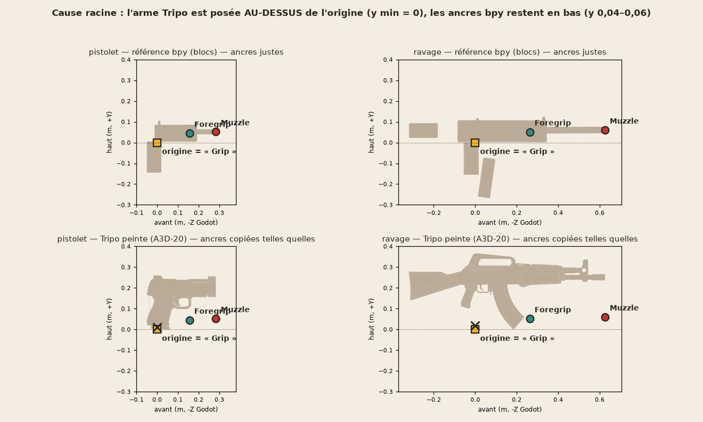

# 12 — Viewmodel v2 : mains, armes et animations « façon Far Far West »

Date : 2026-09-25. Auteur : architecte (Opus). Statut : plan verrouillé, prêt à importer (tâches FP-10 à FP-20, §8).
Déclencheur : verdict de playtest du 2026-09-25 — « armes mal placées dans les mains, pas d'animation de
rechargement, armes mal texturées ; regardez Far Far West ; un prototype bon, jouable, fiable, une seule carte ».

## 0. En cinq lignes

1. **La cause racine est mesurable, ce n'est pas une affaire de goût.** Les armes Tripo peintes ont été posées
   *au-dessus* de leur origine, alors que les ancres (poignée, garde-main, bouche) ont été recopiées de l'ancienne
   arme en blocs. Résultat : la main droite serre le vide 10 à 15 cm sous la poignée, et la gauche flotte sous
   le chargeur (§1.1, image).
2. **Décision.** Un rig de bras FP unique (avant-bras + mains UAL, doigts articulés), animé dans Blender en espace
   caméra. L'IK est résolue et cuite dans Blender, contre la *vraie* géométrie de l'arme. On livre un GLB autonome
   par arme (bras + pièces mobiles + 7 clips), joué par un `AnimationPlayer`. Les couches procédurales existantes
   (sway, bob, ressort de recul) restent par-dessus.
3. **Les armes passent en contrat v2.** Origine = poignée. Repères posés sur la vraie surface : Grip, Foregrip,
   Muzzle, Sight, MagWell, Eject. Pièces séparées : chargeur, culasse, barillet, pompe, levier. Les textures sont
   repeintes dans la palette §5.1 (plus de bleu).
4. **Priorité aux armes les plus vues.** Ravage et Pistolet d'abord : c'est le loadout de départ, donc 100 % des
   apparitions. Viennent ensuite Fracas et Magnum (le rechargement du revolver est la vitrine « western »), puis
   Rafale, Marqueur et Faucheur.
5. **0 crédit Tripo**, tout se fait dans Blender 5.2. Onze tâches en cinq vagues, avec une validation utilisateur
   sur le Ravage avant d'étendre aux autres armes.

---

## 1. Audit de l'existant (lecture seule)

### 1.1 Cause racine n° 1 : les ancres ne sont pas sur l'arme



*Figure : coupe latérale générée depuis les GLB (script de sondage, sans Blender). En haut, l'arme en blocs, dont
les ancres sont justes. En bas, l'arme Tripo peinte avec les mêmes ancres, copiées telles quelles. La croix
marque le pivot du gant droit.*

**Mesures sur les 7 GLB** (`assets/models/weapons/*.glb` contre `assets/models/weapons/_bpy/*.glb`) :

- **y minimal de la boîte englobante :** **0,000 pour les 7 armes peintes**, contre −0,145 (pistolet) à −0,267
  (Ravage) pour les armes bpy. L'arme Tripo est donc entièrement *au-dessus* de l'origine (« sol du
  tourne-disque » de Tripo Studio).
- **Ancres :** `Muzzle` est à y 0,052–0,060 et `Foregrip` à y 0,044–0,051. Or le canon Tripo est à y ≈ 0,20
  (pistolet) et ≈ 0,26 (Ravage).
  - La bouche est donc **15 à 20 cm sous le canon**, ce qui fait partir le flash et les traceurs du bas de l'arme.
  - Le Foregrip flotte **sous le chargeur**.
- **Origine, c'est-à-dire la prise de la main droite :**
  - pistolet : sous le talon de la crosse ;
  - Ravage : **12 cm sous la poignée**, dans le vide.
- **D'où ça vient :**
  - `tools/ai3d/manifests/painted_weapons.yaml:50-99` : `z_offset: 0.0` et `x_offset: 0.0` pour les 7 armes.
    Le manifeste lui-même demandait un réglage « à l'œil, jamais deviné à l'avance », jamais fait.
  - `tools/blender/fit_weapon_painted.py:68-88` : l'étape 6 aligne la boîte, puis l'étape 9 recopie les ancres
    bpy « telles quelles, JAMAIS recalculées ».
- **`tests/combat/test_weapon_models.gd:131`** (`test_muzzle_and_foregrip_anchors_match_the_backed_up_bpy_reference`)
  **verrouille l'erreur** : il exige que les ancres peintes soient égales aux ancres bpy. Ce plan rend ce test
  caduc ; il est remplacé en FP-19 (décision d'architecte, pas une réécriture pour faire passer le code).

### 1.2 Défauts qui s'ajoutent à la cause racine

| Constat | Où | Effet à l'écran |
|---|---|---|
| Les gants sont des enfants du modèle d'arme, qui est mis à l'échelle ×0,95 à ×1,70 selon l'arme | `scripts/player/ViewModel.gd:614-618` et `:628-639` | La taille des mains change d'une arme à l'autre (Fracas : mains ×1,70). |
| Gant droit ancré sur l'origine, avec un décalage y de 0,011–0,018 | `ViewModel.gd:703-711` | Le poing est sous la crosse, pas autour de la poignée. |
| Gant gauche ancré sur `lerp(Foregrip, Muzzle, 0.4) + (0.06, 0.03, 0)` | `ViewModel.gd:822-831` | Point arbitraire, sur une ligne qui passe dans le vide sous l'arme. |
| Mains = poings Tripo rigides, doigts fondus, sans squelette | `fit_gloves_painted.py`, `fp_gloves.glb` | Impossible de serrer une poignée, de saisir un chargeur, de pomper. Trois passes de tables de décalage par arme (FP-01 à FP-03) n'y ont rien changé. |
| « Sprint » est l'état de déplacement **par défaut** (`Idle.gd:31` : Sprint sauf si `walk` est maintenu) | `ViewModel.gd:517`, `:530`, `:543` | Dès qu'on bouge : roulis de 25° + recul de 16 cm, **y compris en tirant**. |
| Rechargement = creux sinusoïdal de 12 cm + translation du gant gauche | `ViewModel.gd:1043-1065`, `:992` | Aucun chargeur ne bouge : « pas d'animation de rechargement ». |
| Dégainer = montée de 0,28 s ; tirer = ressort seul ; aucun `AnimationPlayer` | `ViewModel.gd:1067-1080` | Aucune personnalité par arme. |
| Textures Tripo 2K « boueuses », un seul matériau, aucun liseré d'arête | `assets/models/weapons/*_basecolor.jpg` | Du **bleu** sur Rafale, Ravage, Fracas et Faucheur, alors que §5.1 l'interdit (confusion avec l'allié). |

### 1.3 Ce qui marche et qu'on garde

- **`ViewModel.AnimState`** : ressort de recul, sway, bob, blends, tous testés (`tests/combat/test_weapon_fx.gd`).
- **La compensation de FOV `_fov_scale()`** (`ViewModel.gd:539-564`). Mettre les axes x et y à l'échelle
  tan(fov/2)/tan(27°) équivaut exactement à une projection à 54° : c'est la règle §5.3 du viewmodel fixe à 54°.
- **Mesures de cadrage :** `set_mask_mode` + `tools/fp_shots.gd` pour CHK-28, CHK-29 et CHK-30.
- **Signaux de `Weapon`** (`fired`, `reload_started`, `weapon_changed`). Le rechargement est autoritaire serveur :
  `Inventory.start_reload`/`tick` remplit le chargeur à la fin de `reload_time`.
- **La source CC0 Quaternius UAL** (53 os `DEF-`, doigts compris), déjà utilisée par les agents. ⚠ Elle n'existe
  aujourd'hui que dans un dossier temporaire (`…/scratchpad/downloads/ual/ual.glb`) : FP-10 la copie dans le dépôt.

---

## 2. Recherche

Légende : **[V]** vérifié sur la source, **[O]** observé sur les captures Steam, **[I]** inférence.

### 2.1 Far Far West (Evil Raptor, Lyon, Unreal Engine 5, accès anticipé depuis le 28/04/2026)

- **[V] Mains flottantes sans bras, façon Rayman :** un seul jeu d'animations par arme, partagé entre vue FP et
  vue TP. C'est un choix de contrainte technique, qui justifie aussi les robots.
  Source : [PC Gamer](https://www.pcgamer.com/games/fps/developers-of-steam-next-fests-wildly-popular-robot-wizard-cowboy-shooter-say-its-cowboy-robots-are-also-wizards-because-magic-is-always-cool/),
  [wiki Evil Raptor](https://farfarwest.wiki.gg/wiki/Evil_Raptor).
- **[V] Les défauts de ce choix :** des joueurs trouvent que les mains flottantes « font jeu VR »
  ([discussion Steam](https://steamcommunity.com/app/3124540/discussions/1/838376331376995165/)).
- **[V] Personnalité par arme :**
  - revolver à 4 barillets ; pompe et Leveredge rechargés **cartouche par cartouche, interruptibles** ;
  - **appuyer sur R chargeur plein** joue une figure (moulinet du revolver) ;
  - les « Dual Revolvers » sont **lancés** au rechargement.
  - Sources : [Equipment](https://farfarwest.wiki.gg/wiki/Equipment), [Shotgun](https://farfarwest.wiki.gg/wiki/Shotgun),
    [Leveredge](https://farfarwest.wiki.gg/wiki/Leveredge), [Dual Revolvers](https://farfarwest.wiki.gg/wiki/Dual_Revolvers),
    [TV Tropes](https://tvtropes.org/pmwiki/pmwiki.php/Funny/FarFarWest),
    [discussion inspect](https://steamcommunity.com/app/3124540/discussions/1/833873623246789515/).
- **[V] Retour de la presse :** « une fluidité très agréable » (visée, tir, rechargement), « meaty and responsive ».
  Sources : [PC Gamer preview](https://www.pcgamer.com/games/fps/this-co-op-fps-steam-demo-feels-poised-to-do-for-spellslinging-robot-cowboys-what-deep-rock-galactic-did-for-space-dwarves/),
  [GamingTrend](https://gamingtrend.com/previews/far-far-west-preview/).
- **[V] Une animation trop envahissante a été corrigée :** le patch 0.1.1.3 raccourcit l'inspection du Quad
  Cylinder, qui « remplissait l'écran » ([wiki](https://farfarwest.wiki.gg/wiki/Quad_Cylinder)).
- **[O] Captures Steam** ([page](https://store.steampowered.com/app/3124540/)) :
  - arme en bas à droite, canon vers le réticule, environ 30 % de la hauteur d'écran ;
  - gants épais à manchette ;
  - formes « jouet » aux gros biseaux, **liserés d'usure peints sur les arêtes**, accents lumineux ;
  - **aucun contour noir** : la lecture passe par le contraste de valeur.
- **Vidéos pour mesurer image par image**, que l'agent de recherche n'a pas pu lire à cause du blocage YouTube :
  [All Weapons](https://www.youtube.com/watch?v=j7FMvTOTNfs), [Showcase 4K](https://www.youtube.com/watch?v=ngYEdaXLz9o).
  **Aucune durée de clip n'a pu être mesurée** : les durées du §3.5 viennent des principes du §2.2 et des
  `reload_time` du jeu.

**Ce qu'on reprend :**
- des mains épaisses et bien lisibles ;
- des pièces mobiles qui « vendent » chaque geste (barillet, pompe, culasse) ;
- R chargeur plein = inspection ;
- des rechargements qui ne traversent jamais le centre de l'écran ;
- des liserés peints sur les arêtes.

**Ce qu'on ne copie pas :**
- *Les mains flottantes par défaut.* Nos agents sont des humains et des animaux, la bible §4.7 impose les
  avant-bras UAL, et l'effet « VR » est un reproche documenté. Les mains flottantes restent un mode de repli du
  rig (§3.2), sans aucun clip à refaire.
- *L'absence de contour.* La bible impose une encre de 2 px.

### 2.2 Principes d'animation FP

- **Overwatch** (GDC 2017, Matt Boehm) : le rechargement du revolver de Cassidy tient en 45 images. Les bras
  s'étirent pour l'impact. Un rechargement qui bouchait la vue a été déplacé vers la main gauche.
  Sources : [Game Developer](https://www.gamedeveloper.com/art/video-conveying-character-via-first-person-animations-in-i-overwatch-i-),
  [Inven](https://www.invenglobal.com/articles/1187/how-overwatchs-first-person-animation-breathed-life-into-heroes).
- **Destiny** (GDC 2015, David Helsby) : garder le « couloir de combat » central libre et ne pas imiter le bob
  réel de la tête. Source : [archive](https://archive.org/details/GDC2015Helsby).
- **anim.works** : placer le temps fort de l'action le plus tôt possible ; un rechargement ne balaie jamais le
  centre. Source : [article](https://anim.works/1st-person-vs-3rd-person-animation/).
- **MoCap Online** : visée en 8 à 15 images à 60 i/s ; la visée réduit le sway de 50 à 80 %.
  Source : [guide](https://mocaponline.com/blogs/mocap-news/first-person-animation-guide).
- **Dev_Unallocated** : le sway traîne derrière la souris ; bob à deux fréquences ; recul en ressort avec
  contre-poussée ; la respiration s'efface avec la vitesse.
  Source : [article](https://www.devunallocated.com/projects/project-killhouse/procedural-weapon-animations-condensed).

### 2.3 Techniques Godot 4.5–4.7

- **Anti-clipping et FOV du viewmodel** ([PR #93142](https://github.com/godotengine/godot/pull/93142), Godot 4.5) :
  - `BaseMaterial3D` gagne `use_z_clip_scale`/`z_clip_scale` et `use_fov_override`/`fov_override` [V] ;
  - un shader personnalisé écrit `Z_CLIP_SCALE`, et `PROJECTION_MATRIX` hors `IN_SHADOW_PASS` [V]
    ([référence shaders](https://docs.godotengine.org/en/latest/tutorials/shaders/shader_reference/spatial_shader.html)) ;
  - le viewmodel reste dans les tampons de profondeur et de normales, donc l'encre InkPost continue de le voir [I] ;
  - **SubViewport rejeté** : l'arme sortirait des tampons de l'encre et de l'éclairage [V/I].
- **IK côté Godot :**
  - Godot 4.6 a livré TwoBoneIK3D et les autres `IKModifier3D` ([PR #110120](https://github.com/godotengine/godot/pull/110120)),
    **mais ils ignorent la rotation de la cible** [V] ;
  - `SkeletonIK3D` est déprécié ([doc](https://docs.godotengine.org/en/stable/classes/class_skeletonik3d.html)) [V] ;
  - ⇒ **pas d'IK à l'exécution** : c'est justement l'endroit où les trois échecs de `fp_arms` s'étaient produits.
- **Animation :**
  - `AnimationPlayer.play(name, custom_blend, custom_speed)` [V] ([doc](https://docs.godotengine.org/en/stable/classes/class_animationplayer.html)) ;
  - les clips dont le nom commence ou finit par `loop` ou `cycle` sont importés en boucle [V]
    ([doc import](https://docs.godotengine.org/en/stable/tutorials/assets_pipeline/importing_3d_scenes/node_type_customization.html)).
- **Blender 5.x :**
  - actions à slots (API 4.4) ; `action.fcurves` a été retiré en 5.0 [V]
    ([4.4](https://developer.blender.org/docs/release_notes/4.4/upgrading/slotted_actions/), [5.0](https://developer.blender.org/docs/release_notes/5.0/python_api/)) ;
  - l'exporteur glTF, en mode **Actions**, exporte chaque action poussée dans le NLA, avec « Deformation Bones
    Only » et « Reset pose bones between actions » [V]
    ([doc exporteur](https://github.com/KhronosGroup/glTF-Blender-IO/blob/main/docs/blender_docs/scene_gltf2.rst)).

### 2.4 Code et assets libres

| Source | Licence | Verdict |
|---|---|---|
| [Jeh3no Simple FPS Weapon System](https://github.com/Jeh3no/Godot-simple-FPS-weapon-system) | MIT | Motifs de sway et bob seulement ; on écarte son SubViewport. |
| [vi4hu procedural recoil](https://github.com/vi4hu/godot-procedural-recoil) | MIT | Référence ; notre ressort `AnimState` suffit. |
| [Chaff Games FPS Template](https://github.com/chafmere/Godot4-FPS-Template) | MIT / CC0 | Référence d'architecture, rien à importer. |
| [GDQuest FPS arms](https://github.com/gdquest-demos/godot-4-FPS-arms) | code MIT, **art CC-BY-NC-SA** | **Écarté** : art non commercial, incompatible avec un F2P à cosmétiques. |
| [OGA « fps arms (rigged only) »](https://opengameart.org/content/fps-arms-rigged-only) | CC0 | Référence de structure IK ; style réaliste, maillage non retenu. |
| Sketchfab FP hands (CC-BY) | CC-BY 4.0 | Écarté : style réaliste, crédits multiples. |
| [Quaternius UAL](https://quaternius.com/packs/universalanimationlibrary.html) | CC0 | **Retenu** : déjà le squelette commun des agents, bible §4.7. |

---

## 3. Décision

### 3.1 L'approche retenue

**Un rig de bras FP unique, animé dans Blender en espace caméra**, avec l'IK *résolue et cuite dans Blender* contre
la vraie géométrie de l'arme. Chaque arme devient **un GLB autonome** `assets/models/fp/fp_<id>.glb`
(bras + pièces de l'arme skinnées + 7 clips), accompagné d'un fichier `fp_<id>.json` (événements, repères,
pose de hanche). En jeu, un `AnimationPlayer` est piloté par un animateur pur, `ViewModelAnimator`, et les
couches procédurales existantes s'appliquent par-dessus.

**Pourquoi cette approche tient là où les trois essais `fp_arms` ont échoué :**
- **Pas de pose calculée en jeu.** Les échecs venaient d'une pose calculée dans Godot (`FP_Hold`, bras tendus,
  `solve_grip_transform`). Ici, les mains sont posées **dans Blender, sur les repères de l'arme réelle**, et le
  résultat est vérifié par des mesures géométriques automatiques (§3.6).
- **Ce qu'on voit dans Blender est ce qu'on aura en jeu.** La caméra Blender est la caméra du jeu : 54°
  vertical, 16:9, mêmes axes. Les planches de contrôle Blender sont donc justes avant même Godot.
- **Mode de repli sans rien refaire.** Les mains sont animées via des contrôleurs en espace caméra : le mode
  « mains flottantes » (Far Far West) se réduit à masquer l'avant-bras et à ajouter une manchette. Tous les clips
  restent valables.

**Rejetés (une ligne chacun) :**
- *Mains flottantes par défaut* : effet VR reproché, et bible §4.7 (gardé comme mode A/B).
- *IK à l'exécution (TwoBoneIK3D 4.6)* : ignore la rotation de la cible, et c'est l'origine des échecs passés.
- *AnimationTree* : clips exclusifs par priorité, plus simples à tester sans rendu via un animateur pur.
- *SubViewport* : casse l'encre et la lumière.
- *Régénérer par Tripo* : payant, sans rig, doigts fondus.
- *Bras réalistes CC-BY* : hors style.

### 3.2 Rig de bras FP (FP-10)

**Axes et caméra.**
- Blender : X = droite, **Y = avant** (c'est −Z dans Godot), Z = haut. La caméra est à l'origine et regarde +Y.
- Caméra : `sensor_fit='VERTICAL'`, `angle_y` = 54°, rendu 1920×1080.
- La conversion d'axes reste celle de l'exporteur glTF, `export_yup=True` (le piège est déjà documenté dans
  `make_characters.py`).

**Os exportés (tous « deform »).**

| Groupe | Os |
|---|---|
| Racine | `fp_root` |
| Arme | `fp_weapon` |
| Pièces | `fp_mag`, `fp_slide`, `fp_bolt`, `fp_pump`, `fp_cylinder`, `fp_hammer` |
| Accessoire | `fp_prop`, pour le chargeur rapide ou la cartouche ; caché hors usage par une échelle de 0,001 |
| Bras UAL gardés tels quels | `DEF-upper_arm.L/R`, `DEF-forearm.L/R`, `DEF-hand.L/R`, `DEF-f_{index,middle,ring,pinky}.0{1,2,3}.L/R`, `DEF-thumb.0{1,2,3}.L/R` |

Les noms UAL sont conservés pour qu'ART-16 (bras par agent) garde le même squelette.

**Contrôleurs** (non exportés) :
- `ik_hand.L/R` : IK de chaîne 2 avec `use_rotation`, plus un pôle `pole_elbow.L/R` placé bas et vers l'extérieur ;
- `ctl_finger.*` pour les doigts.

**Maillage.** Avant-bras + mains + manche, dupliqués du mannequin UAL par os dominant (même technique `_build_shell`
que `make_characters.py`).
- Mains ×1,15 : c'est le plafond de la bible.
- Slots `fp_sleeve` (couleur-clé de l'agent assombrie, règle FP-03) et `fp_glove` (cuir `#6B4A2E`, bible §4.7),
  peints par `paint_bake.py`.
- Au plus 7 000 triangles.

**Épaules.** Le script place l'armature (translation seule, bornée) pour que, à la hanche, la main soit à 0,80–0,92
de la longueur du bras : le coude plie de 25 à 60°. Un étirement du bras est permis jusqu'à ×1,12 (principe
Overwatch). Les coudes restent hors du cadre.

**Poses de doigts** (préréglages) : `grip`, `trigger`, `support`, `open`, `pinch`, `flat`, plus **auto-prise**.
- Chaque articulation se replie par pas de 2° jusqu'au contact avec le maillage de l'arme, détecté par BVH
  (`find_nearest` < rayon de la phalange).
- Plafond de 95° par articulation.
- Déterministe.

**Mode `--arms-mode floating`** : suppression des faces d'avant-bras au-delà de 4 cm du poignet, et ajout d'une
manchette (anneau de 1 cm, couleur de manche).

### 3.3 Contrat « arme v2 » (FP-11)

**Entrée et sortie.**
- `rig_weapon_parts.py` part de `assets/models/weapons/_painted_v1/<id>.glb`, une copie de l'actuel faite une fois,
  pour garder une chaîne rejouable.
- Il écrit `assets/models/weapons/v2/<id>.glb`.
- Le v1 reste en service (vue TP, monde, ancien viewmodel) jusqu'à la bascule FP-19.

**Origine et échelle.**
- Origine = **Grip** : le centre de la poignée, là où la paume se referme, à la hauteur du pontet.
- Échelle uniforme fixée **par la poignée** : longueur de la poignée entre 0,10 et 0,13 m, pour une main ×1,15.
  Il n'y a plus d'échelle d'arme en jeu : c'est la distance à la caméra qui cadre.

**Repères** (empties, avec orientation) :

| Repère | Emplacement |
|---|---|
| `Grip` | L'origine. |
| `Foregrip` | Paume gauche, sous le garde-main, à 1,5 cm ou moins de la surface. Le nom est gardé pour la compatibilité. |
| `Muzzle` | Bout du canon réel, axe −Z. |
| `Sight` | Bord haut de la hausse, sur la ligne de visée. |
| `MagWell` | Haut du chargeur en place. |
| `Eject` | Fenêtre d'éjection, flanc droit. |

**Pièces** (`MeshInstance3D` distincts, origine au pivot, trous bouchés, matériau `<id>_painted` conservé) :

| Arme | Pièces |
|---|---|
| Pistolet | Body, Slide, Mag |
| Magnum | Body, Cylinder (pivot sur l'axe de la grue), Hammer |
| Rafale | Body, Mag |
| Marqueur | Body, Mag |
| Ravage | Body, Mag |
| Fracas | Body, Pump |
| Faucheur | Body, Bolt, Mag |

**Découpe** par boîtes, en coordonnées de l'arme, décrites dans `tools/ai3d/manifests/weapon_rigs.yaml`. Les boîtes
sont mesurées sur des **plans cotés** (vues orthographiques de profil, de dessus et de face, grille de 1 cm,
repères dessinés) produits par `weapon_blueprint.py`. Rien n'est deviné.

**Textures.** Si `assets/textures/weapons/<id>_albedo.png` existe (FP-12), il remplace l'image Base Color. Les UV
sont identiques.

### 3.4 Textures (FP-12) : repeindre sans changer les UV

Constat : Far Far West et la bible se lisent tous deux par le contraste de valeur et les liserés d'arête.

1. **Rappel à la palette §5.1**, dans l'espace OKLab :
   - chaque texel est tiré vers la couleur de palette la plus proche, force 0,6 ;
   - les bleus (teinte 190–250°, S > 0,35) sont remappés vers l'acier émaillé `#4A505C` ou le sarcelle
     `#2E8C86`, selon la clarté ;
   - des **zones forcées par boîte** (manifeste `weapon_repaint.yaml`) posent l'accent du §5.2 : garde-main rouge
     du Ravage, tromblon laiton du Fracas, carcasse crème et bague rouge du Pistolet, etc.
2. **Surcouches `paint_bake.py`** cuites **sur l'UV0 existante** (nouvelle option `--keep-uv`) :
   - liseré d'éclat sur les arêtes convexes ;
   - creux teintés ;
   - trait d'encre fin ;
   - coups de pinceau projetés en 3D, donc sans couture visible.
3. Sortie : `assets/textures/weapons/<id>_albedo.png` en 2048². Aucun fichier de géométrie n'est touché, ce qui
   permet de faire tourner cette tâche en parallèle de FP-10 et FP-11.

### 3.5 Chorégraphie (FP-13 à FP-18) : des données, pas du code d'animation

**Le DSL.** `tools/blender/fp_choreo/<famille>.py` décrit en pur Python, testable sans Blender, une liste de `Clip` :

| Champ | Contenu |
|---|---|
| `name`, `length`, `loop` | Identité et durée du clip. |
| `keys` | Par cible (`weapon`, `hand.L`, `hand.R`, `mag`, `slide`, `pump`, `cylinder`, `bolt`, `prop`) : `t` en **fraction** du clip, position et rotation relatives à la pose de hanche ou à un repère, et l'accélération (`ease`). |
| `fingers` | `(t, main, préréglage)`. |
| `attach` | `(t, pièce, parent)`, par exemple le chargeur qui passe de l'arme à `hand.L`. Les contraintes Child Of sont cuites à l'export. |
| `events` | `(t, nom)`. |

**Le générateur.** `make_fp_viewmodel.py` :
1. lit ce DSL, le manifeste `tools/ai3d/manifests/fp/<id>.yaml` et `reload_time`, pris **dans
   `resources/weapons/<id>.tres`** (jamais recopié à la main) ;
2. convertit en clés à 60 i/s ;
3. cuit l'IK ;
4. pousse chaque action dans le NLA et exporte en mode ACTIONS ;
5. écrit le JSON et un rapport de mesures.

**Clips (noms exacts) :** `idle_loop`, `run_loop`, `fire`, `draw`, `reload`, `reload_empty`, `inspect`.

- `reload` et `reload_empty` durent **exactement `reload_time`** (le serveur ne fait pas de distinction) : en jeu,
  la vitesse vaut 1,0, et reste recalculée si la config change.

**Principes appliqués à tous les clips :**
- anticipation ≥ 0,06 s en sens contraire ;
- temps fort tôt ;
- dépassement ≥ 10 % de l'amplitude, puis retour ;
- le couloir central 20 % × 20 % reste vide ;
- le chargeur **sort entièrement du cadre** (§5.3).

**Temps forts par famille** (fractions du clip ; durées = `reload_time` des `.tres`) :

**Fusil à chargeur** (Ravage 2,5 s, Rafale 2,1 s, Marqueur 2,4 s) :
- **`reload`** :
  - 0–0,07 : anticipation (roulis +6°, 1 cm vers le haut) ;
  - 0,07–0,20 : bascule (roulis −28°, tangage +8°, 4 cm vers la gauche et le bas) ; la main gauche quitte le
    garde-main ;
  - **0,20 `mag_out`**, puis le chargeur sort par le bas à gauche, hors cadre avant 0,34 ;
  - 0,34–0,56 : main gauche hors cadre ;
  - 0,56–0,72 : retour avec le chargeur ;
  - **0,76 `mag_in`** : secousse de 1,5 cm et 3° ;
  - 0,80 `mag_tap` ;
  - 0,84–1,0 : retour à la hanche, dépassement de roulis +3° ; la main gauche est sur le garde-main à 0,92.
- **`reload_empty`** : pareil, plus la main gauche sur le levier d'armement, `bolt` à 0,88.
- **`fire`** : 0,16 s (Rafale 0,12 s). Pic de recul à 2 images (1,2 cm vers l'arrière, 1,5° vers le haut), retour à
  0,12 s avec 15 % de dépassement. Le gros du recul reste le ressort procédural (§3.6).
- **`draw`** : 0,40 s. Départ en bas à droite (−25 cm, roulis −35°, tangage −20°), dépassement de +4° à 0,70,
  `equip` à 0,05.
- **`inspect`** : 3,0 s. Lacet de +35° pour montrer le flanc gauche, puis roulis de −40° pour le flanc droit ; la
  main gauche touche le chargeur ; `inspect_touch` à 0,5.
- **`idle_loop`** : 3,0 s, respiration de 2 mm et 0,4°.
- **`run_loop`** : 0,66 s, soit un cycle à 6 m/s ; la vitesse est proportionnelle à v/6. **Ce clip remplace le
  roulis de 25°** : tangage −8°, roulis 10° vers la gauche, arme abaissée de 3 cm.

**Pistolet** (1,5 s) :
- `fire` : 0,15 s. La culasse recule de 2,5 cm à 0,03 s et revient à 0,09 s.
- `reload` : `mag_out` à 0,18, puis le chargeur **tombe** par gravité et sort du cadre à 0,35 ; main gauche hors
  cadre de 0,25 à 0,50 ; `mag_in` à 0,70.
- `reload_empty` : en plus, `slide_release` à 0,82 (pouce sur l'arrêtoir).
- `draw` : 0,35 s.
- `inspect` : 2,4 s, avec une vérification de chambre (culasse reculée de 1 cm).

**Magnum** (2,3 s, la vitrine western) :
- `fire` : 0,40 s. Relevé de 12°, le chien s'abat.
- `reload` :
  - `cylinder_open` à 0,10 (poussée du pouce gauche, le barillet bascule vers la gauche) ;
  - canon vers le ciel à 60° de 0,18 à 0,30 ; `eject` à 0,28 ;
  - canon vers le bas ;
  - chargeur rapide (`fp_prop`) amené depuis le bas à gauche ; `speedloader_in` à 0,62 ; il est jeté hors cadre
    à 0,68 ;
  - **`cylinder_close` d'un coup de poignet à 0,76** : roulis −30° puis retour ;
  - `hammer` à 0,88.
- `inspect` = **moulinet** de 1,2 s : 360° autour de l'index, `twirl` à 0,1 et à 0,9. C'est la figure de Far Far
  West, jouée sur R chargeur plein.

**Fracas** (2,6 s ; recharge complète côté serveur) :
- `fire` : 0,80 s, soit 1/cadence 1,2. Recul de 3 cm et 6°, **pompe** avec `pump_back` à 0,40 et `pump_fwd` à 0,56.
- `reload` :
  - roulis de +35°, la fenêtre d'alimentation tournée vers la caméra ;
  - **3 insertions** `shell_in` à 0,30, 0,48 et 0,66 (cartouche sur `fp_prop`, main gauche hors cadre entre deux) ;
  - retour sur la pompe de 0,72 à 0,80.
- `reload_empty` : en plus, un coup de pompe à 0,84–0,92.

**Faucheur** (3,4 s ; cadence 2,0) :
- `fire` : 0,50 s = l'intervalle de tir. Recul de 4 cm et 7°, puis la main droite actionne la culasse :
  `bolt_up` à 0,22, `bolt_back` à 0,30, `bolt_fwd` à 0,38, `bolt_down` à 0,42.
- `reload` : changement de chargeur façon fusil.
- `reload_empty` : en plus, un cycle de culasse.

**Liste fermée des événements** : `equip`, `mag_out`, `mag_in`, `mag_tap`, `bolt`, `slide_release`,
`cylinder_open`, `eject`, `speedloader_in`, `cylinder_close`, `hammer`, `shell_in`, `pump_back`, `pump_fwd`,
`bolt_up`, `bolt_back`, `bolt_fwd`, `bolt_down`, `twirl`, `inspect_touch`.

### 3.6 Contrat du GLB FP et côté Godot (FP-13, FP-14)

**`fp_<id>.glb` :**
- racine `fp_<id>` ;
- `Skeleton3D` (os du §3.2) ;
- maillages skinnés : `arms`, `wpn_body`, `wpn_<pièce>`, `prop` ;
- `AnimationPlayer` avec les 7 clips.

La pose de hanche est **cuite dans les clips**, en espace caméra : `REST_POS` et les tables d'échelle et de
décalage disparaissent.

**`fp_<id>.json` :**
```json
{ "version": 1, "id": "ravage", "family": "rifle", "fps": 60,
  "clips": { "reload": { "length": 2.5, "loop": false,
                         "events": [ { "t": 0.20, "name": "mag_out" }, { "t": 0.76, "name": "mag_in" } ] } },
  "sockets": { "Muzzle": { "bone": "fp_weapon", "origin": [0, 0, 0], "basis": [1,0,0, 0,1,0, 0,0,1] },
               "Sight": { "…": "…" }, "Eject": { "…": "…" } },
  "hip": { "weapon": { "origin": [0, 0, 0], "basis": [1,0,0, 0,1,0, 0,0,1] }, "sight_cam": [0, 0, 0] },
  "ads_depth": 0.28,
  "report": { "coverage_hip": 0.17, "muzzle_screen": [0.61, 0.60], "center_clear": true } }
```

Les repères sont reconstruits en jeu par un `BoneAttachment3D` + un `Marker3D` construits depuis le JSON, sans
dépendre de ce que fait l'importeur glTF des empties attachés aux os.

**Pile de nœuds en jeu :**
```
Camera3D
 └─ ViewModel (Node3D) — couches procédurales + compensation FOV (inchangée)
     └─ fp_<id> (instance) : Skeleton3D, maillages skinnés, AnimationPlayer, BoneAttachment3D(fp_weapon) → Muzzle/Sight/Eject
```

**`ViewModelAnimator`** (RefCounted, pur, testé). Il choisit le clip par priorité :

| Priorité | Clip | Déclencheur | Interrompu par |
|---|---|---|---|
| 1 | `draw` | `weapon_changed` | le tir, une fois `SWITCH_DELAY` (0,25 s) écoulé |
| 2 | `reload` / `reload_empty` | `reload_started` ; `reload_empty` si le chargeur est à 0 | changement d'arme, ou `Weapon.is_reloading()` redevenu faux avant 90 % → retour à `idle` en 0,10 s |
| 3 | `fire` | chaque `fired` (relancé à chaque tir) | — |
| 4 | `inspect` | R pressé chargeur plein, hors rechargement et hors visée : purement local, zéro réseau | tir, visée, changement d'arme |
| 5 | `run_loop` | vitesse > 3 m/s, ni tir ni visée depuis 0,4 s | tir ou visée, sortie en 0,06 s ou moins |
| 6 | `idle_loop` | par défaut | — |

- **Vitesse du rechargement** = durée du clip / `cfg.reload_time`.
- **Événements** : chacun est émis **une seule fois** par lecture, en comparant le temps précédent et le temps
  courant du clip (y compris avec une vitesse ≠ 1 et au bouclage). Signal : `anim_event(name, weapon_id)`.
- **Synchronisation serveur :**
  - le serveur reste seul maître (`Inventory.tick` remplit le chargeur à 100 % de `reload_time`) ;
  - l'animation n'est que cosmétique, et elle finit **dans la même image, à une image près**, que la prédiction ;
  - le compteur du HUD se remplit à la fin : `mag_in` à 0,70–0,80 est la norme des FPS ;
  - avancer le moment où les balles sont comptées (vers 60 %, comme Far Far West) serait une décision de gameplay
    hors périmètre, à ouvrir éventuellement en tâche E2.

**Couches procédurales** (`AnimState`, gardé) :
- sway ≤ 1,5° ; bob de 1,2 cm en marche et 2,5 cm en course (§5.3) ; ressort de recul existant ;
- sway et bob tombent à 20 % en visée, le recul à 40 % ;
- **nouveau :** creux à l'atterrissage de 3 cm × clamp(v_chute/8), qui revient en 0,25 s ;
- **supprimé :** le roulis de 25° lié à l'état « Sprint ».

**Visée (ADS).**
- `ads_transform(weapon_hip, sight_local, ads_depth)` est une fonction pure : elle amène `Sight` sur l'axe de la
  caméra, canon sur −Z.
- L'interpolation hanche → visée dure `cfg.ads_time`.
- Pendant le rechargement, l'inspection et le dégainer, la visée est forcée en position hanche.

**Sons.**
- `Audio` s'abonne à `anim_event` :
  - `mag_out` → `reload_out`, `mag_in` → `reload_in` ;
  - les autres événements → `equip` en attendant de vrais bruitages. À lister pour AUD : culasse, pompe,
    barillet, cartouche.
- L'ancien minuteur « reload_in différé » ne sert plus que pour les armes sans GLB FP.

**Caméra.** Petite impulsion (≤ 0,6°, 0,12 s) sur `mag_in`, `cylinder_close`, `pump_fwd` et `bolt_fwd`, via l'API
publique existante de `CameraShake`.

**Transition.** Tant qu'une arme n'a pas son `fp_<id>.glb`, l'ancien chemin (arme + gants) reste actif, mais
**sans** le roulis de 25°. Il est supprimé en FP-19.

### 3.7 Contrôles automatiques, dans Blender puis dans Godot

**Rapport Blender** : à **chaque image** de chaque clip, `make_fp_viewmodel.py` écrit `fp_<id>_report.json`.

| Contrôle | Seuil |
|---|---|
| Contact de la paume droite avec `Grip` | ≤ 1,5 cm, hors gestes de culasse |
| Contact de la paume gauche avec `Foregrip` | ≤ 1,5 cm en `idle`, `fire`, `run`, et aux deux extrémités du rechargement |
| Doigts dans l'arme | aucun à plus de 5 mm |
| Chargeur hors du cadre | ≥ 0,15 s entre `mag_out` et `mag_in` |
| Centre 20 % × 20 % | 0 sommet projeté (sauf `inspect`) |
| Tiers haut | 0 sommet à la hanche |
| Bouche du canon à l'écran | x 0,58–0,64, y 0,56–0,64 |
| Couverture à la hanche, bras compris | poing 7–15 %, SMG 11–19 %, fusil 13–21 %, pompe 15–23 %, sniper 12–23 % |

Sur la couverture : les bras ajoutent environ 3 à 6 points par rapport aux fourchettes « arme + gants ». Les
nouvelles fourchettes sont reportées dans `tokens.json` en FP-19 ; le lead amende la bible §5.3 (couverture et
course).

**En jeu** : `tools/fp_shots.gd --clips` fige l'`AnimationPlayer` (`ViewModel.debug_pose(clip, t)`) et capture la
hanche, la visée, la course, le rechargement à 25, 50 et 75 %, le dégainer à 50 % et le pic de tir.

### 3.8 Budget et priorités

- **Tripo : 0 crédit.**
  - Repli seulement si la repeinture FP-12 est refusée sur le Ravage : retexture Tripo, 20 crédits × 7 = 140
    crédits, sur un solde de 6 575 (`docs/assets/CREDITS.md`).
- **Performances :** au plus 7 000 triangles de bras + 8 000 d'arme ; un squelette d'environ 60 os ; un seul
  `AnimationPlayer`. Négligeable ; contrôlé par `perf_bench`.
- **Armes hors périmètre :** Éclair, Semeuse et Percuteur (pas de modèle).
- **Également hors périmètre :** douilles physiques, bruitages dédiés, recharge cartouche par cartouche côté
  serveur. Ce sont des candidats pour des tâches AUD, VFX ou E2.

---

## 4. Ordre d'exécution

| Vague | Tâches (en parallèle, fichiers disjoints) | Porte de passage |
|---|---|---|
| A | FP-10 rig de bras · FP-11 armes v2 · FP-12 repeinture | Planches : rig, plans cotés, avant/après textures |
| B | FP-13 générateur + Ravage | **Validation utilisateur** de la planche Ravage (bras / mains flottantes A/B) |
| C | FP-14 runtime Godot · FP-15 Pistolet · FP-16 Magnum · FP-17 Fracas · FP-18 Rafale/Marqueur/Faucheur | Ravage en jeu (FP-14) ; planches Blender des autres armes |
| D | FP-19 bascule et nettoyage (tout régénérer, v1 et gants supprimés) | fp_shots des 7 armes + suite complète + revue |
| E | FP-20 anti-clipping `Z_CLIP_SCALE` (P2) | Capture contre un mur |

## 5. Risques

1. **Des animations produites par script sans animateur humain peuvent sembler mécaniques.** Parades :
   - temps forts chiffrés (§3.5) et easing avec dépassement ;
   - planches de contrôle à chaque tâche ;
   - porte de validation utilisateur sur le Ravage avant de passer aux 6 autres armes.
2. **Déformation du maillage UAL aux fortes flexions des doigts** (effet « papillote »). Parades : flexion
   plafonnée à 95°, coques épaisses, mode mains flottantes en repli.
3. **API de Blender 5.2** (actions à slots, paramètres de l'exporteur). Parade : chaque script **sonde d'abord**
   l'API installée (`bpy.ops.export_scene.gltf.get_rna_type()`) et échoue avec un message clair.
4. **Découpe des pièces dans des maillages Tripo fondus** (coutures, trous). Parades : trous bouchés dans la
   couleur la plus sombre de la palette ; contrôle d'IoU de silhouette ≥ 0,98 contre le v1.
5. **Échelle non uniforme (k, k, 1) de la compensation FOV sur des maillages skinnés** : l'épaisseur du contour
   devient anisotrope. Parade : capture de contrôle ; remplacement par `PROJECTION_MATRIX` en shader possible
   plus tard (même PR #93142).
6. **Deux chemins cohabitent pendant les vagues B et C.** Parade : chacun est couvert par les tests ; le chemin
   legacy est supprimé en FP-19, avec une recherche « fp_gloves » qui doit renvoyer 0 résultat.
7. **Le chargeur réinséré (0,76) avant que le HUD ne se remplisse (1,0).** C'est l'usage dans les FPS ; la
   décision de gameplay reste à part (§3.6).

---

## 6. Tâches (à importer par le lead dans `tasks/backlog.yaml`)

```yaml
  - id: FP-10
    epic: E4
    title: Rig de bras FP unique (avant-bras + mains UAL à doigts articulés, auto-prise, épaules résolues, caméra 54°)
    priority: P0
    size: M
    model: sonnet
    agent: builder
    depends_on: []
    files: [tools/blender/fp_rig.py, tools/blender/fp_camera.py, tools/blender/tests/test_fp_rig.py, assets/incoming/quaternius/, assets/models/fp/fp_arms*, reports/checkpoints/2026-09-25_FP-10/]
    reads: [docs/research/12_viewmodel_v2.md, docs/STYLE_BIBLE.md, tools/blender/make_characters.py, tools/blender/paint_bake.py, THIRD_PARTY_LICENSES.md]
    notes: >-
      Voir docs/research/12_viewmodel_v2.md §3.2. Copier la source CC0 ual.glb (aujourd'hui dans un scratchpad
      temporaire, cf. make_characters.py SRC_GLB) vers assets/incoming/quaternius/ual.glb. fp_rig.py = bibliothèque +
      CLI : armature UAL (noms DEF- conservés) + os fp_root/fp_weapon/fp_mag/fp_slide/fp_bolt/fp_pump/fp_cylinder/
      fp_hammer/fp_prop, contrôleurs IK non exportés (ik_hand.L/R + pole_elbow.L/R, use_rotation), maillage avant-bras +
      mains ×1,15 + manche (technique _build_shell), slots fp_sleeve/fp_glove peints via paint_bake.py (CLI, lecture
      seule), préréglages de doigts et auto-prise BVH (pas de 2°, plafond 95°), solveur d'épaules (translation bornée,
      main à 0,80–0,92 de l'allonge, étirement ≤ ×1,12), option --arms-mode forearm|floating (manchette 1 cm).
      fp_camera.py : caméra Blender = caméra du jeu (Y avant = -Z Godot, sensor_fit VERTICAL, 54°, 16:9), projection
      monde->écran, rendu de planche contact (utilisé par FP-13..18). Sonder l'API bpy 5.2 installée avant de l'utiliser
      (actions à slots, action.fcurves supprimé en 5.0).
    acceptance: >-
      Deux exécutions de `blender -b -P tools/blender/fp_rig.py -- --out assets/models/fp/fp_arms.glb` donnent la même
      liste d'os et le même nombre de sommets ; le GLB contient les os du §3.2 (os deform uniquement, aucun contrôleur) ;
      bras ≤ 7 000 tris ; mains ×1,15 ± 0,02 par rapport à UAL ; cuir fp_glove à ΔE_OK ≤ 0,08 de #6B4A2E ; test pytest :
      pour une prise à (0,20 ; -0,20 ; -0,42) et un soutien à (0,02 ; -0,16 ; -0,70) en espace caméra Godot, les deux
      mains atteignent leur cible à ≤ 2 mm, coude plié de 25 à 60°, coudes projetés hors du cadre 16:9 ; auto-prise sur
      un cylindre r = 1,8 cm : chaque bout de doigt à 0,4–1,2 cm de la surface, aucune articulation > 95° ; modes
      forearm et floating exportés. captures: [planche caméra 54° tenant un cylindre, modes forearm et floating ;
      turntable de fp_arms.glb] dans reports/checkpoints/2026-09-25_FP-10/

  - id: FP-11
    epic: E4
    title: Armes v2 — origine = poignée, repères sur la vraie surface, pièces mobiles séparées (7 armes)
    priority: P0
    size: M
    model: sonnet
    agent: builder
    depends_on: []
    files: [tools/blender/rig_weapon_parts.py, tools/blender/weapon_blueprint.py, tools/blender/tests/test_rig_weapon_parts.py, tools/ai3d/manifests/weapon_rigs.yaml, assets/models/weapons/_painted_v1/, assets/models/weapons/v2/, tests/combat/test_weapon_models_v2.gd, reports/checkpoints/2026-09-25_FP-11/]
    reads: [docs/research/12_viewmodel_v2.md, tools/blender/fit_weapon_painted.py, tools/ai3d/manifests/painted_weapons.yaml, docs/STYLE_BIBLE.md, tests/combat/test_weapon_models.gd]
    notes: >-
      Cause racine du verdict (§1.1 du doc 12) : armes Tripo posées au-dessus de l'origine (AABB y min = 0 pour les 7),
      ancres bpy recopiées (Muzzle 15–20 cm sous le canon, origine 12 cm sous la poignée du Ravage). Copier une fois
      assets/models/weapons/<id>.glb vers _painted_v1/ (entrée figée, rejouable), puis produire v2/<id>.glb (§3.3) :
      translation + échelle uniforme par la poignée (0,10–0,13 m), repères Grip (origine)/Foregrip/Muzzle/Sight/MagWell/
      Eject orientés, pièces séparées (Pistolet Slide+Mag, Magnum Cylinder+Hammer, Rafale/Marqueur/Ravage Mag, Fracas
      Pump, Faucheur Bolt+Mag), origine au pivot, trous bouchés, matériau <id>_painted conservé ; si
      assets/textures/weapons/<id>_albedo.png existe (FP-12), il remplace la Base Color (UV identiques).
      weapon_blueprint.py rend profil/dessus/face orthographiques avec grille 1 cm et repères : les valeurs du manifeste
      se MESURENT sur ces plans, jamais devinées. Ne pas toucher aux GLB v1 ni à test_weapon_models.gd (bascule en FP-19).
    acceptance: >-
      Pour les 7 armes v2 : Grip à l'intérieur du maillage et à ≥ 1 cm de la surface ; Foregrip à ≤ 1,5 cm sous la
      surface du garde-main ; Muzzle à ≤ 1 cm du sommet le plus en avant du canon ; Sight ≥ 3 cm au-dessus de l'axe du
      canon ; axe Sight->Muzzle à ≤ 1,5° de -Z, haut = +Y ± 2° ; pièces présentes et nommées comme au §3.3 ; IoU de la
      silhouette de profil v2 contre v1 (transformée) ≥ 0,98 ; ≤ 8 000 tris ; tests pytest et
      tests/combat/test_weapon_models_v2.gd verts. captures: [planche des 7 plans cotés avec repères, 1 à 2 JPG] dans
      reports/checkpoints/2026-09-25_FP-11/

  - id: FP-12
    epic: E4
    title: Repeinture des 7 armes dans la palette §5.1 (plus de bleu, liserés d'arête, UV conservées)
    priority: P1
    size: M
    model: sonnet
    agent: builder
    depends_on: []
    files: [tools/blender/repaint_weapon.py, tools/blender/paint_bake.py, tools/blender/tests/test_repaint_weapon.py, tools/blender/tests/test_paint_bake.py, tools/ai3d/manifests/weapon_repaint.yaml, assets/textures/weapons/, reports/checkpoints/2026-09-25_FP-12/]
    reads: [docs/research/12_viewmodel_v2.md, docs/STYLE_BIBLE.md, docs/style/tokens.json, assets/models/weapons/]
    notes: >-
      §3.4 du doc 12. Entrée : texture et UV0 des GLB peints actuels (lecture seule). 1) rappel palette en OKLab (force
      0,6 vers la couleur §5.1 la plus proche ; bleus 190–250° S > 0,35 remappés acier #4A505C ou sarcelle #2E8C86) ;
      2) zones forcées par boîte (coordonnées du GLB actuel) pour les accents du §5.2 ; 3) surcouches paint_bake cuites
      sur l'UV0 existante (nouvelle option --keep-uv) : liseré d'éclat, creux teintés, trait fin, coups de pinceau 3D.
      Sortie PNG seulement (2048²), consommée par rig_weapon_parts.py (FP-11) puis régénérée en FP-19.
    acceptance: >-
      Pour les 7 textures : ≤ 2 % des texels opaques en teinte 190–250° avec S > 0,35 ; ≤ 1 % en teintes réservées
      300–355° et 105–145° ; 6 clusters dominants (k-means) chacun à ΔE_OK ≤ 0,10 d'une couleur §5.1 ou de son ombre
      (L × 0,6) ; luminance moyenne des texels de liseré ≥ celle des faces voisines + 0,06 ; hash de l'UV0 inchangé ;
      accents du §5.2 présents (garde-main rouge Ravage, tromblon laiton Fracas, carcasse crème Pistolet) ; tests
      pytest verts. captures: [turntables avant/après Ravage, Pistolet, Fracas en une planche] dans
      reports/checkpoints/2026-09-25_FP-12/

  - id: FP-13
    epic: E4
    title: Générateur de viewmodel FP par arme + chorégraphie fusil (Ravage — 7 clips cuits, contrôles automatiques)
    priority: P0
    size: L
    model: sonnet
    agent: builder
    depends_on: [FP-10, FP-11]
    files: [tools/blender/make_fp_viewmodel.py, tools/blender/fp_choreo/__init__.py, tools/blender/fp_choreo/common.py, tools/blender/fp_choreo/rifle.py, tools/blender/tests/test_fp_choreo.py, tools/blender/tests/test_make_fp_viewmodel.py, tools/ai3d/manifests/fp/ravage.yaml, assets/models/fp/fp_ravage*, reports/checkpoints/2026-09-25_FP-13/]
    reads: [docs/research/12_viewmodel_v2.md, tools/blender/fp_rig.py, tools/blender/fp_camera.py, assets/models/weapons/v2/, resources/weapons/ravage.tres, docs/STYLE_BIBLE.md]
    notes: >-
      §3.5–3.7 du doc 12. make_fp_viewmodel.py --id <id> : rig FP-10 + arme v2 (pièces skinnées rigides sur fp_weapon/
      fp_mag/...), mains posées sur Grip/Foregrip par IK + auto-prise, cadrage de hanche résolu (bouche x 0,61 / y 0,60),
      clips du DSL fp_choreo (fractions de clip, easing avec dépassement, attach Child Of cuits), reload_time LU dans
      resources/weapons/<id>.tres, clés à 60 i/s, IK cuite, push-down NLA, export glTF mode ACTIONS (deform uniquement,
      reset pose entre actions), fp_<id>.json (schéma §3.6) et fp_<id>_report.json (contrôles §3.7 à chaque image),
      planche contact via fp_camera.py. fp_choreo/common.py = DSL pur + validateurs (testables sans bpy). rifle.py =
      famille fusil à chargeur, paramétrée pour être réutilisée telle quelle par Rafale/Marqueur (FP-18). Produire aussi la
      planche en mode floating (A/B pour l'utilisateur). PORTE : le lead montre la planche à l'utilisateur avant la vague C.
    acceptance: >-
      fp_ravage.glb : Skeleton3D avec les os du §3.2, maillages skinnés arms/wpn_body/wpn_mag, AnimationPlayer avec
      idle_loop (3,0 s, boucle), run_loop (0,66 s, boucle), fire (0,16 s), draw (0,40 s), reload et reload_empty (2,5 s
      = reload_time ± 1 image), inspect (3,0 s) ; fp_ravage.json valide : mag_out ∈ [0,15 ; 0,30], mag_in ∈
      [0,70 ; 0,82], bolt (vide) ∈ [0,82 ; 0,92], tous les événements < 0,95 ; rapport : contact de la paume droite ≤
      1,5 cm à chaque image, de la paume gauche ≤ 1,5 cm en idle/fire/run et aux extrémités du rechargement, aucun doigt
      à plus de 5 mm dans l'arme, chargeur entièrement hors cadre pendant ≥ 0,15 s, 0 sommet dans le carré central
      20 % × 20 % pour tous les clips sauf inspect, 0 dans le tiers haut à la hanche, bouche à x 0,58–0,64 / y 0,56–0,64,
      couverture à la hanche 13–21 % ; anticipation ≥ 0,06 s, dépassement ≥ 10 % sur draw et mag_in, pic du tir à ≤ 2
      images ; tests pytest verts. captures: [planche contact 12 images (idle, pic de tir, draw 50 %, reload 10/25/40/55/
      70/85 %, reload_empty au bolt, run, inspect 50 %), même planche en mode floating] dans
      reports/checkpoints/2026-09-25_FP-13/

  - id: FP-14
    epic: E2
    title: Viewmodel v2 en jeu — AnimationPlayer + animateur pur, rechargement synchro serveur, sons sur événements, course sans roulis de 25°, visée par Sight
    priority: P0
    size: L
    model: sonnet
    agent: builder
    depends_on: [FP-13]
    files: [scripts/player/ViewModel.gd, scripts/player/viewmodel/, tests/player/test_viewmodel_animator.gd, tests/player/test_fp_viewmodel_contract.gd, tests/combat/test_weapon_fx.gd, scripts/combat/Weapon.gd, scripts/core/Audio.gd, tools/fp_shots.gd, reports/checkpoints/2026-09-25_FP-14/]
    reads: [docs/research/12_viewmodel_v2.md, assets/models/fp/fp_ravage.json, scripts/combat/Inventory.gd, scripts/player/CameraShake.gd, scripts/player/states/Idle.gd, docs/STYLE_BIBLE.md]
    notes: >-
      §3.6 du doc 12. Nouveau scripts/player/viewmodel/ViewModelAnimator.gd (RefCounted pur : priorités draw > reload >
      fire > inspect > run > idle, fondus, vitesse = durée du clip / cfg.reload_time, événements passés une fois par
      lecture) et FpViewmodelData.gd (lecture et validation du JSON, ads_transform pur). ViewModel.gd : si
      assets/models/fp/fp_<id>.glb existe, l'instancier (pose de hanche cuite, pas de REST_POS ni de tables par arme),
      piloter son AnimationPlayer, BoneAttachment3D(fp_weapon) + Marker3D Muzzle/Sight/Eject depuis le JSON
      (muzzle_global_position s'en sert), visée par ads_transform, R chargeur plein = inspect (local), creux
      d'atterrissage, debug_pose(clip, t) pour les captures, set_mask_mode sur les maillages skinnés, manche recolorée
      (règle FP-03) ; sinon chemin legacy INCHANGÉ sauf la suppression du roulis de 25° en « Sprint » (Idle.gd:31 : Sprint
      = déplacement par défaut) remplacée par une posture de course ≤ 12° qui sort en ≤ 0,06 s au tir ou à la visée.
      Weapon.gd : getters publics is_reloading() et current_mag() uniquement. Audio.gd : abonnement à
      ViewModel.anim_event (mag_out -> reload_out, mag_in -> reload_in, autres -> equip) ; minuteur différé gardé seulement
      pour les armes sans GLB FP. fp_shots.gd --clips. Les tests de AnimState dont le contrat change (pose sprint 25°)
      sont remplacés selon ce plan — le signaler dans le rapport.
    acceptance: >-
      gdUnit (tests/player/test_viewmodel_animator.gd) : reload_started avec chargeur à 0 -> reload_empty, sinon reload ;
      vitesse = durée / reload_time à ± 1 % pour 1,5 / 2,5 / 3,4 s ; fin du clip à ± 1 image de la fin de
      Inventory.tick simulé ; changement d'arme pendant le rechargement -> draw en 1 image ; is_reloading faux avant 90 %
      -> retour à idle en 0,10 s ; 10 tirs à 10 coups/s -> 10 relances de fire ; le tir interrompt inspect/run/draw
      (après 0,25 s) ; run seulement au-dessus de 3 m/s sans tir ni visée depuis 0,4 s ; chaque événement émis une fois
      pour une vitesse de 0,6 à 1,6 et au bouclage ; inspect jamais pendant un rechargement ou une visée.
      tests/player/test_fp_viewmodel_contract.gd : fp_ravage.glb + JSON conformes, Marker3D Muzzle à ≤ 1 cm du bout du
      canon v2. En jeu (fp_shots --clips) : Ravage à la hanche = 0 px dans le carré central et dans le tiers haut, bouche
      à x 0,58–0,64 / y 0,56–0,64 ; visée : haut de la hausse à y 0,50 ± 0,02, couverture ≤ 28 % ; reload à 50 % :
      chargeur absent du cadre ; traceur et flash partent du Marker3D Muzzle ; armes legacy : plus de roulis > 12° en
      mouvement ; perf_bench sans régression > 3 %. captures: [fp_shots Ravage : hanche, visée, course, reload 25/50/75 %,
      draw 50 %, pic de tir — 1 à 4 JPG] dans reports/checkpoints/2026-09-25_FP-14/

  - id: FP-15
    epic: E4
    title: Pistolet FP — culasse, chute du chargeur, arrêtoir sur rechargement à vide (7 clips)
    priority: P0
    size: M
    model: sonnet
    agent: builder
    depends_on: [FP-13]
    files: [tools/blender/fp_choreo/pistol.py, tools/blender/tests/test_fp_choreo_pistol.py, tools/ai3d/manifests/fp/pistolet.yaml, assets/models/fp/fp_pistolet*, reports/checkpoints/2026-09-25_FP-15/]
    reads: [docs/research/12_viewmodel_v2.md, tools/blender/make_fp_viewmodel.py, tools/blender/fp_choreo/common.py, resources/weapons/pistolet.tres]
    notes: >-
      Temps forts du §3.5 (Pistolet). make_fp_viewmodel.py et fp_choreo/common.py sont en LECTURE seule : si le DSL doit
      changer, s'arrêter et le signaler au lead (block). Chargeur qui tombe par gravité (keys + ease-in), culasse sur
      fp_slide à chaque tir, slide_release au pouce en reload_empty.
    acceptance: >-
      fp_pistolet.glb/.json : 7 clips (fire 0,15 s, draw 0,35 s, reload et reload_empty = 1,5 s ± 1 image, inspect 2,4 s) ;
      mag_out ∈ [0,12 ; 0,25], mag_in ∈ [0,62 ; 0,78], slide_release (vide) ∈ [0,78 ; 0,90] ; culasse reculée de 2,0 à
      3,0 cm au pic du tir ; rapport §3.7 conforme (couverture poing 7–15 %, contacts, carré central vide, chargeur hors
      cadre ≥ 0,15 s) ; tests pytest verts. captures: [planche contact 12 images] dans reports/checkpoints/2026-09-25_FP-15/

  - id: FP-16
    epic: E4
    title: Magnum FP — barillet basculant, chargeur rapide, fermeture au poignet, moulinet d'inspection
    priority: P1
    size: M
    model: sonnet
    agent: builder
    depends_on: [FP-13]
    files: [tools/blender/fp_choreo/revolver.py, tools/blender/tests/test_fp_choreo_revolver.py, tools/ai3d/manifests/fp/magnum.yaml, assets/models/fp/fp_magnum*, reports/checkpoints/2026-09-25_FP-16/]
    reads: [docs/research/12_viewmodel_v2.md, tools/blender/make_fp_viewmodel.py, tools/blender/fp_choreo/common.py, resources/weapons/magnum.tres]
    notes: >-
      Temps forts du §3.5 (Magnum), la vitrine « western ». Chargeur rapide = maillage procédural (6 cartouches laiton +
      molette) sur fp_prop, caché hors rechargement (échelle 0,001). inspect = moulinet de 360° autour de l'index sur
      1,2 s. DSL en lecture seule (sinon block).
    acceptance: >-
      fp_magnum.glb/.json : 7 clips (fire 0,40 s, reload et reload_empty = 2,3 s ± 1 image, inspect 1,2 s) ;
      cylinder_open ∈ [0,06 ; 0,16], speedloader_in ∈ [0,55 ; 0,70], cylinder_close ∈ [0,70 ; 0,82] ; rotation du
      barillet ≥ 70° hors de la carcasse entre open et close ; relevé du canon ≥ 50° pendant l'éjection ; moulinet = 360°
      ± 5° ; fp_prop invisible (échelle ≤ 0,001) hors [0,40 ; 0,72] ; rapport §3.7 conforme (poing) ; tests pytest
      verts. captures: [planche contact 12 images + 4 images du moulinet] dans reports/checkpoints/2026-09-25_FP-16/

  - id: FP-17
    epic: E4
    title: Fracas FP — pompe à chaque tir, insertion de cartouches, pompe au rechargement à vide
    priority: P1
    size: M
    model: sonnet
    agent: builder
    depends_on: [FP-13]
    files: [tools/blender/fp_choreo/shotgun.py, tools/blender/tests/test_fp_choreo_shotgun.py, tools/ai3d/manifests/fp/fracas.yaml, assets/models/fp/fp_fracas*, reports/checkpoints/2026-09-25_FP-17/]
    reads: [docs/research/12_viewmodel_v2.md, tools/blender/make_fp_viewmodel.py, tools/blender/fp_choreo/common.py, resources/weapons/fracas.tres]
    notes: >-
      Temps forts du §3.5 (Fracas). Recharge serveur complète (6) : le clip montre 3 insertions (cosmétique, dans la
      durée reload_time). Cartouche = maillage procédural (rouge + culot laiton) sur fp_prop. fire = 1/cadence (0,83 s
      max) avec la pompe sur fp_pump. DSL en lecture seule (sinon block).
    acceptance: >-
      fp_fracas.glb/.json : 7 clips (fire ≤ 0,83 s, reload et reload_empty = 2,6 s ± 1 image) ; pump_back ∈
      [0,32 ; 0,48] et pump_fwd ∈ [0,48 ; 0,64] dans fire ; 3 shell_in dans reload, espacés de ≥ 0,15 ; course de la
      pompe de 6 à 9 cm ; rapport §3.7 conforme (pompe 15–23 %) ; tests pytest verts. captures: [planche contact
      12 images] dans reports/checkpoints/2026-09-25_FP-17/

  - id: FP-18
    epic: E4
    title: Rafale, Marqueur (famille fusil) et Faucheur (culasse à verrou) en FP
    priority: P1
    size: M
    model: sonnet
    agent: builder
    depends_on: [FP-13]
    files: [tools/blender/fp_choreo/bolt.py, tools/blender/tests/test_fp_choreo_bolt.py, tools/ai3d/manifests/fp/rafale.yaml, tools/ai3d/manifests/fp/marqueur.yaml, tools/ai3d/manifests/fp/faucheur.yaml, assets/models/fp/fp_rafale*, assets/models/fp/fp_marqueur*, assets/models/fp/fp_faucheur*, reports/checkpoints/2026-09-25_FP-18/]
    reads: [docs/research/12_viewmodel_v2.md, tools/blender/make_fp_viewmodel.py, tools/blender/fp_choreo/common.py, tools/blender/fp_choreo/rifle.py, resources/weapons/rafale.tres, resources/weapons/marqueur.tres, resources/weapons/faucheur.tres]
    notes: >-
      Rafale et Marqueur réutilisent fp_choreo/rifle.py TEL QUEL (paramètres par manifeste : cadrage, durées lues dans les
      .tres) ; bolt.py = famille verrou du Faucheur (cycle de culasse dans fire, main droite qui quitte la poignée, puis
      changement de chargeur). Si rifle.py ou common.py doivent changer : block et signaler au lead.
    acceptance: >-
      3 GLB + JSON à 7 clips ; reload = reload_time ± 1 image (Rafale 2,1 s, Marqueur 2,4 s, Faucheur 3,4 s) ; fire du
      Faucheur = 0,50 s avec bolt_up < bolt_back < bolt_fwd < bolt_down dans [0,15 ; 0,90] et la paume droite revenue à
      ≤ 1,5 cm du Grip à la fin du clip ; rapport §3.7 conforme pour les 3 (SMG 11–19 %, fusil 13–21 %, sniper 12–23 %) ;
      tests pytest verts. captures: [une planche contact de 12 images par arme] dans reports/checkpoints/2026-09-25_FP-18/

  - id: FP-19
    epic: E4
    title: Bascule viewmodel v2 — tout régénérer, vue TP et armes au sol sur les armes v2, suppression des gants flottants v1
    priority: P1
    size: M
    model: sonnet
    agent: builder
    depends_on: [FP-12, FP-14, FP-15, FP-16, FP-17, FP-18]
    files: [scripts/player/ViewModel.gd, scripts/player/viewmodel/, tests/player/test_fp_gloves.gd, tests/player/test_viewmodel_pose_math.gd, tests/combat/test_weapon_models.gd, tests/combat/test_weapon_models_v2.gd, tests/combat/test_weapon_fx.gd, scripts/combat/Weapon.gd, scripts/player/ThirdPersonWeapon.gd, scripts/world/WorldWeapon.gd, assets/models/weapons/, assets/models/fp/, assets/models/characters/fp_gloves*, tools/blender/make_gloves.py, tools/blender/fit_gloves_painted.py, tools/fp_shots.gd, tools/char_ingame_shots.gd, tools/blender/viewmodel_shots.gd, docs/style/tokens.json, tools/review/style_check.py, reports/checkpoints/2026-09-25_FP-19/]
    reads: [docs/research/12_viewmodel_v2.md, docs/STYLE_BIBLE.md, tools/blender/rig_weapon_parts.py, tools/blender/make_fp_viewmodel.py]
    notes: >-
      1) Régénérer toute la chaîne avec les textures FP-12 : rig_weapon_parts.py (entrée _painted_v1/) puis
      make_fp_viewmodel.py pour les 7. 2) Mettre les v2 à la place des v1 dans assets/models/weapons/ (garder _bpy/ et
      _painted_v1/), Weapon.model_path_for inchangé. 3) ThirdPersonWeapon : l'origine est désormais la poignée
      (raccorder Grip à la main, recaler les réglages faits à l'œil) ; WorldWeapon : centrage de l'arme au sol.
      4) Supprimer le chemin legacy (gants, tables par arme, REST_POS) de ViewModel.gd, fp_gloves.glb et ses textures,
      make_gloves.py, fit_gloves_painted.py, test_fp_gloves.gd, et le test caduc
      test_weapon_models.gd::test_muzzle_and_foregrip_anchors_match_the_backed_up_bpy_reference (il verrouillait la cause
      racine : décision d'architecte, doc 12 §1.1). 5) tokens.json : coverage_hip avec les bras (§3.7) et posture de
      course ; corriger le bug d'échelle CHK-29 (pourcentage comparé à une fraction) dans style_check.py.
    acceptance: >-
      Aucune référence à fp_gloves, GloveR/GloveL, weapon_scale_for ou weapon_nudge_for dans le dépôt (grep = 0 hors
      docs/ et reports/) ; fp_shots --clips des 7 armes : CHK-28 = 0 px, tiers haut = 0 px, CHK-29 dans les nouvelles
      fourchettes, CHK-30 bouche x 0,58–0,64 / y 0,56–0,64, visée : hausse à y 0,50 ± 0,02, reload à 50 % : chargeur
      absent du cadre ; char_ingame_shots : Grip à ≤ 2 cm de la main droite du personnage pour les 7 ; armes au sol
      centrées sur leur anneau ; suite gdUnit complète verte ; run_review complet sans nouvel échec ; perf_bench sans
      régression > 3 %. captures: [fp_shots 7 armes hanche + reload 50 % en planche, char_ingame_shots TP, 1 à 4 JPG] dans
      reports/checkpoints/2026-09-25_FP-19/

  - id: FP-20
    epic: E2
    title: Anti-clipping du viewmodel contre les murs (Z_CLIP_SCALE par instance dans les shaders ink)
    priority: P2
    size: S
    model: sonnet
    agent: builder
    depends_on: [FP-19]
    files: [assets/shaders/ink_toon.gdshader, assets/shaders/ink_outline.gdshader, scripts/core/Cartoon.gd, scripts/player/ViewModel.gd, tests/rendering/test_viewmodel_zclip.gd, reports/checkpoints/2026-09-25_FP-20/]
    reads: [docs/research/12_viewmodel_v2.md, docs/STYLE_BIBLE.md]
    notes: >-
      Godot 4.5+ (PR godotengine/godot#93142) : `instance uniform float vm_zclip = 1.0;` puis `Z_CLIP_SCALE = vm_zclip;`
      dans le vertex des deux shaders (la valeur par défaut ne change rien au monde) ; ViewModel pose
      set_instance_shader_parameter("vm_zclip", 0.1) sur ses maillages. Ne pas toucher à PROJECTION_MATRIX (la compensation
      FOV par échelle reste en place). Vérifier que les ombres ne bougent pas.
    acceptance: >-
      Joueur collé à un mur (0,41 m) avec le Faucheur et le Fracas : 0 pixel de mur devant le viewmodel (capture
      masque) ; rendu du monde identique à ± 1 % de pixels (capture avant/après sur la même vue) ; ombres inchangées ;
      test vert. captures: [mur avant/après, Faucheur et Fracas] dans reports/checkpoints/2026-09-25_FP-20/
```

## 7. Sources de ce document

**Far Far West :**
- [PC Gamer, entretien Evil Raptor](https://www.pcgamer.com/games/fps/developers-of-steam-next-fests-wildly-popular-robot-wizard-cowboy-shooter-say-its-cowboy-robots-are-also-wizards-because-magic-is-always-cool/)
- [PC Gamer, preview de la démo](https://www.pcgamer.com/games/fps/this-co-op-fps-steam-demo-feels-poised-to-do-for-spellslinging-robot-cowboys-what-deep-rock-galactic-did-for-space-dwarves/)
- [GamingTrend](https://gamingtrend.com/previews/far-far-west-preview/)
- [page Steam](https://store.steampowered.com/app/3124540/)
- [actualités Steam (crédits)](https://steamcommunity.com/app/3124540/allnews/)
- [wiki : équipement](https://farfarwest.wiki.gg/wiki/Equipment)
- [wiki : Quad Cylinder](https://farfarwest.wiki.gg/wiki/Quad_Cylinder)
- [wiki : Dual Revolvers](https://farfarwest.wiki.gg/wiki/Dual_Revolvers)
- [discussion Steam : « VR »](https://steamcommunity.com/app/3124540/discussions/1/838376331376995165/)

**Principes d'animation FP :**
- [Overwatch GDC 2017](https://www.gamedeveloper.com/art/video-conveying-character-via-first-person-animations-in-i-overwatch-i-)
- [Destiny GDC 2015](https://archive.org/details/GDC2015Helsby)
- [anim.works](https://anim.works/1st-person-vs-3rd-person-animation/)
- [MoCap Online](https://mocaponline.com/blogs/mocap-news/first-person-animation-guide)
- [Dev_Unallocated](https://www.devunallocated.com/projects/project-killhouse/procedural-weapon-animations-condensed)
- [t3ssel8r, second-order dynamics](https://www.youtube.com/watch?v=KPoeNZZ6H4s)

**Godot :**
- [PR #93142](https://github.com/godotengine/godot/pull/93142)
- [BaseMaterial3D](https://docs.godotengine.org/en/stable/classes/class_basematerial3d.html)
- [Godot 4.6, notes de version](https://godotengine.org/releases/4.6/)
- [PR #110120](https://github.com/godotengine/godot/pull/110120)
- [AnimationPlayer](https://docs.godotengine.org/en/stable/classes/class_animationplayer.html)
- [personnalisation à l'import](https://docs.godotengine.org/en/stable/tutorials/assets_pipeline/importing_3d_scenes/node_type_customization.html)

**Blender :**
- [exporteur glTF](https://github.com/KhronosGroup/glTF-Blender-IO/blob/main/docs/blender_docs/scene_gltf2.rst)
- [actions à slots (4.4)](https://developer.blender.org/docs/release_notes/4.4/upgrading/slotted_actions/)
- [API Python 5.0](https://developer.blender.org/docs/release_notes/5.0/python_api/)

**Code et assets :**
- [Jeh3no](https://github.com/Jeh3no/Godot-simple-FPS-weapon-system)
- [vi4hu](https://github.com/vi4hu/godot-procedural-recoil)
- [GDQuest arms (écarté)](https://github.com/gdquest-demos/godot-4-FPS-arms)
- [OGA CC0 arms](https://opengameart.org/content/fps-arms-rigged-only)
- [Quaternius UAL](https://quaternius.com/packs/universalanimationlibrary.html)
