# Tableau des tâches

_Généré par `python tools/tasks/plan.py board` le 2026-09-25T14:39:22 — ne pas éditer à la main._

| Épopée | Avancement | Fait / Total |
|---|---|---|
| E0 — Outillage & process | `████████░░` | 19 / 24 |
| E1 — Stabilité & bugs | `█████████░` | 19 / 21 |
| E2 — Sensations de jeu | `██████░░░░` | 20 / 31 |
| E3 — Bots | `██████░░░░` | 21 / 34 |
| E4 — Direction artistique & 3D | `███████░░░` | 66 / 89 |
| E5 — Interface | `███████░░░` | 20 / 28 |
| E6 — Cartes | `████████░░` | 17 / 20 |
| E7 — Technique, perf & réseau | `███░░░░░░░` | 4 / 12 |
| E8 — Fun, méta & rétention | `█████░░░░░` | 12 / 22 |

## Plan en vagues (max 6 agents en parallèle)

**Vague 0** — `UX-03` Éditeur de viseur (couleur, contour, point central, lignes intérieures/extérieures, écart, opacité) avec aperçu et code importable/exportable · `BUG-20` Caméra — pas de saut d'angle à l'entrée en étourdissement · `ART-15` Personnalité d'animation par agent (démarche, idle, rebond, squash du corps) · `BOT-26` Visée v2 : offset qui dérive, erreur anisotrope, flick aléatoire, retard de perception, réaction ex-gaussienne · `GF-23` HUD munitions : états de la réserve, invites « [R] RECHARGER » et « CHANGER D'ARME », toast « +N » · `ART-79` Matières peintes à la main Wasteland (Nano Banana dans Tripo Studio, planches de 4 matières) · `ART-83` Bâtiments Wasteland peints par Tripo (concepts tirés de la référence, Smart Mesh, collisions boîtes) · `VFX-20` Effets peints des capacités des 6 agents (braise de Faux départ, cloche, glu, baume, révélation, grappin) + reel · `LD-43` Validation v4 — banc bots (TDM + HP), caméras de revue v4, build de playtest pour l'utilisateur · `UX-21` Icônes peintes des capacités et passifs (30) — découpe des planches Tripo, fond transparent, branchées dans le HUD et les écrans d'agents

**Vague 1** — `GATE-01` Jalon « jouable » : partie de 10 min contre bots sans bug bloquant ni erreur · `ART-74` Vague Tripo « Wasteland peint » — épaves et repères manquants, enseignes (plafond total 1 520 cr avec ART-79) · `BOT-03` Perception complète (multi-points, dégâts reçus, pas, mémoire, info d'équipe, latence équivalente) · `ART-72` Repères bpy (grue, derrick, château d'eau, pylône FUEL, ferme GAS, éolienne, clocher) + intégration de 3 sorties Tripo · `ART-73B` Pose des façades v2 sur les bâtiments de Wasteland (alignées sur les ouvertures Kit, skyline à 4 paliers) · `ART-23` Wasteland v3 de bout en bout (palette, repères, décalques, coulisses)

**Vague 2** — `ART-75` Sol et bords (sable, piste, craquelures, traces de pneus ; falaises en roches à strates ; lit du Ravin) · `ART-24` Cargo Ship v3 de bout en bout (conteneurs par quadrant, coque #7E251D, mer, coulisses) · `BOT-07` Sélecteur de comportement utility avec hystérésis + personnalités + moral · `GF-01` Compensation de lag serveur (historique des hitbox + rembobinage plafonné à 200 ms) · `UX-07` Accessibilité — sous-titres et indices visuels des sons (pas, capacités ennemies, bombe), échelle d'UI jusqu'à 2,0, défaut 1,5 sur Steam Deck · `BOT-11` Profils de difficulté data-driven (multi-axes, façon CS bot) + transparence

**Vague 3** — `BOT-06` Choix de position par score (attaque, peek, repli, tenue d'objectif) · `ART-77` Dressing par zone (≈ 190–230 instances, 25–35 décalques dont les pochoirs de callouts, enseignes), budgets de §d.5 · `GF-05` Recul lisible (motif qui s'accumule, récupération après l'arrêt du tir) · `UX-09` Premier lancement guidé (FTUE) — langue/luminosité/sensibilité (import cm/360 depuis Valorant/CS2/Overwatch)/couleur ennemie → tutoriel de mouvement → TDM vs bots RECRUE → écran « et maintenant ? » · `ART-50` Revue style du lot 1 — Wasteland, Cargo Ship, Vif, Verrou, HUD, notée et comparée · `MV-03` Stun de chute adouci (perte de contrôle courte, désactivé en Duel/Duo/SnD)

**Vague 4** — `BOT-27` Mouvement de combat : esquive 3 états à l'allure de marche, gestion de distance corrigée, tenue d'angle après perte de LOS · `BOT-08` Couche équipe (commandant) pour SnD/Hardpoint/TDM + carte de danger · `ART-78` Passe finale Wasteland (checklist bible §11, perf, playtest humain) · `GF-08` Shake caméra à trauma (Eiserloh) + punch FOV sur tir / dégâts reçus / kill · `ART-22` Props v3 des autres thèmes (port, adobe, ville, alpin, carrière, toits) · `TECH-10` Spike netfox sur Godot 4.7.2 (rollback du mouvement, tir hitscan rembobiné, 8 joueurs + bots)

**Vague 5** — `BOT-28` Suivi de chemin lissé et déblocage « humain » (fin de l'oscillation 5 Hz), escaliers/rampes de Wasteland · `GF-09` Réticule dynamique qui montre la dispersion réelle · `ART-25` Repeindre Port-Ferraille, Val-Poussière et Saint-Ombre en v3 · `ART-26` Repeindre Col du Vautour, La Fosse et Le Belvédère en v3 · `TECH-05` Encre du décor en CompositorEffect post-opaque (profondeur + normales), comparée au quad actuel · `ART-16` Gants et manches FP par agent

**Vague 6** — `BOT-10` Usage des capacités par règles de situation · `GF-14` Hitmarker prédit (option, façon 'damage prediction' CS2) · `TECH-07` LightmapGI stylisé (soleil BAKE_DYNAMIC, shadowmask Replace, sondes pour les persos, UV2) · `ART-37` Réglages et pause v3 (onglets inclinés, curseurs en fente, aperçu) · `TECH-04` Contour ennemi au stencil (coque unique, pas de coque interne, jamais d'X-ray) · `TECH-11` Filtre de visibilité anti-wallhack (fog of war serveur)

**Vague 7** — `BOT-29` Perception humaine ciblée : réflexe aux dégâts, ouïe pas/tirs bruitée, délai d'équipe, test toutes les 0,25 s (réduit BOT-03) · `MV-04` Retour d'atterrissage (dip caméra + son) et réglages de confort · `GF-25` Caisses du Comptoir sur le Relais de la Soif · `TECH-12` Préparer l'auth Steam côté serveur et épingler GodotSteam et Nakama pour 4.7.2 · `ART-61` Mesurer le bord du chapeau de verrou.glb contre l'enveloppe de tête (0,34 m) et corriger si besoin · `BUG-U02` Corriger le vol de rebind clavier par un clic souris dans OptionsMenu

**Vague 8** — `BOT-12` Achat SnD selon l'économie et la personnalité · `UX-15` Remap complet (capacités, armes 1–3, ramasser, lâcher, boutique, tableau), capture physique, échange en cas de conflit · `GF-26` Litige : l'arme principale tombe à la mort, ramassable avec ses munitions restantes · `LD-06` Audit de hauteur libre sur les routes de mouvement (≥ 3,2 m au-dessus des rampes de slide, gaps de dive et escaliers) · `LD-07` Carte-gym de métriques (portes, couloirs 1,6/2,5/3,5 m, couverts 0,9/1,1/1,4/1,8 m, marches 0,2/0,4/0,5 m, gaps 6/8/10 m, pentes 15/22/27/37°) · `NAR-03` Finir l'alignement sur LORE.md — bible §1/§4.5/§4.8/§9.6, commentaires des capacités, chemins vanne/roseau

**Vague 9** — `BOTFIX-01` Bot idle : scanner au lieu de figer la direction une fois l'objectif atteint · `TECH-06` Anticrénelage SMAA et SSAO en option, avec préréglages graphiques (dont Steam Deck) · `OPS-12` Mesurer CHK-42 (flash de bouche) depuis fp_shots dans style_check · `FUN-03` Progression locale (niveau de compte, maîtrise d'arme et d'agent, paliers de camos d'encre) — module pur + sauvegarde user://, prêt pour Nakama · `FUN-04` Micro-questionnaire post-match (fun 1–5 + 0–2 puces de frustration) et questionnaire de playtest long (7 points, items PlaytestCloud) · `ART-19` Planches concept IA des 6 agents et de 2 décors depuis le prompt kit (optionnel)

**Vague 10** — `BOTFIX-02` Jouer l'animation d'interaction pendant qu'un bot pose/désamorce la bombe · `BUG-U04` Ne plus écrire settings.cfg sur disque à chaque frame de glissé d'un slider · `TECH-09` Occlusion culling sur Cargo Ship seulement, gardé si la mesure le justifie · `FUN-01` Enchaînement de session — « Rejouer » relance le même salon en ≤ 20 s (vote ou compte à rebours de 10 s), bots gardés, équipes rééquilibrées · `FUN-07` Note OpenSkill par file (4v4, Duel, Duo) + équilibrage des équipes des salons personnalisés · `FUN-10` Défis quotidiens (3) et hebdomadaires (5) sans FOMO payant — objectifs de jeu (kills en slide, manches gagnées, zones tenues), récompense d'XP seulement

**Vague 11** — `FUN-02` Résumé de fin de match personnel (K/D/A, dégâts, précision, meilleure série, kills en mouvement, XP gagnée par ligne) sur une page à bandeau pinceau · `DOC-02` balance_table.gd — retirer la prose « sprint-to-fire » du dictionnaire WEAPON_LORE · `FUN-06` Kit de playtest — protocole hebdo, grille d'observation, script d'agrégation (questionnaires + indicateurs §3.3) en rapport Markdown · `FUN-08` Garde-fous de monétisation en code — aucun objet aléatoire payant, pas d'offre à minuteur, prix en euros, cosmétiques non échangeables, lint des teintes réservées sur les skins · `FUN-09` Premier match orienté — au premier lancement, la file par défaut est Arène TDM contre bots RECRUE, puis Duel ; R&D mise en avant après 3 matchs · `LD-04B` Callouts de Cargo Ship et Wasteland (mêmes règles que LD-04)

## E0 — Outillage & process

Revue automatique, sondes de gameplay, pipeline 3D, planification. Tout le reste s'appuie dessus.

| | Id | Tâche | Prio | Taille | Modèle | Dépend de |
|---|---|---|---|---|---|---|
| ✔ | `ART-00` | Bible de style v3 (Pinterest + planches) et jetons de style | P0 | L | opus | — |
| ✔ | `AUD-01` | Audit des bugs et du comportement des bots (docs/audit/) | P0 | M | sonnet | — |
| ✔ | `OPS-01` | Chaîne de revue automatique (run_review.ps1 + rapport HTML) | P0 | L | sonnet | — |
| ✔ | `OPS-02` | Sondes de gameplay (tir dans chaque état, modes, capacités) et captures d'interface | P0 | L | sonnet | — |
| ✔ | `OPS-02B` | Finir les sondes — captures d'interface, test de régression du tir, contrôle de manche corrigé | P0 | M | sonnet | — |
| ✔ | `OPS-03` | Boîte à outils Blender (toonkit, turntable, check_asset) et pipeline 3D | P0 | M | sonnet | — |
| ✔ | `OPS-04` | Planificateur de tâches par dépendances et workflow de sprint parallèle | P0 | M | sonnet | — |
| ✔ | `RES-01` | Recherche — sensations de tir, mouvement, IA des bots | P0 | M | opus | — |
| ✔ | `RES-02` | Recherche — level design, UI/UX, fun et rétention | P0 | M | opus | — |
| ✔ | `RES-03` | Recherche — pipeline 3D assisté par IA et technique Godot | P0 | M | opus | — |
| ✔ | `OPS-05` | Revue automatique en CI (tests de revue + sondes en mode rapide) | P1 | S | sonnet | OPS-01, OPS-02 |
| ✔ | `OPS-06` | Revue — bruit connu (debugger distant des tests, clé absente du test d'entraînement) et journal net_smoke propre | P1 | S | sonnet | — |
| ✔ | `OPS-07` | Planche turntable fidèle au jeu — cadrage complet, contraste, paliers d'ink_toon | P1 | S | sonnet | — |
| ✔ | `OPS-08` | Sondes d'intégration — headshot accroupi et carte de l'hôte au join (suites de GF-04 et BUG-02) | P1 | M | sonnet | OPS-02, OPS-02B |
| ✔ | `OPS-10` | bot_smoke paramétrable (durée, mode, carte, équipe) pour des matchs de bots de 10 minutes | P1 | S | sonnet | — |
| ✔ | `OPS-11` | Mesures manquantes du style — paires sol ombre/soleil (CHK-09), largeurs de silhouette et plis (CHK-10/11), perf_bench A/B | P1 | M | sonnet | — |
| ✖ | `OPS-13` | style_check — lisibilité du texte (CHK-32/33 cassés par la fragmentation des glyphes), lint de thème CHK-37, nuages CHK-13 | P1 | M | sonnet | OPS-11 |
| ✔ | `BUG-U01` | Coordonner Input.mouse_mode entre les overlays (Pause/Achat/fin de match) et gater les actions modales | P2 | M | sonnet | — |
| · | `BUG-U02` | Corriger le vol de rebind clavier par un clic souris dans OptionsMenu | P2 | S | sonnet | — |
| ✔ | `BUG-U03` | Rendre le menu Arsenal défilable au clavier/à la manette | P2 | S | sonnet | — |
| · | `BUG-U04` | Ne plus écrire settings.cfg sur disque à chaque frame de glissé d'un slider | P2 | S | sonnet | — |
| ✔ | `OPS-09` | Revue — noter automatiquement CHK-28/29/30 (cadrage du viewmodel) depuis fp_shots.json et les masques | P2 | S | sonnet | — |
| · | `OPS-12` | Mesurer CHK-42 (flash de bouche) depuis fp_shots dans style_check | P2 | S | sonnet | OPS-11, ART-40 |
| · | `DOC-02` | balance_table.gd — retirer la prose « sprint-to-fire » du dictionnaire WEAPON_LORE | P3 | S | sonnet | — |

## E1 — Stabilité & bugs

Zéro bug bloquant, zéro erreur Godot dans une partie de 10 minutes.

| | Id | Tâche | Prio | Taille | Modèle | Dépend de |
|---|---|---|---|---|---|---|
| ✔ | `BUG-01` | Mort subite quand un match à mort ou Hardpoint est à égalité à la fin du temps | P0 | S | sonnet | — |
| ✔ | `BUG-02` | Le client charge la carte et le mode de l'hôte, pas sa sélection locale | P0 | M | sonnet | — |
| ✔ | `BUG-03` | Nettoyage des objets de capacités et resynchronisation sur refus serveur | P0 | M | sonnet | BUG-04 |
| ✔ | `BUG-04` | Charge d'ultime plafonnée à 0,1 pt/s, gelée mort ou hors phase active, et recharge des capacités en début de manche | P0 | S | sonnet | — |
| ✔ | `BUG-06` | Fumée = vue seulement — rayons physiques des capacités et des armes au sol ignorent la couche VISION | P0 | S | sonnet | — |
| ✔ | `BUG-07` | Réapparition propre — réinitialiser chute, tampons de saut/roulade et slide_jumped | P0 | S | sonnet | — |
| ✔ | `BUG-08` | Sorties d'états sous plafond bas et délai de sécurité du plongeon | P0 | S | sonnet | — |
| ✔ | `BUG-09` | HUD — rafraîchissements inutiles et gardes manquantes (tableau des scores, munitions, capacités, manche, revanche) | P0 | S | sonnet | — |
| ✔ | `BUG-10` | Bombe — porteur déconnecté, attribution tardive, progression fantôme | P0 | S | sonnet | — |
| ✔ | `BUG-11` | Revanche — réinitialiser changement de côté et point Hardpoint | P0 | S | sonnet | — |
| ✔ | `BUG-12` | Duel/Duo — fin garantie d'une manche en impasse sur la zone | P0 | S | sonnet | — |
| ✔ | `BUG-13` | Réglages — appliquer l'échelle d'interface et borner sensibilités et FOV au chargement | P0 | S | sonnet | — |
| ▶ | `BUG-20` | Caméra — pas de saut d'angle à l'entrée en étourdissement | P0 | S | sonnet | — |
| ✔ | `BUG-22` | Capsule de collision partagée entre tous les joueurs — un accroupi rétrécit la hitbox de tous | P0 | S | sonnet | — |
| ✔ | `BUG-24` | Sonde — spawn_not_stuck réutilise un joueur fantôme de test_arena (faux « spawn coincé ») | P0 | S | sonnet | — |
| ✔ | `BUG-25` | Mode tactique — crédits envoyés aux bots par RPC (« unknown peer ID 9001 ») | P0 | S | sonnet | — |
| ✔ | `BUG-26` | Tir refusé par le serveur en sprint (sonde fire_in_state:Sprint) — régression apparue avec GF-03 | P0 | S | sonnet | GF-03 |
| · | `GATE-01` | Jalon « jouable » : partie de 10 min contre bots sans bug bloquant ni erreur | P0 | S | sonnet | OPS-01, OPS-02, AUD-01, BUG-K01, BUG-01, BUG-02, BUG-04, BUG-03, BUG-06, BUG-07, BUG-08, BUG-09, BUG-10, BUG-11, BUG-12, BUG-13, BUG-20, BUG-22, BUG-24, BUG-25, BUG-26, BUG-27 |
| ✔ | `BUG-27` | « No multiplayer peer is assigned » — GameMode/TDMMode appellent multiplayer.is_server() sans pair (écrans de match de ui_shots) | P1 | S | sonnet | — |
| ✔ | `BUG-K01` | Retirer proprement le délai sprint→tir devenu inopérant (config, feel, tests, doc) | P1 | S | sonnet | — |
| ✔ | `BUG-K02` | Audio — son de rechargement fantôme et vol de canal quand le pool sature | P2 | S | sonnet | — |

## E2 — Sensations de jeu

Tir, mouvement et retours (visuels, sonores, caméra) au niveau d'un shooter du commerce.

| | Id | Tâche | Prio | Taille | Modèle | Dépend de |
|---|---|---|---|---|---|---|
| ✔ | `GF-03` | Interpolation physique + caméra FPS lisse (position interpolée, rotation souris immédiate) | P0 | M | sonnet | RES-01 |
| ✔ | `GF-04` | Hitbox serveur fiables (tête dédiée + accroupi répliqué) | P0 | M | sonnet | RES-01 |
| ✔ | `GF-20` | Recharge complète au respawn en arène | P0 | S | sonnet | RES-01 |
| ✔ | `GF-21` | Réserves arène, règle de munitions par mode, boutique arène limitée au spawn, passage automatique à l'autre arme à sec | P0 | M | sonnet | GF-20, RES-01 |
| ✔ | `GF-27` | Boucles d'animation en jeu : `reset` coupé sur les boucles, hystérésis, STUN et INTERACT en boucle, vrai INTERACT, haut du corps selon la locomotion, rechargement calé sur `reload_time` | P0 | M | sonnet | RES-01 |
| ✔ | `GF-28` | Reels de revue qui bouclent : images par clip, un GIF par clip, contrôle LOOP_FAIL | P0 | S | sonnet | RES-01 |
| ✔ | `LD-40` | Blockout v4 de Wasteland (88 × 45 m, 3 couloirs façon COD, wagon central, toits non jouables) — tests v4 d'abord | P0 | L | sonnet | RES-01 |
| ✔ | `LD-41` | Marqueurs v4 — spawns d'équipe et 24 spawns TDM/HP, 3 zones Hardpoint (P3 au bord du canyon), 2 sites SnD, zone Duel, callouts | P0 | M | sonnet | LD-40, RES-01 |
| ▶ | `LD-43` | Validation v4 — banc bots (TDM + HP), caméras de revue v4, build de playtest pour l'utilisateur | P0 | M | sonnet | LD-41, LD-42, RES-01 |
| ✔ | `MV-01` | Montée et descente de marches (step-up/step-down via body_test_motion) | P0 | M | sonnet | RES-01 |
| · | `GF-01` | Compensation de lag serveur (historique des hitbox + rembobinage plafonné à 200 ms) | P1 | L | sonnet | GF-02, GF-04, RES-01 |
| ✔ | `GF-02` | Interpolation des joueurs distants (buffer de snapshots ~2 ticks) | P1 | M | sonnet | RES-01 |
| ✔ | `GF-04B` | Zone de tête = 0,40 m supérieurs de la capsule courante (debout comme accroupi) | P1 | S | sonnet | BUG-22, RES-01 |
| · | `GF-05` | Recul lisible (motif qui s'accumule, récupération après l'arrêt du tir) | P1 | M | sonnet | RES-01 |
| ✔ | `GF-06` | Traceurs du canon jusqu'au point d'impact + impact prédit localement | P1 | M | sonnet | RES-01 |
| ✔ | `GF-07` | Une confirmation par tir (plombs agrégés) avec drapeau kill envoyé par le serveur | P1 | S | sonnet | RES-01 |
| · | `GF-08` | Shake caméra à trauma (Eiserloh) + punch FOV sur tir / dégâts reçus / kill | P1 | S | sonnet | GF-03, RES-01 |
| · | `GF-09` | Réticule dynamique qui montre la dispersion réelle | P1 | S | sonnet | MV-02, RES-01 |
| ✔ | `GF-10` | Réaction visible de la cible (flash de hit cel-shadé + flinch) et micro-hitstop cosmétique au kill | P1 | M | sonnet | GF-07, RES-01 |
| ✔ | `GF-11` | Audio d'arme en couches + mix priorisé (hit/kill jamais masqués) | P1 | M | sonnet | GF-07, RES-01 |
| ✔ | `GF-12` | Buffer d'entrée pour armes semi-auto + clic à vide | P1 | S | sonnet | RES-01 |
| ✔ | `GF-13` | Dispersion en disque, dans le repère caméra | P1 | S | sonnet | RES-01 |
| · | `GF-14` | Hitmarker prédit (option, façon 'damage prediction' CS2) | P1 | S | sonnet | GF-07, GF-06, RES-01 |
| ✔ | `GF-22` | Cartouchière lâchée à la mort (arène) | P1 | M | sonnet | GF-21, RES-01 |
| ▶ | `GF-23` | HUD munitions : états de la réserve, invites « [R] RECHARGER » et « CHANGER D'ARME », toast « +N » | P1 | S | sonnet | UX-13, RES-01 |
| ✔ | `GF-24` | Bots et munitions : recharge tactique, passage au pistolet, détour vers cartouchière ou caisse | P1 | M | sonnet | GF-22, RES-01 |
| ✔ | `MV-02` | Imprécision de mouvement continue avec zone morte (façon Valorant) + ADS qui ralentit | P1 | M | sonnet | RES-01 |
| · | `MV-03` | Stun de chute adouci (perte de contrôle courte, désactivé en Duel/Duo/SnD) | P1 | S | sonnet | RES-01 |
| · | `MV-04` | Retour d'atterrissage (dip caméra + son) et réglages de confort | P1 | S | sonnet | RES-01 |
| · | `GF-25` | Caisses du Comptoir sur le Relais de la Soif | P2 | M | sonnet | GF-22, RES-01 |
| · | `GF-26` | Litige : l'arme principale tombe à la mort, ramassable avec ses munitions restantes | P2 | S | sonnet | GF-22, RES-01 |

## E3 — Bots

Des bots crédibles, réglables en difficulté, qui jouent l'objectif et utilisent leurs capacités.

| | Id | Tâche | Prio | Taille | Modèle | Dépend de |
|---|---|---|---|---|---|---|
| ✔ | `BOT-01` | Objectifs de mode stables, par bot et sans omniscience (TDM/SnD/Hardpoint/Duel) | P0 | M | sonnet | RES-01, AUD-01 |
| ✔ | `BOT-02` | Modèle de visée humain (angle, offset périodique, ressort-amortisseur, tir conditionné) | P0 | M | sonnet | RES-01, AUD-01 |
| ✔ | `BOT-04` | Discipline de combat (plus de sauts/plongeons aléatoires, strafe réactif, distance par arme, rafales) | P0 | S | sonnet | BOT-02, RES-01, AUD-01 |
| ✔ | `BOT-09` | Anti-blocage, évitement entre bots, strafe contraint à la navmesh | P0 | S | sonnet | RES-01, AUD-01 |
| ✔ | `BOT-20` | Banc « humanité » : métriques B1-B20, phase Hardpoint, Wasteland, traces de présence | P0 | M | sonnet | BOT-13, RES-01, AUD-01 |
| ✔ | `BOT-21` | Supprimer les gestes suspects immédiats (sauts/accroupis au hasard, métronome, ADS qui clignote, tangage figé, phases) | P0 | S | sonnet | RES-01, AUD-01 |
| ✔ | `BOT-22B` | Données « bot_knowledge » de Wasteland (14 zones, couloirs N/C/S, angles, perchoirs, couverts, hp_holds) + rebake BotSpots | P0 | M | sonnet | BOT-22, BUG-29, RES-01, AUD-01 |
| ✔ | `BOT-30` | Bots sur le banc Wasteland — occupation Hardpoint, changements de but, équilibre des lanes, premier contact | P0 | M | sonnet | BOT-24, LD-27, RES-01, AUD-01 |
| ✔ | `BUG-28` | Régression « les bots ne tirent plus » — patrouille vers le point le plus proche = leur propre spawn | P0 | S | sonnet | BOT-01, RES-01, AUD-01 |
| ✔ | `BUG-29` | Toit de FuelHouse (PF1) inatteignable — îlot de navmesh + rampe interne forcée par building2 (Kit) | P0 | S | sonnet | RES-01, AUD-01 |
| ✔ | `BUG-30` | tests/maps/test_wasteland_markers.gd rouge — timings de rotation et parité des zones Hardpoint A/C vs B sur la navmesh | P0 | S | sonnet | RES-01, AUD-01 |
| ✔ | `LD-42` | Données bots v4 — couloirs, hotspots, bot_knowledge (zones, angles, perchoirs, couverts, hp_holds), rebake BotSpots | P0 | M | sonnet | LD-40, RES-01, AUD-01 |
| · | `BOT-03` | Perception complète (multi-points, dégâts reçus, pas, mémoire, info d'équipe, latence équivalente) | P1 | M | sonnet | RES-01, AUD-01 |
| ✔ | `BOT-05` | Données tactiques de carte pré-calculées (cachettes, couverture par direction, spots de tir) | P1 | M | sonnet | RES-01, AUD-01 |
| ✔ | `BOT-05B` | Brancher BotSpots au démarrage de partie et précalculer les spots des 8 cartes | P1 | S | sonnet | BOT-05, RES-01, AUD-01 |
| · | `BOT-06` | Choix de position par score (attaque, peek, repli, tenue d'objectif) | P1 | M | sonnet | BOT-03, BOT-05, RES-01, AUD-01 |
| · | `BOT-07` | Sélecteur de comportement utility avec hystérésis + personnalités + moral | P1 | L | sonnet | BOT-03, RES-01, AUD-01 |
| · | `BOT-08` | Couche équipe (commandant) pour SnD/Hardpoint/TDM + carte de danger | P1 | L | sonnet | BOT-01, BOT-06, BOT-07, RES-01, AUD-01 |
| · | `BOT-10` | Usage des capacités par règles de situation | P1 | M | sonnet | BOT-07, RES-01, AUD-01 |
| · | `BOT-11` | Profils de difficulté data-driven (multi-axes, façon CS bot) + transparence | P1 | S | sonnet | BOT-02, BOT-03, RES-01, AUD-01 |
| · | `BOT-12` | Achat SnD selon l'économie et la personnalité | P1 | S | sonnet | RES-01, AUD-01 |
| ✔ | `BOT-13` | Banc de mesure automatique des bots (headless) avec seuils de régression | P1 | M | sonnet | BOT-01, BOT-02, BOT-09, RES-01, AUD-01 |
| ✔ | `BOT-22` | Connaissance de carte Wasteland (couloirs, angles, perchoirs, couvertures, positions HP) + rebake BotSpots au sol | P1 | M | sonnet | LD-24, RES-01, AUD-01 |
| ✔ | `BOT-22C` | Réintégrer PF1 (toit FUEL, atteignable depuis BUG-29) dans les perchoirs et le lien de chute des bots | P1 | S | sonnet | BOT-22B, RES-01, AUD-01 |
| ✔ | `BOT-23` | Objectifs TDM par couloir, sans convergence ni synchronisation (fin du piétinement au spawn) | P1 | M | sonnet | BOT-22, RES-01, AUD-01 |
| ✔ | `BOT-24` | Hardpoint : rôles zone / surveillance / pré-rotation sur les positions de Wasteland | P1 | S | sonnet | BOT-22, BOT-23, RES-01, AUD-01 |
| ✔ | `BOT-25` | Regard humain hors combat (BotLook : attention dirigée, pré-visée des coins, tangage, ressort plafonné) — absorbe BOTFIX-01 | P1 | M | sonnet | BOT-21, BOT-22, RES-01, AUD-01 |
| ▶ | `BOT-26` | Visée v2 : offset qui dérive, erreur anisotrope, flick aléatoire, retard de perception, réaction ex-gaussienne | P1 | M | sonnet | BOT-25, RES-01, AUD-01 |
| · | `BOT-27` | Mouvement de combat : esquive 3 états à l'allure de marche, gestion de distance corrigée, tenue d'angle après perte de LOS | P1 | M | sonnet | BOT-26, RES-01, AUD-01 |
| · | `BOT-28` | Suivi de chemin lissé et déblocage « humain » (fin de l'oscillation 5 Hz), escaliers/rampes de Wasteland | P1 | M | sonnet | BOT-27, RES-01, AUD-01 |
| · | `BOT-29` | Perception humaine ciblée : réflexe aux dégâts, ouïe pas/tirs bruitée, délai d'équipe, test toutes les 0,25 s (réduit BOT-03) | P1 | M | sonnet | BOT-28, RES-01, AUD-01 |
| · | `BOTFIX-01` | Bot idle : scanner au lieu de figer la direction une fois l'objectif atteint | P1 | S | sonnet | RES-01, AUD-01 |
| · | `BOTFIX-02` | Jouer l'animation d'interaction pendant qu'un bot pose/désamorce la bombe | P1 | S | sonnet | RES-01, AUD-01 |
| ✔ | `BOTFIX-03` | Aligner agent_radius/agent_height du bake navmesh sur des multiples de cell_size/cell_height | P1 | S | sonnet | RES-01, AUD-01 |

## E4 — Direction artistique & 3D

Appliquer la bible de style v3 aux personnages, armes, décors, shaders et effets.

| | Id | Tâche | Prio | Taille | Modèle | Dépend de |
|---|---|---|---|---|---|---|
| ✔ | `A3D-20` | Armes Tripo peintes en vue FP et TP (7 armes du jeu) — remplace les armes bpy en blocs | P0 | L | sonnet | ART-80, ART-00, OPS-03 |
| ✔ | `ART-01` | Environnement WYSIWYG (tonemap linéaire) et sonde de calibration look_probe | P0 | M | sonnet | ART-00, OPS-03 |
| ✔ | `ART-02` | ink_toon v3 — 2 bandes, ombre perceptuelle, masques vertex, lavis monde, reflet dur | P0 | M | sonnet | ART-01, ART-00, OPS-03 |
| ✔ | `ART-03` | Scoreur automatique de la checklist de style (style_check) branché sur la revue | P0 | L | sonnet | OPS-01, ART-00, OPS-03 |
| ✔ | `ART-04` | gen_textures v3 — albédos sans encre, 7 terrains, 4 trim-sheets, atlas de décalques | P0 | M | sonnet | ART-00, OPS-03 |
| ✔ | `ART-05` | Cartoon.gd v3 — palettes de carte v3, fabrique prop_uv, zéro grain, jetons générés | P0 | M | sonnet | ART-02, ART-00, OPS-03 |
| ✔ | `ART-06` | Ciel v3 et coulisses d'horizon (anneau de silhouettes) sur les 8 cartes | P0 | M | sonnet | ART-01, ART-05, ART-00, OPS-03 |
| ✔ | `ART-08` | ink_outline v3 — poids bas des personnages et table de largeurs par distance | P0 | S | sonnet | ART-00, OPS-03 |
| ✔ | `ART-11` | Verrou jouable — rigger le modèle Tripo sur le squelette commun, garder sa texture, l'intégrer au jeu | P0 | L | sonnet | A3D-08, ART-10, ART-14, ART-00, OPS-03 |
| ✔ | `ART-11V` | Vif jouable — même chaîne que Verrou (rig commun, texture conservée, intégration) | P0 | M | sonnet | ART-11, ART-00, OPS-03 |
| ✔ | `ART-11W` | Rig Tripo — poids copiés du mannequin UAL, axe du bras mesuré à la main, tête et accessoires verrouillés (6 agents re-riggés) | P0 | M | sonnet | ART-11Z, ART-00, OPS-03 |
| ✔ | `ART-11Z` | Rig Tripo — garder le repos T-pose d'origine (bras cassés dans les 46 animations) et re-rigger les 6 agents | P0 | M | sonnet | ART-11X, ART-00, OPS-03 |
| ✔ | `ART-70` | Look Wasteland (palette par quartier, sol #D2A46C réellement rendu, azimut solaire par carte, remplissage des intérieurs) | P0 | M | sonnet | ART-00, OPS-03 |
| ✔ | `ART-73` | Kit « bidonville » v2 en bpy — modules de façade détaillés (planches une à une, encadrements en retrait, bandeaux, chanfreins) | P0 | L | sonnet | ART-00, OPS-03 |
| ▶ | `ART-79` | Matières peintes à la main Wasteland (Nano Banana dans Tripo Studio, planches de 4 matières) | P0 | M | opus | ART-00, OPS-03 |
| ✔ | `ART-79B` | Raccord et remplacement des matières peintes (make_tileable.py, découpe des planches 2×2, gen_textures protégé) | P0 | M | sonnet | ART-00, OPS-03 |
| ✔ | `ART-80` | Import Tripo « peinture conservée » (ai_import_painted.py) + matériau toon texturé côté Godot | P0 | M | sonnet | ART-70, ART-00, OPS-03 |
| ✔ | `ART-82` | Coin beauté Grand-Rue — 30 m de rue au niveau final, capturé au cadrage de la référence | P0 | L | sonnet | ART-73, ART-79B, ART-80, ART-00, OPS-03 |
| ▶ | `ART-83` | Bâtiments Wasteland peints par Tripo (concepts tirés de la référence, Smart Mesh, collisions boîtes) | P0 | L | opus | ART-80, ART-00, OPS-03 |
| ✔ | `ART-84` | Gants FPS peints (Tripo, deux poses — prise et soutien) à la place des gants en blocs | P0 | M | opus | ART-00, OPS-03 |
| ✔ | `ART-85` | Sol procédural de Wasteland — relief doux, piste creusée à ornières, jupes de terre au pied des bâtiments, mélange peint | P0 | L | sonnet | ART-00, OPS-03 |
| ✔ | `ART-86` | Atmosphère Wasteland — soleil bas chaud, brume de profondeur et de hauteur, AO, étalonnage, ombres plus franches | P0 | M | sonnet | ART-00, OPS-03 |
| ✔ | `ART-87` | Kit de dressing — poteaux et câbles qui pendent, clôtures, grappes de props au pied des murs, débris et touffes | P0 | M | sonnet | ART-00, OPS-03 |
| ✔ | `ART-88` | Coin beauté v2 — sol, dressing dense, silhouette de ville au fond, côte à côte avec la référence | P0 | M | sonnet | ART-85, ART-86, ART-87, ART-00, OPS-03 |
| ✔ | `ART-89` | Installer les 4 grappes de décor Tripo (épave, clôture, étal, bric-à-brac) et remplacer les props « jouet » du dressing | P0 | M | sonnet | ART-00, OPS-03 |
| ✔ | `FP-01` | Recadrage FPS des 7 armes peintes (échelle, décalage, ADS) — l'arme ne mange plus l'écran | P0 | M | sonnet | A3D-20, ART-00, OPS-03 |
| ✔ | `FP-02` | Intégrer les gants FPS peints (ancrés sur Grip/Foregrip, manchette teintée à la couleur d'équipe) | P0 | S | sonnet | ART-84, FP-01, ART-00, OPS-03 |
| ✔ | `TOOL-01` | Peinture automatique Blender (paint_bake.py) — texture « peinte à la main » cuite sur n'importe quel modèle | P0 | L | sonnet | ART-00, OPS-03 |
| ✔ | `TOOL-01B` | Peinture automatique v2 — base en textures peintes projetées, arêtes éclaircies nettes, grain visible, valeurs claires | P0 | M | opus | TOOL-01, ART-00, OPS-03 |
| ✔ | `TOOL-02` | Générateur de roches, mesas à strates et bords de canyon stylisés (Blender) + peinture TOOL-01 | P0 | M | sonnet | ART-00, OPS-03 |
| ✔ | `TOOL-02B` | Roches v2 « taillées à la serpe » + mesas à terrasses + paroi de canyon, texture peinte de strates alignée à l'horizontale | P0 | M | opus | TOOL-01, TOOL-02, ART-00, OPS-03 |
| ✔ | `A3D-12` | ai_restyle v2 — texture Tripo quantifiée en slots Cartoon, pièces mobiles des armes séparées, marqueurs | P1 | L | sonnet | ART-00, OPS-03 |
| ✔ | `A3D-13` | Restyler la vague 1 Tripo (23 GLB) — ai_restyle v2, pièces mobiles des 10 armes, planches de revue | P1 | L | sonnet | A3D-12, ART-00, OPS-03 |
| — | `A3D-14` | Ravage de bout en bout — GLB restylé promu dans assets/models/weapons/ et branché en vue FP et TP | P1 | M | sonnet | A3D-13, A3D-09, ART-00, OPS-03 |
| — | `A3D-15` | ai_restyle — faire passer les 24 GLB Tripo de la vague 1 (watertight non bloquant, budget après biseau, boîte de pompe du Fracas) | P1 | M | sonnet | A3D-13, ART-00, OPS-03 |
| ✔ | `ART-04B` | Retirer les 17 textures peintes v2 — Cartoon.gd ne les précharge plus, puis gen_textures.py les supprime | P1 | S | sonnet | ART-04, ART-05, ART-00, OPS-03 |
| ✔ | `ART-07` | ink_edges v3 — plis par normale et largeurs de silhouette recalibrées | P1 | M | sonnet | ART-01, OPS-11, ART-00, OPS-03 |
| — | `ART-10` | Gabarit personnage v3 (tête = zone headshot, 1:4.5) et tenues des 6 agents | P1 | L | sonnet | A3D-04, ART-00, OPS-03 |
| — | `ART-11C` | Choc jouable — même chaîne que Vif (rig commun, texture conservée, intégration) | P1 | M | sonnet | ART-11V, NAR-02, ART-00, OPS-03 |
| — | `ART-11G` | Guet jouable — même chaîne que Vif (rig commun, texture conservée, intégration) | P1 | M | sonnet | ART-11V, NAR-02, ART-00, OPS-03 |
| — | `ART-11N` | Vanne jouable — même chaîne que Vif (rig commun, texture conservée, intégration) | P1 | M | sonnet | ART-11V, NAR-02, ART-00, OPS-03 |
| ✔ | `ART-11R` | Roseau jouable — même chaîne que Vif (rig commun, texture conservée, intégration) | P1 | M | sonnet | ART-11V, NAR-02, ART-00, OPS-03 |
| ✔ | `ART-11X` | Rig Tripo — pièces détachées (bords de chapeau, lunettes, basques) collées rigidement à l'os voisin ; Guet et Vanne jouables | P1 | M | sonnet | ART-11R, ART-00, OPS-03 |
| — | `ART-11Y` | Re-rig de Verrou et Choc avec le script corrigé par ART-11X (pièces flottantes, triangles étirés) | P1 | S | sonnet | ART-11X, ART-11C, ART-00, OPS-03 |
| ✔ | `ART-12` | Cadrage du viewmodel — FOV fixe 54°, arme à droite, carré central libre | P1 | M | sonnet | ART-00, OPS-03 |
| ✖ | `ART-13` | Les 10 armes v3 — archétype lisible, signature fantaisiste, emplacements d'autocollant | P1 | L | sonnet | A3D-03, ART-20, ART-00, OPS-03 |
| ✔ | `ART-14` | Couleurs d'agent v3 et rim de ciel des personnages | P1 | S | sonnet | ART-00, OPS-03 |
| ✖ | `ART-17` | Têtes-objets lot 2 — Choc (cloche), Roc (enclume), Guet (dé), Baume (aloès) | P1 | L | sonnet | ART-11, NAR-01, ART-00, OPS-03 |
| ✔ | `ART-20` | Stylekit v3 — masques vertex RGBA, biseaux par classe, normales pondérées, LOD | P1 | M | sonnet | A3D-02, ART-00, OPS-03 |
| — | `ART-21` | Props v3 Wasteland et Cargo Ship (skins, couverts, repères) en jouets biseautés | P1 | L | sonnet | ART-20, ART-04, A3D-03, ART-00, OPS-03 |
| · | `ART-23` | Wasteland v3 de bout en bout (palette, repères, décalques, coulisses) | P1 | L | sonnet | ART-02, ART-05, ART-06, ART-07, ART-21, ART-27, ART-00, OPS-03 |
| · | `ART-24` | Cargo Ship v3 de bout en bout (conteneurs par quadrant, coque #7E251D, mer, coulisses) | P1 | L | sonnet | ART-02, ART-05, ART-06, ART-07, ART-21, ART-27, ART-00, OPS-03 |
| ✔ | `ART-27` | Décalques de sites A/B et de zones d'objectif | P1 | S | sonnet | ART-04, ART-00, OPS-03 |
| ✔ | `ART-40` | Kit VFX peint — flash de bouche, traceurs, impacts, poussière, étincelles, décalques | P1 | L | sonnet | GF-06, ART-04, ART-00, OPS-03 |
| · | `ART-42` | Capacités v3 — objets d'agent, fumée cel opaque, reveal en bulle, anneau d'équipe | P1 | L | sonnet | ART-40, ART-20, ART-17, ART-00, OPS-03 |
| · | `ART-43` | Élimination « REMBALLÉ » — rembourrage, confettis, tête-objet qui roule | P1 | M | sonnet | ART-40, ART-17, ART-00, OPS-03 |
| · | `ART-50` | Revue style du lot 1 — Wasteland, Cargo Ship, Vif, Verrou, HUD, notée et comparée | P1 | S | sonnet | ART-03, ART-11, ART-23, ART-24, ART-35, ART-00, OPS-03 |
| ✔ | `ART-60` | Réaligner tokens.json, les seuils CHK-22/23 et style_check sur le gabarit personnages v3.1 | P1 | S | opus | ART-00, OPS-03 |
| ✔ | `ART-71` | Kit — escaliers et échelles à limons et contremarches, arêtes et trims de bâtiments, débords de toit | P1 | M | sonnet | ART-00, OPS-03 |
| · | `ART-72` | Repères bpy (grue, derrick, château d'eau, pylône FUEL, ferme GAS, éolienne, clocher) + intégration de 3 sorties Tripo | P1 | L | sonnet | ART-80, ART-00, OPS-03 |
| · | `ART-73B` | Pose des façades v2 sur les bâtiments de Wasteland (alignées sur les ouvertures Kit, skyline à 4 paliers) | P1 | M | sonnet | LD-20, ART-73, LD-43, ART-00, OPS-03 |
| · | `ART-74` | Vague Tripo « Wasteland peint » — épaves et repères manquants, enseignes (plafond total 1 520 cr avec ART-79) | P1 | M | sonnet | ART-80, ART-00, OPS-03 |
| · | `ART-75` | Sol et bords (sable, piste, craquelures, traces de pneus ; falaises en roches à strates ; lit du Ravin) | P1 | M | sonnet | LD-20, ART-70, ART-74, ART-79B, LD-43, ART-00, OPS-03 |
| ✔ | `ART-76` | Coulisses désert (jupe 40–150 m, anneau de mesas à strates, fond, repères directionnels) + nuages ≥ 6° | P1 | M | sonnet | ART-00, OPS-03 |
| · | `ART-77` | Dressing par zone (≈ 190–230 instances, 25–35 décalques dont les pochoirs de callouts, enseignes), budgets de §d.5 | P1 | L | sonnet | ART-72, ART-73, ART-74, ART-75, LD-21, ART-80, ART-73B, LD-43, ART-00, OPS-03 |
| · | `ART-78` | Passe finale Wasteland (checklist bible §11, perf, playtest humain) | P1 | M | sonnet | ART-77, LD-27, ART-76, ART-71, ART-82, ART-00, OPS-03 |
| ✔ | `ART-90` | Coin beauté — retirer les derniers props procéduraux (panneaux bleus, caisses unies) et rendre l'étal et le bric-à-brac visibles | P1 | S | sonnet | ART-89, ART-00, OPS-03 |
| ✔ | `CLEAN-01` | Tests de grain périmés (grain des personnages à 0, bible v3.1) et commentaire de police de ComicBurst | P1 | S | sonnet | ART-05, ART-00, OPS-03 |
| ✔ | `FP-03` | Manches FPS fines et sombres (tissu de veste, matériau à part) — fin des gros cônes orange | P1 | S | sonnet | FP-02, ART-00, OPS-03 |
| ▶ | `VFX-20` | Effets peints des capacités des 6 agents (braise de Faux départ, cloche, glu, baume, révélation, grappin) + reel | P1 | L | sonnet | AGT-09, ART-00, OPS-03 |
| — | `A3D-01` | Bible de style 3D (proportions chunky, biseaux, palette et kinds, budgets de tris, règles de silhouette, grille d'acceptation turntable) | P2 | S | sonnet | ART-00, OPS-03 |
| ✔ | `A3D-02` | Compléter la bibliothèque toonkit (biseau + normales pondérées, normales lissées pour contours, AO et courbure) | P2 | M | sonnet | A3D-01, OPS-03, ART-00 |
| ✔ | `A3D-03` | Migrer make_props, make_weapons et make_gloves vers stylekit | P2 | L | sonnet | A3D-02, ART-00, OPS-03 |
| — | `A3D-04` | Migrer make_characters vers stylekit et bibliothèque d'animations partagée (UAL1 + UAL2 CC0) | P2 | L | sonnet | A3D-02, ART-00, OPS-03 |
| — | `A3D-05` | Turntable Blender headless (EEVEE, 4 vues + planche PNG) pour la revue visuelle par Claude | P2 | S | sonnet | A3D-02, ART-00, OPS-03 |
| ✔ | `A3D-06` | Client API Tripo (repli Meshy) avec provenance et plafond de crédits | P2 | M | sonnet | ART-00, OPS-03 |
| — | `A3D-08` | Persos à tête d'objet (catalogue de têtes procédurales et IA restylées, attache à l'os head) | P2 | L | sonnet | A3D-04, A3D-07, ART-00, OPS-03 |
| ✔ | `A3D-09` | Garde-fou de licence et section IA (provenance obligatoire, liste noire Hunyuan, brouillon de déclaration Steam) | P2 | S | sonnet | A3D-06, ART-00, OPS-03 |
| — | `A3D-10` | (Optionnel, après accord de l'utilisateur) images conceptuelles locales via ComfyUI ROCm + FLUX.1 schnell ou SDXL | P2 | M | sonnet | A3D-01, ART-00, OPS-03 |
| ✔ | `A3D-11` | (Optionnel) configuration blender-mcp pour l'exploration, télémétrie coupée | P2 | S | sonnet | ART-00, OPS-03 |
| ✔ | `ART-09` | Heures du jour et descriptions des cartes alignées sur la bible | P2 | S | sonnet | ART-00, OPS-03 |
| ▶ | `ART-15` | Personnalité d'animation par agent (démarche, idle, rebond, squash du corps) | P2 | M | sonnet | ART-10, ART-00, OPS-03 |
| · | `ART-16` | Gants et manches FP par agent | P2 | M | sonnet | A3D-03, ART-10, ART-00, OPS-03 |
| · | `ART-22` | Props v3 des autres thèmes (port, adobe, ville, alpin, carrière, toits) | P2 | L | sonnet | ART-21, ART-00, OPS-03 |
| · | `ART-25` | Repeindre Port-Ferraille, Val-Poussière et Saint-Ombre en v3 | P2 | L | sonnet | ART-22, ART-23, ART-24, ART-00, OPS-03 |
| · | `ART-26` | Repeindre Col du Vautour, La Fosse et Le Belvédère en v3 | P2 | L | sonnet | ART-22, ART-23, ART-24, ART-00, OPS-03 |
| · | `ART-61` | Mesurer le bord du chapeau de verrou.glb contre l'enveloppe de tête (0,34 m) et corriger si besoin | P2 | S | sonnet | ART-00, OPS-03 |
| — | `A3D-07` | Script de restyle des sorties IA (nettoyage, budget, transfert de palette vers les kinds, normales, AO/courbure, échelle et origine) | P3 | L | sonnet | A3D-02, A3D-05, OPS-03, ART-00 |
| · | `ART-19` | Planches concept IA des 6 agents et de 2 décors depuis le prompt kit (optionnel) | P3 | M | sonnet | A3D-10, A3D-09, ART-00, OPS-03 |

## E5 — Interface

Toutes les interfaces refaites selon la bible de style, lisibles en 720p et 1080p.

| | Id | Tâche | Prio | Taille | Modèle | Dépend de |
|---|---|---|---|---|---|---|
| ✔ | `ART-30` | Jetons UI v3 et polices (vraies italiques Barlow, Bangers) dans Comic.gd | P0 | M | sonnet | ART-00, RES-02 |
| ✔ | `ART-31` | Kit de composants autocollant (bandeau v3, barre inclinée, carte, hexagone, bulle, trame) | P0 | L | sonnet | ART-30, ART-00, RES-02 |
| ✔ | `UX-01` | HUD relatif au joueur local (allié/ennemi calculés depuis l'équipe locale) + killfeed enrichi (arme/capacité, headshot, couleur de la victime) + VICTOIRE/DÉFAITE | P0 | M | sonnet | ART-31, UX-11, ART-00, RES-02 |
| ✔ | `UX-02` | FOV exprimé en horizontal 16:9 (défaut 103°, curseur 80–120), converti en vertical pour Camera3D ; effets de FOV dynamique plafonnés à +5° et désactivables | P0 | S | sonnet | ART-00, RES-02 |
| ✔ | `UX-08` | Menu principal en 1 clic — « JOUER » lance la dernière file (ou Arène vs bots au premier lancement) ; héberger/IP déplacés dans « Partie personnalisée » | P0 | M | sonnet | UX-12, ART-00, RES-02 |
| ✔ | `UX-12` | Kit de motion UI (UiFx) et Theme centralisé — transitions ≤ 250 ms cubiques, fondus seuls en mouvement réduit, styles des contrôles natifs dans ui_theme.tres | P0 | M | sonnet | ART-00, RES-02 |
| ✔ | `UX-13` | Libellés réels des touches partout (barre de capacités, sélection d'agent, menu Agents, invites) | P0 | S | sonnet | ART-00, RES-02 |
| ✔ | `UX-14` | Disposition clavier `Auto / AZERTY / QWERTY` (libellés seulement), migration des anciennes liaisons logiques, réinitialisation qui ne force plus le QWERTY, détection FR | P0 | M | sonnet | UX-13, ART-00, RES-02 |
| ✔ | `UX-20` | Portraits et vitrine des agents avec les vrais modèles peints (cartes de sélection, menu principal) | P0 | M | sonnet | ART-00, RES-02 |
| ▶ | `UX-21` | Icônes peintes des capacités et passifs (30) — découpe des planches Tripo, fond transparent, branchées dans le HUD et les écrans d'agents | P0 | M | sonnet | ART-00, RES-02 |
| ✔ | `ART-32` | Menu principal et écran Jouer v3 | P1 | M | sonnet | ART-31, UX-08, ART-00, RES-02 |
| · | `ART-33` | Sélection d'agent v3 (aplat couleur-clé, roster, hexagones, verrouillage) | P1 | M | sonnet | ART-31, ART-38, UX-11, ART-00, RES-02 |
| ✔ | `ART-34` | Achat et Arsenal v3 (cartes-armes, panneau de détail, états verrouillés) | P1 | M | sonnet | ART-31, UX-05, ART-00, RES-02 |
| ✔ | `ART-35` | HUD v3 (chips charbon, hexagones de capacité, échelle 21, marges de sécurité) | P1 | L | sonnet | ART-31, UX-01, ART-00, RES-02 |
| ✔ | `ART-36` | Tableau des scores, écran « REMBALLÉ » et fin de match v3 | P1 | M | sonnet | ART-31, UX-01, ART-00, RES-02 |
| · | `ART-38` | Portraits d'agents (rendus 3D détourés pour roster, tableau et killfeed) | P1 | S | sonnet | ART-17, ART-00, RES-02 |
| ✔ | `ART-41` | Retour de tir v3 — hitmarkers, confirmation de kill, onomatopées, chiffres de dégâts | P1 | M | sonnet | GF-07, ART-30, ART-00, RES-02 |
| ▶ | `UX-03` | Éditeur de viseur (couleur, contour, point central, lignes intérieures/extérieures, écart, opacité) avec aperçu et code importable/exportable | P1 | M | sonnet | UX-12, ART-00, RES-02 |
| ✔ | `UX-04` | Minimap (240 px à 1080p) dessinée depuis Layouts + nom de la zone courante sous la minimap | P1 | L | sonnet | LD-04, UX-12, ART-00, RES-02 |
| ✔ | `UX-05` | Menu d'achat rapide — grille catégories × armes, touches 1–5 puis 1–5, « Racheter » (R), revente avant le premier tir | P1 | M | sonnet | UX-12, ART-00, RES-02 |
| ✔ | `UX-06` | Options complètes — Affichage (mode fenêtre, échelle de rendu 50–100 %, vsync, limite d'images 60/144/240/illimitée, préréglage graphique dont Steam Deck), sensibilité ADS, maintien/bascule (accroupi, ADS, marche), secousses et head-bob, volumes voix/UI/ambiance, audio mono, afficher FPS/réseau, réinitialiser la page | P1 | L | sonnet | UX-02, UX-12, ART-00, RES-02 |
| · | `UX-07` | Accessibilité — sous-titres et indices visuels des sons (pas, capacités ennemies, bombe), échelle d'UI jusqu'à 2,0, défaut 1,5 sur Steam Deck | P1 | M | sonnet | UX-06, ART-00, RES-02 |
| · | `UX-09` | Premier lancement guidé (FTUE) — langue/luminosité/sensibilité (import cm/360 depuis Valorant/CS2/Overwatch)/couleur ennemie → tutoriel de mouvement → TDM vs bots RECRUE → écran « et maintenant ? » | P1 | M | sonnet | UX-02, UX-08, UX-12, ART-00, RES-02 |
| ✔ | `UX-10` | Système de ping contextuel (appui = marque au sol / ennemi / objet ; maintien = roue « ennemi ici », « j'y vais », « défendez », « besoin d'aide ») avec nom de zone | P1 | L | sonnet | LD-04, UX-12, ART-00, RES-02 |
| ✔ | `UX-11` | Sélection d'agent d'équipe — choix des coéquipiers visibles, composition par rôle, dernier agent présélectionné, aperçu de capacité animé | P1 | M | sonnet | UX-12, ART-00, RES-02 |
| · | `UX-15` | Remap complet (capacités, armes 1–3, ramasser, lâcher, boutique, tableau), capture physique, échange en cas de conflit | P1 | S | sonnet | UX-14, ART-00, RES-02 |
| · | `ART-37` | Réglages et pause v3 (onglets inclinés, curseurs en fente, aperçu) | P2 | M | sonnet | ART-31, UX-06, ART-00, RES-02 |
| ✔ | `ART-39` | Sons d'interface (tic, schlack, ka-ching, DING, fanfare) | P2 | S | sonnet | ART-00, RES-02 |

## E6 — Cartes

Cartes lisibles, métriques justes, flux de jeu équilibrés pour chaque mode.

| | Id | Tâche | Prio | Taille | Modèle | Dépend de |
|---|---|---|---|---|---|---|
| ✔ | `LD-20` | Blockout v3 de Wasteland (3 lanes, Grand-Rue à 3 coudes, Ravin à -1,2 m, GAS à 2 étages, accès des positions fortes, découpe en 5 fichiers) | P0 | L | sonnet | LD-26, ART-70, RES-02 |
| ✔ | `LD-23` | Choix de spawn (anti-empilement de 3 m, ancrage Hardpoint, pas de spawn dans ou en vue de la zone active) | P0 | M | sonnet | GF-20, RES-02 |
| ✔ | `LD-26` | Caméras de revue Wasteland (16 vues WL, ortho du dessus, sans HUD, aucune caméra dans la géométrie) | P0 | S | sonnet | RES-02 |
| ✔ | `LD-03` | 16–24 points de spawn neutres par map 4v4 (TDM/Hardpoint), répartis en bordure des 3 couloirs | P1 | M | sonnet | LD-02, RES-02 |
| ✔ | `LD-10` | Corriger les timings R&D mesurés par LD-05 (rotation A↔B 7–12 s, ≥ 3 entrées sur val_poussiere site B) | P1 | M | sonnet | LD-05, RES-02 |
| ✔ | `LD-11` | Arènes Duel/Duo — premier contact 2–4 s et lignes de vue ≤ 30 m (La Fosse, Belvédère) | P1 | M | sonnet | LD-09, LD-10, RES-02 |
| ✔ | `LD-21` | Marqueurs Wasteland (24 tdm_spawns + 8 d'équipe, 3 zones HP, 14 callouts, strong_positions) | P1 | M | sonnet | LD-20, RES-02 |
| ✔ | `LD-22` | MapSetup — zones construites selon le mode, NavigationLink3D depuis les données, emprise HP par zone | P1 | M | sonnet | LD-20, RES-02 |
| ✔ | `LD-24` | Données bots Wasteland (lanes, hotspots, hp_hold_points, hp_entries, nav_links, danger_spans) + rebake de BotSpots | P1 | M | sonnet | LD-21, LD-22, RES-02 |
| ✔ | `LD-25` | Buts de bots (patrouille par hotspots et lanes, tenue HP par points et entrées, préavis HP de 10 s) | P1 | M | sonnet | LD-24, RES-02 |
| ✔ | `LD-27` | Banc bots Wasteland (TDM 10 min et Hardpoint 10 min, Vétéran), seuils de régression | P1 | S | sonnet | LD-25, RES-02 |
| — | `LD-01` | Marche automatique (step-up) de 0,45 m dans le contrôleur joueur, bots compris | P2 | M | sonnet | RES-02 |
| ✔ | `LD-02` | Spawns dynamiques notés (distance ennemie, ligne de vue, alliés, mort récente) pour TDM et Hardpoint | P2 | M | sonnet | OPS-10, RES-02 |
| ✔ | `LD-04` | Callouts — volumes nommés par zone sur les 8 maps | P2 | M | sonnet | RES-02 |
| ✔ | `LD-05` | Mesure automatique des timings R&D (rotation A↔B, avance défenseur, entrées par site) | P2 | S | sonnet | RES-02 |
| · | `LD-06` | Audit de hauteur libre sur les routes de mouvement (≥ 3,2 m au-dessus des rampes de slide, gaps de dive et escaliers) | P2 | S | sonnet | RES-02 |
| · | `LD-07` | Carte-gym de métriques (portes, couloirs 1,6/2,5/3,5 m, couverts 0,9/1,1/1,4/1,8 m, marches 0,2/0,4/0,5 m, gaps 6/8/10 m, pentes 15/22/27/37°) | P2 | S | sonnet | LD-01, RES-02 |
| ✔ | `LD-08` | Outil de heatmap (kills, morts, différence) par map, depuis les événements de télémétrie | P2 | M | sonnet | FUN-05, OPS-10, RES-02 |
| ✔ | `LD-09` | Validation des arènes Duel/Duo (premier contact, routes vers la zone, symétrie) | P2 | S | sonnet | RES-02 |
| · | `LD-04B` | Callouts de Cargo Ship et Wasteland (mêmes règles que LD-04) | P3 | S | sonnet | LD-04, RES-02 |

## E7 — Technique, perf & réseau

144 i/s sur la machine de dev, pas de saccade de compilation de shaders, réseau robuste.

| | Id | Tâche | Prio | Taille | Modèle | Dépend de |
|---|---|---|---|---|---|---|
| ✔ | `TECH-01` | Activer le shader baker et préchauffer pipelines et effets au chargement de carte | P1 | M | sonnet | RES-03 |
| ✔ | `TECH-03` | Contour en coque sur normales lissées (statique CUSTOM0, skinné TANGENT) | P1 | M | sonnet | A3D-02, RES-03 |
| ✔ | `TECH-02` | Moniteurs de compilation de pipelines dans l'overlay F3 et seuils d'échec du benchmark | P2 | S | sonnet | RES-03 |
| · | `TECH-04` | Contour ennemi au stencil (coque unique, pas de coque interne, jamais d'X-ray) | P2 | M | sonnet | TECH-03, RES-03 |
| · | `TECH-05` | Encre du décor en CompositorEffect post-opaque (profondeur + normales), comparée au quad actuel | P2 | L | sonnet | TECH-02, RES-03 |
| · | `TECH-06` | Anticrénelage SMAA et SSAO en option, avec préréglages graphiques (dont Steam Deck) | P2 | M | sonnet | TECH-01, RES-03 |
| · | `TECH-07` | LightmapGI stylisé (soleil BAKE_DYNAMIC, shadowmask Replace, sondes pour les persos, UV2) | P2 | L | sonnet | A3D-03, RES-03 |
| ✔ | `TECH-08` | LOD, visibility ranges et MultiMesh pour le dressing (jamais sur un couvert) | P2 | M | sonnet | RES-03 |
| · | `TECH-09` | Occlusion culling sur Cargo Ship seulement, gardé si la mesure le justifie | P2 | S | sonnet | TECH-02, TECH-08, RES-03 |
| · | `TECH-10` | Spike netfox sur Godot 4.7.2 (rollback du mouvement, tir hitscan rembobiné, 8 joueurs + bots) | P2 | L | sonnet | RES-03 |
| · | `TECH-11` | Filtre de visibilité anti-wallhack (fog of war serveur) | P2 | M | sonnet | TECH-10, RES-03 |
| · | `TECH-12` | Préparer l'auth Steam côté serveur et épingler GodotSteam et Nakama pour 4.7.2 | P2 | M | sonnet | TECH-10, RES-03 |

## E8 — Fun, méta & rétention

Boucles de session et de progression, onboarding, identité du jeu.

| | Id | Tâche | Prio | Taille | Modèle | Dépend de |
|---|---|---|---|---|---|---|
| ✔ | `AGT-01` | Socle : passifs, statuts, assistances, repoussée, relance | P0 | M | sonnet | GF-27, RES-02 |
| ✔ | `AGT-02` | Économie d'ultime (§3.4) et annonces ennemies d'ultime | P0 | S | sonnet | AGT-01, GF-22, RES-02 |
| ✔ | `NAR-01` | Univers et histoire du jeu (docs/LORE.md), agents cohérents avec le monde, prompts de concepts | P0 | L | opus | RES-02 |
| ✔ | `AGT-03` | Vif : Mèche courte, Faux départ, mèche de l'Éblouissement | P1 | M | sonnet | AGT-01, RES-02 |
| ✔ | `AGT-04` | Choc : Tête de cloche, Tape-la-cloche, armement de la Déferlante | P1 | M | sonnet | AGT-01, RES-02 |
| ✔ | `AGT-05` | Vanne : Relevé, Piquet d'arpenteur (grappin) | P1 | M | sonnet | AGT-01, GF-21, RES-02 |
| ✔ | `AGT-06` | Guet : Planeur, Coup de dé | P1 | M | sonnet | AGT-01, RES-02 |
| ✔ | `AGT-07` | Roseau : Baume au repos, Baume du Palud, Sursaut d'équipe, retrait de l'Apaisement | P1 | M | sonnet | AGT-01, RES-02 |
| ✔ | `AGT-08` | Verrou : Sang-froid, Glu, Bastion avec Glu | P1 | M | sonnet | AGT-01, RES-02 |
| ✔ | `AGT-09` | Câblage : `AgentDatabase`, UI des passifs et signatures, bots, docs | P1 | M | sonnet | AGT-03, AGT-04, AGT-05, AGT-06, AGT-07, AGT-08, GF-24, UX-13, RES-02 |
| ✔ | `NAR-02` | Aligner le code et la bible sur LORE.md (Roc→Vanne, Baume→Roseau, Guet vautour ; tokens, §3/§4.2/§4.6/§4.7/§9.5) | P1 | M | sonnet | NAR-01, RES-02 |
| ✔ | `FUN-05` | Télémétrie — événements JSONL locaux (session, match, spawn, kill, manche, achat, capacité, agent, réglages, tutoriel, abandon, fps/ping par match), schéma versionné, envoi Talo plus tard | P2 | M | sonnet | RES-02 |
| · | `NAR-03` | Finir l'alignement sur LORE.md — bible §1/§4.5/§4.8/§9.6, commentaires des capacités, chemins vanne/roseau | P2 | S | sonnet | NAR-02, RES-02 |
| · | `FUN-01` | Enchaînement de session — « Rejouer » relance le même salon en ≤ 20 s (vote ou compte à rebours de 10 s), bots gardés, équipes rééquilibrées | P3 | M | sonnet | RES-02 |
| · | `FUN-02` | Résumé de fin de match personnel (K/D/A, dégâts, précision, meilleure série, kills en mouvement, XP gagnée par ligne) sur une page à bandeau pinceau | P3 | M | sonnet | FUN-03, FUN-05, RES-02 |
| · | `FUN-03` | Progression locale (niveau de compte, maîtrise d'arme et d'agent, paliers de camos d'encre) — module pur + sauvegarde user://, prêt pour Nakama | P3 | M | sonnet | RES-02 |
| · | `FUN-04` | Micro-questionnaire post-match (fun 1–5 + 0–2 puces de frustration) et questionnaire de playtest long (7 points, items PlaytestCloud) | P3 | S | sonnet | FUN-05, RES-02 |
| · | `FUN-06` | Kit de playtest — protocole hebdo, grille d'observation, script d'agrégation (questionnaires + indicateurs §3.3) en rapport Markdown | P3 | S | sonnet | FUN-04, FUN-05, RES-02 |
| · | `FUN-07` | Note OpenSkill par file (4v4, Duel, Duo) + équilibrage des équipes des salons personnalisés | P3 | M | sonnet | FUN-03, RES-02 |
| · | `FUN-08` | Garde-fous de monétisation en code — aucun objet aléatoire payant, pas d'offre à minuteur, prix en euros, cosmétiques non échangeables, lint des teintes réservées sur les skins | P3 | S | sonnet | RES-02 |
| · | `FUN-09` | Premier match orienté — au premier lancement, la file par défaut est Arène TDM contre bots RECRUE, puis Duel ; R&D mise en avant après 3 matchs | P3 | S | sonnet | UX-08, RES-02 |
| · | `FUN-10` | Défis quotidiens (3) et hebdomadaires (5) sans FOMO payant — objectifs de jeu (kills en slide, manches gagnées, zones tenues), récompense d'XP seulement | P3 | M | sonnet | FUN-03, FUN-05, RES-02 |

## Graphe des dépendances

```mermaid
graph LR
  GATE_01["GATE-01"]
  OPS_01 --> GATE_01
  OPS_02 --> GATE_01
  AUD_01 --> GATE_01
  BUG_K01 --> GATE_01
  BUG_01 --> GATE_01
  BUG_02 --> GATE_01
  BUG_04 --> GATE_01
  BUG_03 --> GATE_01
  BUG_06 --> GATE_01
  BUG_07 --> GATE_01
  BUG_08 --> GATE_01
  BUG_09 --> GATE_01
  BUG_10 --> GATE_01
  BUG_11 --> GATE_01
  BUG_12 --> GATE_01
  BUG_13 --> GATE_01
  BUG_20 --> GATE_01
  BUG_22 --> GATE_01
  BUG_24 --> GATE_01
  BUG_25 --> GATE_01
  BUG_26 --> GATE_01
  BUG_27 --> GATE_01
  LD_06["LD-06"]
  RES_02 --> LD_06
  LD_07["LD-07"]
  LD_01 --> LD_07
  RES_02 --> LD_07
  UX_03["UX-03"]
  UX_12 --> UX_03
  ART_00 --> UX_03
  RES_02 --> UX_03
  UX_07["UX-07"]
  UX_06 --> UX_07
  ART_00 --> UX_07
  RES_02 --> UX_07
  UX_09["UX-09"]
  UX_02 --> UX_09
  UX_08 --> UX_09
  UX_12 --> UX_09
  ART_00 --> UX_09
  RES_02 --> UX_09
  FUN_01["FUN-01"]
  RES_02 --> FUN_01
  FUN_02["FUN-02"]
  FUN_03 --> FUN_02
  FUN_05 --> FUN_02
  RES_02 --> FUN_02
  FUN_03["FUN-03"]
  RES_02 --> FUN_03
  FUN_04["FUN-04"]
  FUN_05 --> FUN_04
  RES_02 --> FUN_04
  FUN_06["FUN-06"]
  FUN_04 --> FUN_06
  FUN_05 --> FUN_06
  RES_02 --> FUN_06
  FUN_07["FUN-07"]
  FUN_03 --> FUN_07
  RES_02 --> FUN_07
  FUN_08["FUN-08"]
  RES_02 --> FUN_08
  FUN_09["FUN-09"]
  UX_08 --> FUN_09
  RES_02 --> FUN_09
  FUN_10["FUN-10"]
  FUN_03 --> FUN_10
  FUN_05 --> FUN_10
  RES_02 --> FUN_10
  GF_01["GF-01"]
  GF_02 --> GF_01
  GF_04 --> GF_01
  RES_01 --> GF_01
  GF_05["GF-05"]
  RES_01 --> GF_05
  GF_08["GF-08"]
  GF_03 --> GF_08
  RES_01 --> GF_08
  GF_09["GF-09"]
  MV_02 --> GF_09
  RES_01 --> GF_09
  GF_14["GF-14"]
  GF_07 --> GF_14
  GF_06 --> GF_14
  RES_01 --> GF_14
  MV_03["MV-03"]
  RES_01 --> MV_03
  MV_04["MV-04"]
  RES_01 --> MV_04
  BOT_03["BOT-03"]
  RES_01 --> BOT_03
  AUD_01 --> BOT_03
  BOT_06["BOT-06"]
  BOT_03 --> BOT_06
  BOT_05 --> BOT_06
  RES_01 --> BOT_06
  AUD_01 --> BOT_06
  BOT_07["BOT-07"]
  BOT_03 --> BOT_07
  RES_01 --> BOT_07
  AUD_01 --> BOT_07
  BOT_08["BOT-08"]
  BOT_01 --> BOT_08
  BOT_06 --> BOT_08
  BOT_07 --> BOT_08
  RES_01 --> BOT_08
  AUD_01 --> BOT_08
  BOT_10["BOT-10"]
  BOT_07 --> BOT_10
  RES_01 --> BOT_10
  AUD_01 --> BOT_10
  BOT_11["BOT-11"]
  BOT_02 --> BOT_11
  BOT_03 --> BOT_11
  RES_01 --> BOT_11
  AUD_01 --> BOT_11
  BOT_12["BOT-12"]
  RES_01 --> BOT_12
  AUD_01 --> BOT_12
  TECH_04["TECH-04"]
  TECH_03 --> TECH_04
  RES_03 --> TECH_04
  TECH_05["TECH-05"]
  TECH_02 --> TECH_05
  RES_03 --> TECH_05
  TECH_06["TECH-06"]
  TECH_01 --> TECH_06
  RES_03 --> TECH_06
  TECH_07["TECH-07"]
  A3D_03 --> TECH_07
  RES_03 --> TECH_07
  TECH_09["TECH-09"]
  TECH_02 --> TECH_09
  TECH_08 --> TECH_09
  RES_03 --> TECH_09
  TECH_10["TECH-10"]
  RES_03 --> TECH_10
  TECH_11["TECH-11"]
  TECH_10 --> TECH_11
  RES_03 --> TECH_11
  TECH_12["TECH-12"]
  TECH_10 --> TECH_12
  RES_03 --> TECH_12
  BUG_20["BUG-20"]
  BOTFIX_01["BOTFIX-01"]
  RES_01 --> BOTFIX_01
  AUD_01 --> BOTFIX_01
  BOTFIX_02["BOTFIX-02"]
  RES_01 --> BOTFIX_02
  AUD_01 --> BOTFIX_02
  BUG_U04["BUG-U04"]
  BUG_U02["BUG-U02"]
  ART_17["ART-17"]
  ART_11 --> ART_17
  NAR_01 --> ART_17
  ART_00 --> ART_17
  OPS_03 --> ART_17
  ART_13["ART-13"]
  A3D_03 --> ART_13
  ART_20 --> ART_13
  ART_00 --> ART_13
  OPS_03 --> ART_13
  ART_15["ART-15"]
  ART_10 --> ART_15
  ART_00 --> ART_15
  OPS_03 --> ART_15
  ART_16["ART-16"]
  A3D_03 --> ART_16
  ART_10 --> ART_16
  ART_00 --> ART_16
  OPS_03 --> ART_16
  ART_22["ART-22"]
  ART_21 --> ART_22
  ART_00 --> ART_22
  OPS_03 --> ART_22
  ART_23["ART-23"]
  ART_02 --> ART_23
  ART_05 --> ART_23
  ART_06 --> ART_23
  ART_07 --> ART_23
  ART_21 --> ART_23
  ART_27 --> ART_23
  ART_00 --> ART_23
  OPS_03 --> ART_23
  ART_24["ART-24"]
  ART_02 --> ART_24
  ART_05 --> ART_24
  ART_06 --> ART_24
  ART_07 --> ART_24
  ART_21 --> ART_24
  ART_27 --> ART_24
  ART_00 --> ART_24
  OPS_03 --> ART_24
  ART_25["ART-25"]
  ART_22 --> ART_25
  ART_23 --> ART_25
  ART_24 --> ART_25
  ART_00 --> ART_25
  OPS_03 --> ART_25
  ART_26["ART-26"]
  ART_22 --> ART_26
  ART_23 --> ART_26
  ART_24 --> ART_26
  ART_00 --> ART_26
  OPS_03 --> ART_26
  ART_33["ART-33"]
  ART_31 --> ART_33
  ART_38 --> ART_33
  UX_11 --> ART_33
  ART_00 --> ART_33
  RES_02 --> ART_33
  ART_37["ART-37"]
  ART_31 --> ART_37
  UX_06 --> ART_37
  ART_00 --> ART_37
  RES_02 --> ART_37
  ART_38["ART-38"]
  ART_17 --> ART_38
  ART_00 --> ART_38
  RES_02 --> ART_38
  ART_42["ART-42"]
  ART_40 --> ART_42
  ART_20 --> ART_42
  ART_17 --> ART_42
  ART_00 --> ART_42
  OPS_03 --> ART_42
  ART_43["ART-43"]
  ART_40 --> ART_43
  ART_17 --> ART_43
  ART_00 --> ART_43
  OPS_03 --> ART_43
  ART_19["ART-19"]
  A3D_10 --> ART_19
  A3D_09 --> ART_19
  ART_00 --> ART_19
  OPS_03 --> ART_19
  ART_50["ART-50"]
  ART_03 --> ART_50
  ART_11 --> ART_50
  ART_23 --> ART_50
  ART_24 --> ART_50
  ART_35 --> ART_50
  ART_00 --> ART_50
  OPS_03 --> ART_50
  LD_04B["LD-04B"]
  LD_04 --> LD_04B
  RES_02 --> LD_04B
  DOC_02["DOC-02"]
  ART_61["ART-61"]
  ART_00 --> ART_61
  OPS_03 --> ART_61
  NAR_03["NAR-03"]
  NAR_02 --> NAR_03
  RES_02 --> NAR_03
  OPS_12["OPS-12"]
  OPS_11 --> OPS_12
  ART_40 --> OPS_12
  OPS_13["OPS-13"]
  OPS_11 --> OPS_13
  BOT_26["BOT-26"]
  BOT_25 --> BOT_26
  RES_01 --> BOT_26
  AUD_01 --> BOT_26
  BOT_27["BOT-27"]
  BOT_26 --> BOT_27
  RES_01 --> BOT_27
  AUD_01 --> BOT_27
  BOT_28["BOT-28"]
  BOT_27 --> BOT_28
  RES_01 --> BOT_28
  AUD_01 --> BOT_28
  BOT_29["BOT-29"]
  BOT_28 --> BOT_29
  RES_01 --> BOT_29
  AUD_01 --> BOT_29
  ART_72["ART-72"]
  ART_80 --> ART_72
  ART_00 --> ART_72
  OPS_03 --> ART_72
  ART_74["ART-74"]
  ART_80 --> ART_74
  ART_00 --> ART_74
  OPS_03 --> ART_74
  ART_75["ART-75"]
  LD_20 --> ART_75
  ART_70 --> ART_75
  ART_74 --> ART_75
  ART_79B --> ART_75
  LD_43 --> ART_75
  ART_00 --> ART_75
  OPS_03 --> ART_75
  ART_77["ART-77"]
  ART_72 --> ART_77
  ART_73 --> ART_77
  ART_74 --> ART_77
  ART_75 --> ART_77
  LD_21 --> ART_77
  ART_80 --> ART_77
  ART_73B --> ART_77
  LD_43 --> ART_77
  ART_00 --> ART_77
  OPS_03 --> ART_77
  ART_78["ART-78"]
  ART_77 --> ART_78
  LD_27 --> ART_78
  ART_76 --> ART_78
  ART_71 --> ART_78
  ART_82 --> ART_78
  ART_00 --> ART_78
  OPS_03 --> ART_78
  GF_23["GF-23"]
  UX_13 --> GF_23
  RES_01 --> GF_23
  GF_25["GF-25"]
  GF_22 --> GF_25
  RES_01 --> GF_25
  GF_26["GF-26"]
  GF_22 --> GF_26
  RES_01 --> GF_26
  UX_15["UX-15"]
  UX_14 --> UX_15
  ART_00 --> UX_15
  RES_02 --> UX_15
  ART_79["ART-79"]
  ART_00 --> ART_79
  OPS_03 --> ART_79
  ART_73B["ART-73B"]
  LD_20 --> ART_73B
  ART_73 --> ART_73B
  LD_43 --> ART_73B
  ART_00 --> ART_73B
  OPS_03 --> ART_73B
  ART_83["ART-83"]
  ART_80 --> ART_83
  ART_00 --> ART_83
  OPS_03 --> ART_83
  VFX_20["VFX-20"]
  AGT_09 --> VFX_20
  ART_00 --> VFX_20
  OPS_03 --> VFX_20
  LD_43["LD-43"]
  LD_41 --> LD_43
  LD_42 --> LD_43
  RES_01 --> LD_43
  UX_21["UX-21"]
  ART_00 --> UX_21
  RES_02 --> UX_21
```

